[README(7).md](https://github.com/user-attachments/files/33165140/README.7.md)
# Java Learning System

Java
Bronzeを学習している初学者を対象とした、ゲーム感覚でJavaの問題を学習できるWebアプリケーションです。

## 1. プロジェクト概要

## 開発に必須の設計図一覧

このREADMEでは、実際にJava / Spring Boot / JavaScript / DBを実装するときに参照する図を、設計の流れに沿って整理しています。

| 図 | 目的 |
|---|---|
| 学習体験の基本ループ | 正解・不正解・時間切れ・攻撃・HP・5問終了のルールを確認する |
| 画面遷移図 | HOMEからGame、Result、Reviewまでの画面の移動を確認する |
| データの関係図 | Entity同士の関係と外部キーの流れを確認する |
| システム全体像 | ユーザー・画面・Spring Boot・DBのつながりを確認する |
| 回答判定シーケンス | 1問を回答したときの処理順を確認する |
| 時間切れシーケンス | TIME UP発生時の処理順を確認する |
| Stage進行シーケンス | 1～4問目と5問目の違いを確認する |
| クラス図 | Entity・Controller・Service・Repositoryの役割と関係を確認する |
| 画面レイアウト | Game画面の配置を確認する |
| 現状課題 vs 本アプリ | 何を解決するアプリなのかを確認する |
| Chapter / Pool / Stage | 学習テーマ・問題群・ゲーム単位の関係を確認する |
| Use Case Diagram | 学習者が何をできるかを確認する |
| ロバストネス分析 | 画面・処理・データを分けて確認する |
| MiniGame分離 | QuestionとMiniGameを分離する理由を確認する |
| REST APIの位置付け | 画面とJavaの通信方法を確認する |
| 一時停止 | Pause / Resume / Homeの状態を確認する |
| 将来の拡張 | BronzeからSilver / Goldへ広げる方法を確認する |
| デザイン優先度 | 読みやすさ・操作性・反応・楽しさの優先順位を確認する |


Java Bronzeの問題をゲーム形式で解くWebアプリです。

基本ループ：

``` text
Chapterを選ぶ
↓
Stage開始
↓
Java問題を表示
↓
キーボードで回答
↓
正解・不正解・時間切れを判定
↓
キャラクターが反応
↓
敵HP・コンボ・スコアを更新
↓
説明
↓
次の問題
↓
5問終了
↓
Stage Clear / Perfect
↓
結果・復習
```

## 2. 作成する理由

### 現状の課題と本アプリ

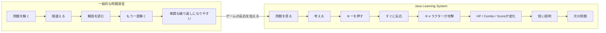

通常の資格学習では「問題を解く→間違える→解説を読む」の繰り返しになりやすいため、問題演習にゲームの反応を加えて、繰り返し学習しやすくすることを目的とします。

## 3. 学習体験の基本ループ

### Mermaid図

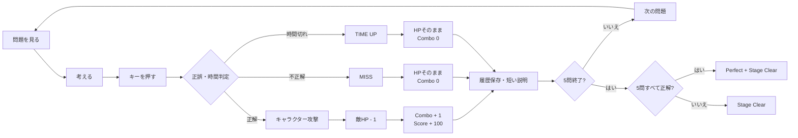

この図をゲーム処理の最重要ルールとして扱います。回答からゲーム上の反応までをできるだけ短くすることを重視します。

## 4. Chapter / Question / Stage

### Chapter / Pool / Stageの関係

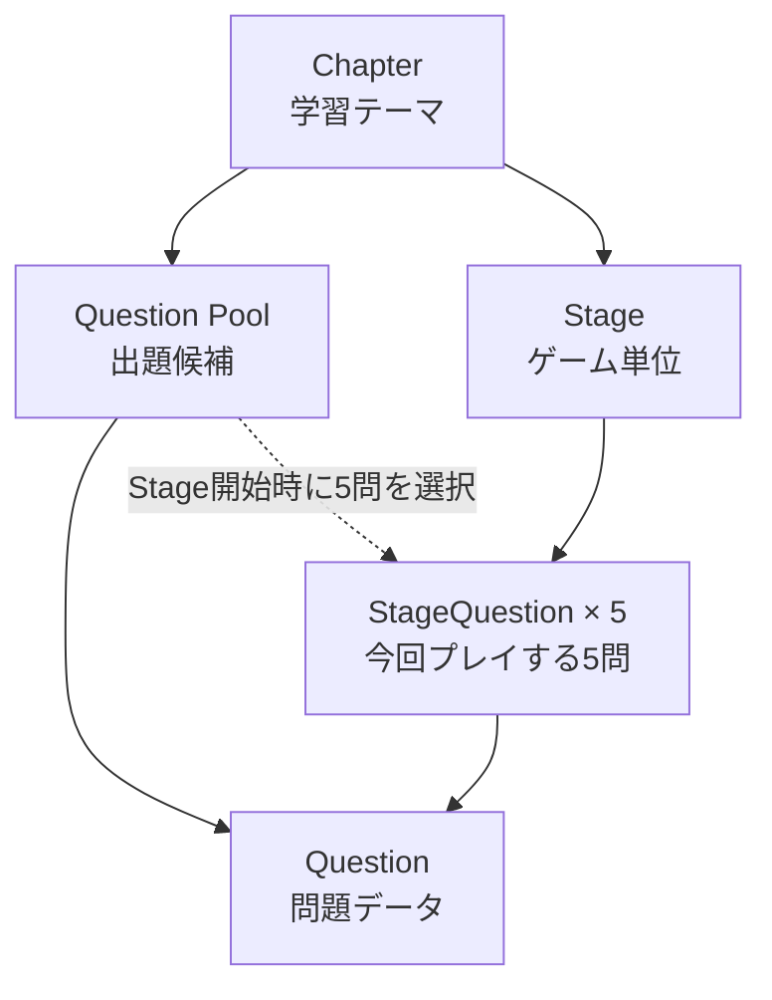

- **Chapter**：学習テーマ
- **Question Pool**：そのChapterで出題できる問題の集まり
- **Question**：実際に解く問題
- **Stage**：5問をゲームとしてプレイする単位
- **StageQuestion**：今回のStageで選ばれた5問を固定するデータ

Stage開始時にQuestion Poolから5問を決め、その5問をStageQuestionとして保存します。

## 5. Chapterの進め方

Chapterは自由に選択できる方式を基本とします。苦手な分野を選んですぐ練習できるようにします。

## 6. 1 Stage = 5問

1 Stageは必ず5問です。

``` text
1問目 → 2問目 → 3問目 → 4問目 → 5問目
```

## 7. 敵HP

1 Stageの敵HPは5です。正解するたびに1減ります。

## 8. プレイ問題数

``` text
5問 = 1 Stage
10問 = 2 Stage
20問 = 4 Stage
```

同じGameSession内では同じ問題を重複させない方針です。

## 9. 問題形式

-   A～Eから1つ
-   A～Gから1つ
-   A～Eから2つ
-   A～Gから2つ
-   A～Gから3つ
-   コード選択 A～Eから1つ
-   コード選択 A～Gから2つ

複数選択は正解の組み合わせと完全一致した場合を正解とします。

## 10. 長い問題への対応

### 画面レイアウトイメージ

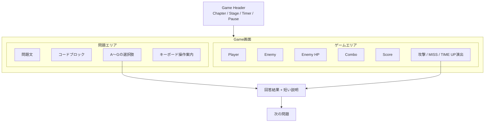

左側は「考えるための情報」、右側は「ゲームの反応」を担当します。問題の読みやすさを優先しながら、回答直後のゲーム反応も見える構成にします。

## 11. キーボード操作

単一選択：A～Gを押して回答。複数選択：A～Gで選択しEnterで確定。Esc：一時停止。マウスは補助操作とします。

## 12. 制限時間

問題ごとに`Question.timeLimitSeconds`で管理します。Stage側には別の制限時間を持たせません。

## 13. 正解時

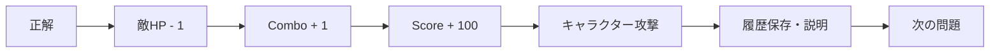

## 14. 不正解時

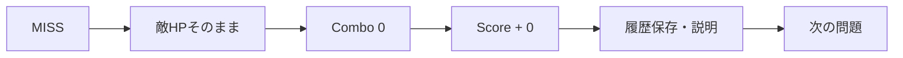

## 15. 時間切れ

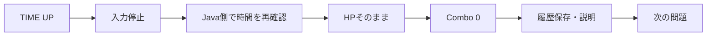

1問につき回答結果は1回だけ確定します。

## 16. Score

MVPでは、正解+100、不正解+0、時間切れ+0とします。

## 17. Combo

正解で+1、不正解・時間切れで0に戻します。

## 18. Stage Clear

5問すべて回答するとStage終了です。

## 19. Perfect

5問すべて正解すると、敵HP0・Perfect・Stage
Clearです。派手な必殺技はMVP完成後に余裕があれば追加します。

## 20. Stageごとの変化

例：Stage1＝剣士 / Java Guard / 草原、Stage2＝サラリーマン / Java Robot
/ オフィス、Stage3＝忍者 / Code Samurai / 城。ゲーム処理は共通化します。

## 21. 画面遷移図

### Mermaid図

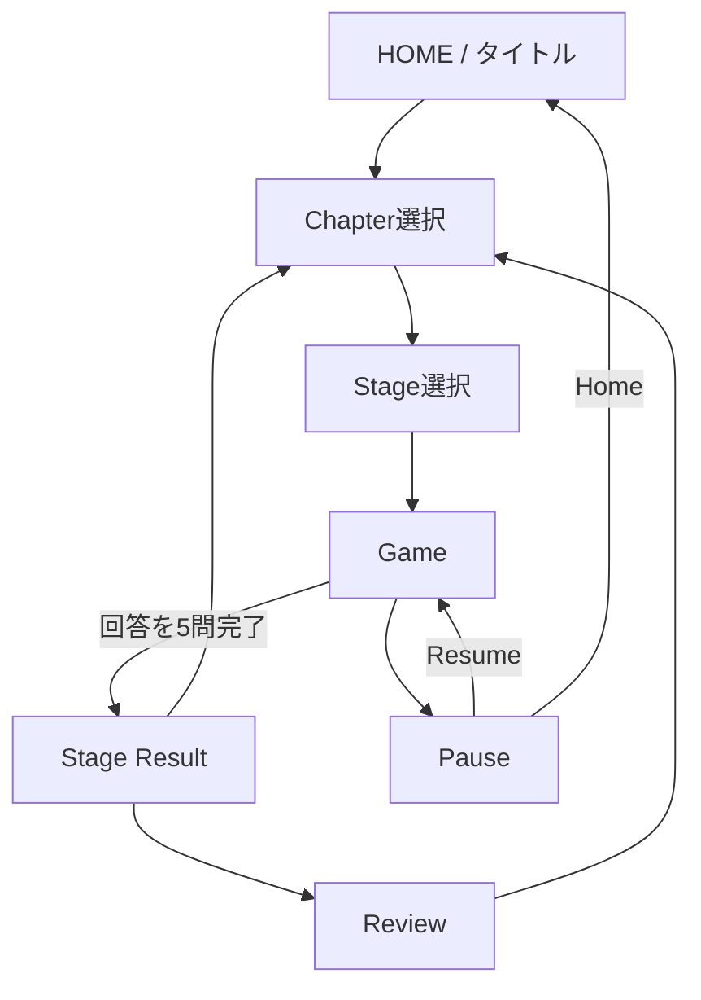

画面遷移は「次にどの画面へ進むか」と「途中でPauseした場合の戻り先」を確認するために使用します。

## 22. 画面一覧・一時停止

### 画面と状態の関係

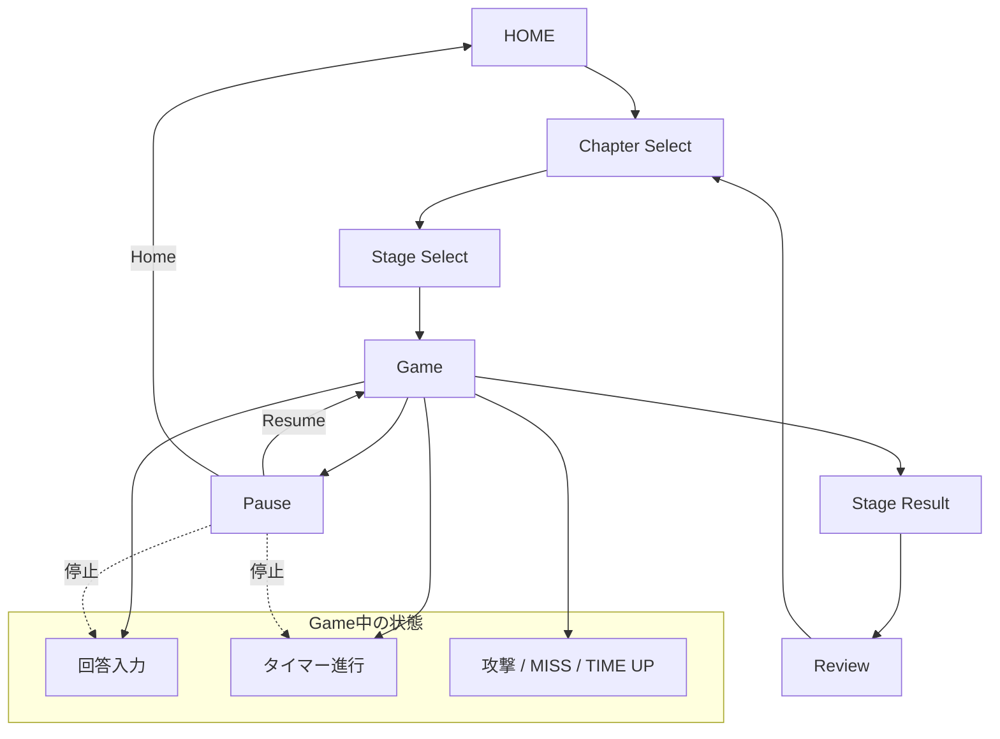

### 一時停止のルール

- Pause中は回答入力を受け付けない
- Pause中はタイマーを進めない
- ResumeするとGameへ戻る
- Homeを選ぶとHOMEへ戻る

画面一覧：HOME、Chapter Select、Stage Select、Game、Pause、Stage Result、Review。

## 23. デザイン方針

### デザイン優先度

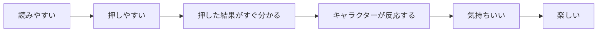

見た目だけを派手にするのではなく、まず「問題が読みやすい」「答えやすい」「反応が分かる」を優先します。

Typing LandやOzawa-Kenは**操作テンポやゲームとしての気持ちよさ**の参考とし、キャラクター・ロゴ・画面・素材をコピーしません。

## 24. データの関係

### Mermaid図

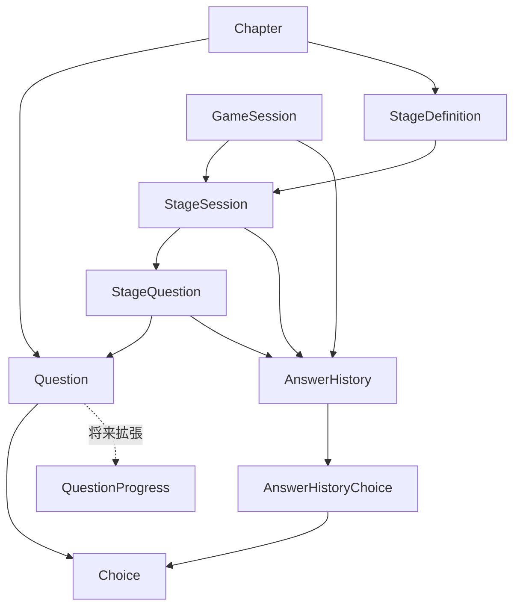

### 重要な関係

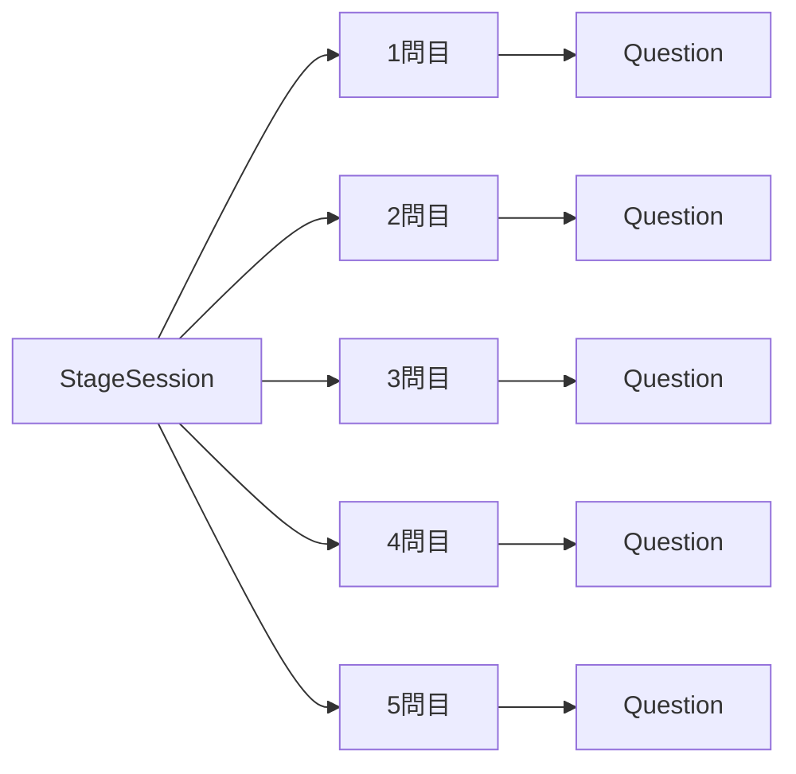

`StageQuestion`によって「今回のStageで出す5問」を固定します。`AnswerHistoryChoice`によって「実際に選んだ選択肢」も保存できます。

`QuestionProgress`はMVP完成後に追加する候補として扱い、現在のコアゲーム処理から分離します。

## 25. システム全体像

### Mermaid図

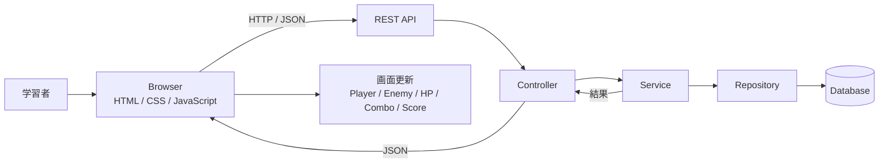

「ユーザー → 画面 → REST API → Java → DB → 結果 → 画面演出」という一連の流れを表します。

## 26. 基本アーキテクチャ

### Mermaid図

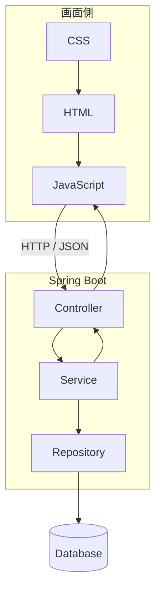

- **Controller**：画面からのリクエストを受け取る
- **Service**：正誤・HP・Combo・Score・Stageなどのルールを処理する
- **Repository**：DBとのやり取りを担当する
- **JavaScript**：入力・表示・ゲーム演出を担当する

画面から直接DBを操作せず、役割を分けて実装します。

## 27. 要求モデル

### Mermaid図

「学習者がしたいこと」から「実装する機能」までをつなげて整理します。

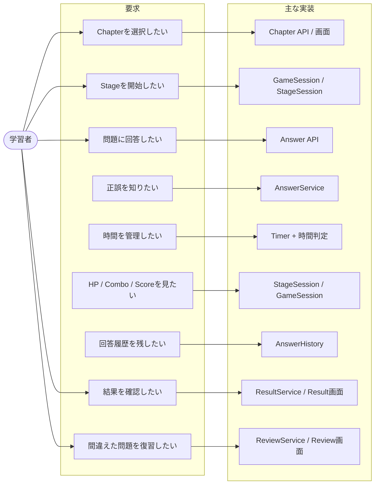

### 要求一覧

| ID | 要求 |
|---|---|
| REQ-01 | Chapterを選択できる |
| REQ-02 | Stageを開始できる |
| REQ-03 | 問題に回答できる |
| REQ-04 | 正誤判定できる |
| REQ-05 | 制限時間を管理できる |
| REQ-06 | HP・Combo・Scoreを更新できる |
| REQ-07 | 回答履歴を保存できる |
| REQ-08 | 結果を確認できる |
| REQ-09 | 間違えた問題を復習できる |

## 28. Use Case Diagram

### Mermaid図

Use Caseは「学習者がシステムで何をできるか」を表します。

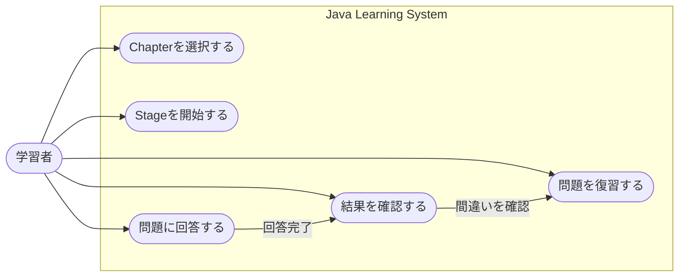

Use Caseは要求モデルより「利用者の操作」に寄せて整理し、その後のシーケンス図につなげます。

## 29. ロバストネス分析

### ロバストネス図

ロバストネス分析では、**画面・処理・データの責任を分ける**ことで、「どこに何のコードを書くのか」を整理します。

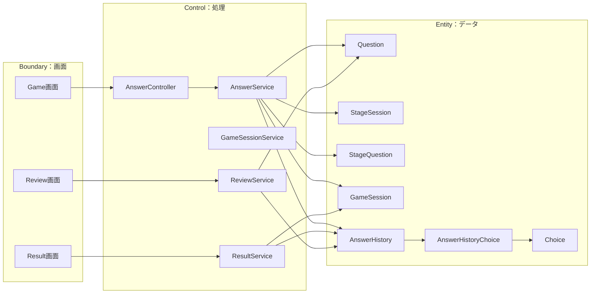

**Boundary**はユーザーが見る・操作する画面、**Control**はゲームルールや処理、**Entity**は問題・Stage・回答履歴などのデータを表します。

この図は、次のクラス図やシーケンス図へ進む前の「責任分担の確認」に使います。

## 30. シーケンス図：回答判定
### Mermaid図

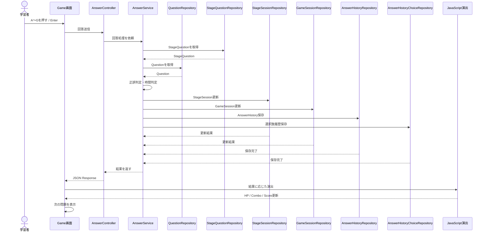

正解・不正解のルールはJava側で確定し、JavaScriptは画面演出を担当します。


```text
学習者
 ↓
Game画面
 ↓
AnswerController
 ↓
AnswerService
 ↓
StageQuestion取得
 ↓
Question取得
 ↓
正誤・時間判定
 ↓
StageSession更新
 ↓
GameSession更新
 ↓
AnswerHistory保存
 ↓
AnswerHistoryChoice保存
 ↓
結果返却
 ↓
キャラクター演出
 ↓
次の問題
```

正解：HP-1、Combo+1、Score+100。不正解：HP維持、Combo0、Score+0。

## 31. シーケンス図：時間切れ
### Mermaid図

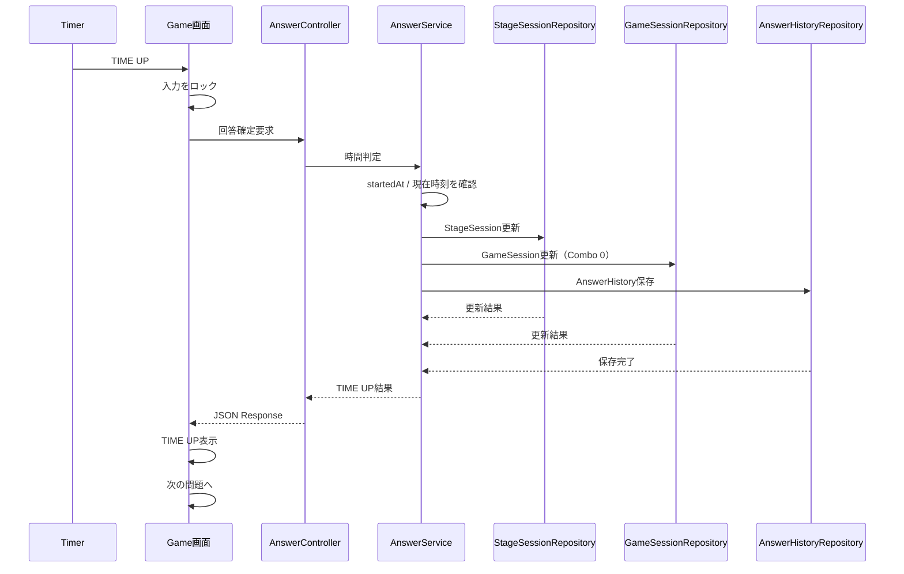

クライアントが「時間切れ」と自己申告するだけではなく、Java側でも時間を確認します。


```text
Timer → TIME UP → 入力停止 → AnswerController → AnswerService → StageSession更新 → GameSession更新（Combo0） → AnswerHistory保存 → 結果返却 → TIME UP表示 → 次の問題
```

## 32. シーケンス図：Stage進行
### Mermaid図

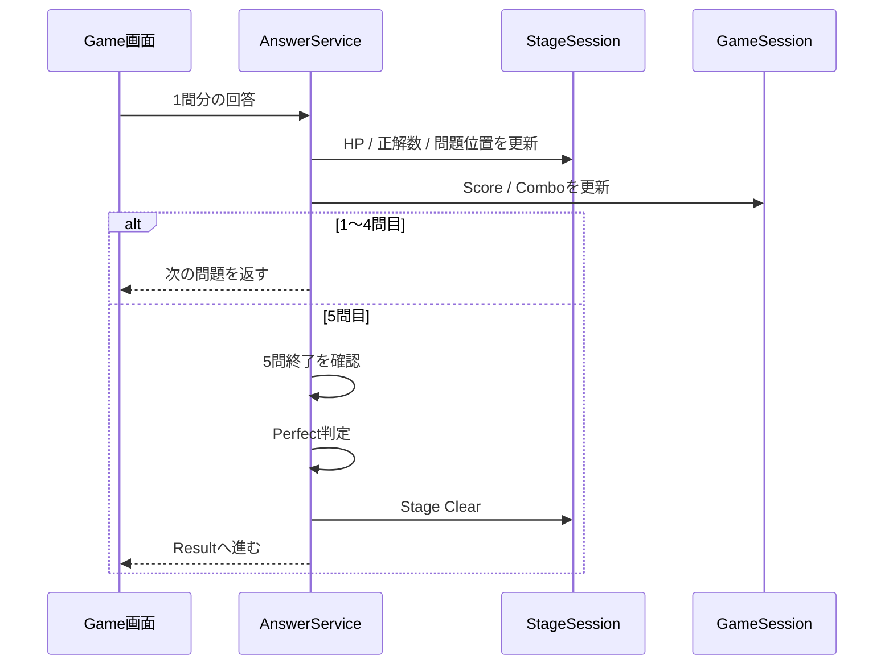

1～4問目は「次の問題」、5問目は「Perfect / Stage Clear判定」という役割分担です。


1～4問目：`回答 → 正誤判定 → HP/Combo/Score更新 → 履歴保存 → 次問題`

5問目：`5問目回答 → 正誤判定 → 履歴保存 → 5問終了 → Perfect判定 → Stage Clear判定 → Result`

## 33. クラス図

### Mermaid図

クラス図では、MVPで実装するEntityと、回答処理に必要なController・Service・Repositoryの関係を確認します。

```mermaid
classDiagram
    class Chapter {
        +Long chapterId
        +String name
        +String description
    }
    class Question {
        +Long questionId
        +Long chapterId
        +String questionText
        +String questionType
        +int timeLimitSeconds
        +String explanation
        +String codeBlock
    }
    class Choice {
        +Long choiceId
        +Long questionId
        +String choiceText
        +int choiceOrder
        +boolean correct
    }
    class StageDefinition {
        +Long stageId
        +Long chapterId
        +int stageNumber
        +String name
        +String playerCharacter
        +String enemy
        +String field
        +String miniGameType
        +String actionPattern
        +int maxEnemyHp
    }
    class GameSession {
        +Long gameSessionId
        +Long chapterId
        +int questionCount
        +int score
        +int currentCombo
        +int currentStage
        +LocalDateTime startedAt
        +LocalDateTime endedAt
    }
    class StageSession {
        +Long stageSessionId
        +Long gameSessionId
        +Long stageId
        +int currentQuestionIndex
        +int correctCount
        +int enemyHp
        +String status
        +LocalDateTime startedAt
        +LocalDateTime endedAt
    }
    class StageQuestion {
        +Long stageQuestionId
        +Long stageSessionId
        +Long questionId
        +int questionOrder
    }
    class AnswerHistory {
        +Long answerHistoryId
        +Long gameSessionId
        +Long stageSessionId
        +Long stageQuestionId
        +boolean correct
        +boolean timeout
        +int answerTime
    }
    class AnswerHistoryChoice {
        +Long id
        +Long answerHistoryId
        +Long choiceId
    }
    class AnswerController {
        +submitAnswer()
    }
    class AnswerService {
        +judgeAnswer()
        +updateStage()
        +saveHistory()
    }
    class StageQuestionRepository {
        +findById()
    }
    class QuestionRepository {
        +findById()
    }
    class StageSessionRepository {
        +findById()
        +save()
    }
    class GameSessionRepository {
        +findById()
        +save()
    }
    class AnswerHistoryRepository {
        +save()
    }
    class AnswerHistoryChoiceRepository {
        +save()
    }

    Chapter --> Question
    Question --> Choice
    Chapter --> StageDefinition
    GameSession --> StageSession
    StageSession --> StageDefinition
    StageSession --> StageQuestion
    StageQuestion --> Question
    GameSession --> AnswerHistory
    StageSession --> AnswerHistory
    StageQuestion --> AnswerHistory
    AnswerHistory --> AnswerHistoryChoice
    AnswerHistoryChoice --> Choice
    AnswerController --> AnswerService
    AnswerService --> StageQuestionRepository
    AnswerService --> QuestionRepository
    AnswerService --> StageSessionRepository
    AnswerService --> GameSessionRepository
    AnswerService --> AnswerHistoryRepository
    AnswerService --> AnswerHistoryChoiceRepository
```

`QuestionProgress`はMVPのクラス図・実装対象には含めません。学習進捗機能を追加するときに将来拡張します。

## 33.1 Javaクラス名

### Controller

`ChapterController`, `GameSessionController`, `AnswerController`, `ResultController`, `ReviewController`

### Service

`ChapterService`, `GameSessionService`, `AnswerService`, `ResultService`, `ReviewService`

### Repository（MVP）

`ChapterRepository`, `QuestionRepository`, `ChoiceRepository`, `StageDefinitionRepository`, `GameSessionRepository`, `StageSessionRepository`, `StageQuestionRepository`, `AnswerHistoryRepository`, `AnswerHistoryChoiceRepository`

### Entity（MVP）

`Chapter`, `Question`, `Choice`, `StageDefinition`, `GameSession`, `StageSession`, `StageQuestion`, `AnswerHistory`, `AnswerHistoryChoice`

### 将来拡張

`QuestionProgress`はMVPでは実装せず、学習進捗機能を追加するときにEntity・Repository・Serviceを追加します。

## 33.2 回答処理の詳細クラス図

回答を送信したときに実際に呼び出すJavaクラスだけを抜き出した図です。

```mermaid
classDiagram
    class AnswerController {
        +submitAnswer()
    }
    class AnswerService {
        +judgeAnswer()
        +updateStage()
        +saveHistory()
    }
    class StageQuestionRepository {
        +findById()
    }
    class QuestionRepository {
        +findById()
    }
    class StageSessionRepository {
        +findById()
        +save()
    }
    class GameSessionRepository {
        +findById()
        +save()
    }
    class AnswerHistoryRepository {
        +save()
    }
    class AnswerHistoryChoiceRepository {
        +save()
    }

    AnswerController --> AnswerService
    AnswerService --> StageQuestionRepository
    AnswerService --> QuestionRepository
    AnswerService --> StageSessionRepository
    AnswerService --> GameSessionRepository
    AnswerService --> AnswerHistoryRepository
    AnswerService --> AnswerHistoryChoiceRepository
```

## 34. MiniGame / GameEffectの設計

### QuestionとMiniGameの分離

```mermaid
flowchart LR
    Q[Question<br/>何を答えるか]

    subgraph MINI[MiniGame：どう遊ぶか]
        M1[Code Target]
        M2[Code Whack-a-Mole]
        M3[Typing Samurai]
        M4[Code Breaker]
    end

    J[共通の回答判定]
    RESULT[共通結果<br/>correct / HP / Combo / Score / History]
    FX[GameEffect<br/>攻撃 / MISS / TIME UP / Stage演出]

    Q --> J
    M1 --> J
    M2 --> J
    M3 --> J
    M4 --> J
    J --> RESULT
    RESULT --> FX
```

Questionは「何を答えるか」、MiniGameは「どう遊ぶか」、GameEffectは「結果をどう見せるか」を担当します。

この分離によって、同じQuestionを別のMiniGameで利用できます。新しいMiniGameを追加するときは、新しいゲーム処理のコードを実装します。

## 35. REST APIの事前確認

### REST APIの位置付け

```mermaid
flowchart LR
    B[Browser<br/>HTML / CSS / JavaScript]
    API[REST API]
    C[Controller]
    S[Service]
    R[Repository]
    DB[(Database)]

    B -->|HTTP Request / JSON| API
    API --> C
    C --> S
    S --> R
    R --> DB
    S --> C
    C -->|JSON Response| B
```

APIは「画面とJavaをつなぐ窓口」です。

### MVPで使う主なAPI

```text
GET  /api/chapters
GET  /api/stages?chapterId={chapterId}
GET  /api/stage-questions/{stageQuestionId}
POST /api/game-sessions
POST /api/answers
GET  /api/game-sessions/{gameSessionId}/result
GET  /api/game-sessions/{gameSessionId}/review
```

### 回答API

実際のプレイでは、Question IDではなく現在のStage上の問題を表す`stageQuestionId`を基準にします。
`GET /api/stage-questions/{stageQuestionId}`で今回のStageの問題を取得し、`POST /api/answers`で同じ`stageQuestionId`を使って回答します。

`POST /api/answers` はJava側で正誤と時間を確定した結果を返します。

```json
{
  "stageQuestionId": 101,
  "selectedChoiceIds": [12, 15]
}
```

### Response

通常の問題で正解した場合：

```json
{
  "correct": true,
  "timeout": false,
  "enemyHp": 4,
  "combo": 1,
  "score": 100,
  "stageClear": false,
  "perfect": false,
  "nextStageQuestionId": 102
}
```

不正解の場合：

```json
{
  "correct": false,
  "timeout": false,
  "enemyHp": 5,
  "combo": 0,
  "score": 100,
  "stageClear": false,
  "perfect": false,
  "nextStageQuestionId": 103
}
```

時間切れの場合：

```json
{
  "correct": false,
  "timeout": true,
  "enemyHp": 5,
  "combo": 0,
  "score": 100,
  "stageClear": false,
  "perfect": false,
  "nextStageQuestionId": 104
}
```

5問目でStage Clearになった場合：

```json
{
  "correct": true,
  "timeout": false,
  "enemyHp": 0,
  "combo": 5,
  "score": 500,
  "stageClear": true,
  "perfect": true,
  "nextStageQuestionId": null
}
```

`nextStageQuestionId` は **Question IDではなくStageQuestion ID** です。
`StageSession → StageQuestion → Question` の構造に統一しているため、次に表示する問題もStage上の問題を指します。

`stageClear=true` は5問すべて回答し終えたことを表し、`perfect=true` は5問すべて正解したことを表します。次の問題がない場合は`nextStageQuestionId=null`とします。

### 時間切れ時のRequest

タイマー表示が0になった場合も同じ`POST /api/answers`を使用します。選択肢がないため`selectedChoiceIds`は空にします。`timeout`はRequestに持たせません。

```json
{
  "stageQuestionId": 101,
  "selectedChoiceIds": []
}
```

時間切れかどうか、正誤、HP、Combo、Score、Stage Clear、Perfectの最終判定はすべてJava側で行います。クライアント側から結果を自己申告する設計にはしません。

### HTTPステータス

| Status | 意味 | 例 |
|---|---|---|
| `200 OK` | 回答処理成功 | 正解・不正解・時間切れを正常に確定 |
| `400 Bad Request` | リクエスト内容が不正 | 必須項目不足、選択肢IDの形式不正 |
| `404 Not Found` | 対象データが存在しない | 指定したStageQuestionが存在しない |
| `409 Conflict` | 現在の状態では処理できない | すでに回答済みのStageQuestionを再送信 |

エラー時もサーバー側で処理を止め、同じ回答を二重保存しません。

## 36. 設計整合性チェック

  ルール                      要求   設計   API   実装
  --------------------------- ------ ------ ----- ------
  1 Stage = 5問               ○      ○      ○     確認
  敵HP = 5                    ○      ○      ○     確認
  正解でHP -1                 ○      ○      ○     確認
  不正解でHP維持              ○      ○      ○     確認
  時間切れでHP維持            ○      ○      ○     確認
  正解でCombo +1              ○      ○      ○     確認
  不正解・時間切れでCombo 0   ○      ○      ○     確認
  正解でScore +100            ○      ○      ○     確認
  5問終了でStage Clear        ○      ○      ○     確認
  5/5でPerfect・敵HP 0        ○      ○      ○     確認
  回答履歴保存                ○      ○      ○     確認
  StageQuestionで5問を固定    ○      ○      ○     確認
  AnswerHistoryChoice保存     ○      ○      ○     確認
  miniGameTypeで統一          ○      ○      ○     確認
  nextStageQuestionIdはStageQuestionId ○ ○ ○     確認
  POST /api/answersのResponse固定 ○      ○      ○     確認
  HTTPステータスを固定         ○      ○      ○     確認

## 37. 回答処理の共通ルール

``` text
回答受付 → 1回だけ確定 → 正誤判定 → StageSession更新 → GameSession更新 → AnswerHistory保存 → 結果返却
```

最終的な正誤判定はJava側で行います。

## 38. 二重回答防止

キー入力とTIME UPが同時に発生しても、1問につき1回だけ回答を確定します。画面側で入力をロックし、サーバー側でも重複処理を防止します。

## 39. データモデル

READMEのクラス図と実装するEntityの項目をここで完全に一致させます。以下をMVPのデータ設計の基準とし、README・設計書・Java Entityで同じ名前と項目を使用します。

### Chapter

`chapterId`, `name`, `description`

### Question

`questionId`, `chapterId`, `questionText`, `questionType`, `timeLimitSeconds`, `explanation`, `codeBlock`

### Choice

`choiceId`, `questionId`, `choiceText`, `choiceOrder`, `correct`

### StageDefinition

`stageId`, `chapterId`, `stageNumber`, `name`, `playerCharacter`, `enemy`, `field`, `miniGameType`, `actionPattern`, `maxEnemyHp`

### GameSession

`gameSessionId`, `chapterId`, `questionCount`, `score`, `currentCombo`, `currentStage`, `startedAt`, `endedAt`

### StageSession

`stageSessionId`, `gameSessionId`, `stageId`, `currentQuestionIndex`, `correctCount`, `enemyHp`, `status`, `startedAt`, `endedAt`

### StageQuestion

`stageQuestionId`, `stageSessionId`, `questionId`, `questionOrder`

Stage開始時に選ばれた5問を固定して管理します。

### AnswerHistory

```text
AnswerHistory
├─ answerHistoryId
├─ gameSessionId
├─ stageSessionId
├─ stageQuestionId
├─ correct
├─ timeout
└─ answerTime
```

`StageQuestion → Question` で対象問題を特定できるため、MVPでは`questionId`をAnswerHistoryに重複保存しません。

### AnswerHistoryChoice

`id`, `answerHistoryId`, `choiceId`

複数選択問題を含め、ユーザーが実際に選択したChoiceを保存します。

### QuestionProgress（将来拡張・MVP対象外）

`QuestionProgress`はMVPでは実装しません。クラス図・MVP Entity一覧・MVP Repository一覧にも含めず、問題ごとの学習進捗機能を追加するときに導入します。

## 40. QuestionProgressとAnswerHistory

`AnswerHistory`はMVPで実装し、「過去に何を回答したか」を保存します。

`QuestionProgress`はMVPでは実装せず、将来「この問題をどの程度習得したか」を管理するときに追加します。

この2つを分けることで、MVPのデータ構造を必要以上に複雑にしません。

## 41. 学習状態

`QuestionProgress`は将来拡張のための設計です。MVPでは使用しません。

将来追加する場合は、例えば以下の状態を利用できます。

```text
UNSEEN → REVIEW → CLEAR → MASTERED
```

`MASTERED`の具体的条件は、学習進捗機能を実装する段階で決定します。

## 42. 設計上の基本ルール

-   役割を分ける
-   同じ処理を重複させない
-   必要以上に複雑にしない
-   初心者でも読める名前にする

## 43. 画面とゲーム処理の分離

Java側：正誤判定、HP、Combo、Score、履歴、Stage判定。

JavaScript側：キー入力、画面更新、キャラクター演出、敵アニメーション、表示更新。

## 44. 設計から実装への流れ

### 将来の拡張イメージ

```mermaid
flowchart LR
    B[Java Bronze] --> C[Chapter追加]
    C --> S[Stage追加]
    S --> Q[Question追加]
    Q --> M[MiniGame追加]
    M --> SI[Java Silver]
    SI --> GO[Java Gold]
```

データ追加は既存コードへの影響をできるだけ小さくし、新しいMiniGameは必要なゲーム処理コードを追加する方針です。

### 設計から実装への流れ

```mermaid
flowchart LR
    A[要求] --> B[Use Case]
    B --> C[データモデル]
    C --> D[ロバストネス]
    D --> E[シーケンス]
    E --> F[クラス]
    F --> G[REST API]
    G --> H[Java実装]
    H --> I[HTML / CSS / JavaScript]
    I --> J[テスト]
```

各図を「何となく作る」のではなく、前の設計を次の設計へつなげるために使用します。

## 45. 開発手順

1.  Spring Boot起動確認
2.  DB接続
3.  Entity
4.  Repository
5.  Service
6.  Controller
7.  API確認
8.  HTML/CSS
9.  JavaScript
10. 回答処理
11. Stage処理
12. ゲーム演出
13. 結果
14. 復習
15. テスト・修正

## 46. Git / GitHub

初心者でも変更内容が分かる日本語コミットを使用します。

例：`READMEを初心者向けに更新`、`回答判定処理を追加`、`Stage進行処理を追加`、`ゲーム画面を作成`、`回答履歴の保存処理を追加`

## 47. AI活用方針

AIは補助として使用します。

AIを活用：問題案、解説案、エラー原因調査、設計確認、コードの意味の説明。

自分で理解して行う：Javaコード入力、クラス作成、API実装、HTML/CSS/JavaScript調整、Git操作、テスト、エラー修正。

## 48. 問題データ

既存教材の文章をそのまま大量転載せず、学習用として自分で問題を構成します。

## 49. データ品質

問題文、正解、選択肢、解説、制限時間、複数選択数を確認します。

## 50. テスト

正解、不正解、時間切れ、Perfect、Stage
Clear、二重送信、履歴保存を確認します。

## 51. Must / Should / Could

Must：Chapter、Stage、5問、問題、キーボード回答、正誤、制限時間、HP、Combo、Score、履歴、結果、復習。

Should：ミニゲーム追加、Stage演出、Perfect演出、Time Attack。

Could：Blender 3D、キャラクター成長、ランキング、Java Silver / Gold。

## 52. 拡張方針

Chapter、Stage、Question、MiniGameを追加できる構造を目指します。Java
Silver、Java
Goldも将来的な拡張候補です。問題・Chapter・Stageなどのデータ追加は既存コードをできるだけ変更せずに行える構成を目指します。新しいMiniGameを追加する場合は、新しいゲーム処理のコード実装が必要です。

## 53. MVP

``` text
Chapter選択 → Stage開始 → 5問回答 → 正誤判定 → HP / Combo / Score → キャラクター反応 → 履歴保存 → Stage Clear → 結果 → 復習
```

まずJava Bronze学習ゲームを最後まで完成させることを最優先します。

## 54. 開発スケジュール

``` text
10/02 企画・検討
10/06 要求整理
10/09 分析
10/13 設計
10/14～ プログラミング
10/26 テスト・デバッグ・リファクタリング
10/28 提出物・発表資料
10/29 発表
```

## 55. 実装優先順位

最優先：Question、Answer、Stage、GameSession、AnswerHistory、Result、Review。

次：ゲーム演出、MiniGame追加、デザイン改善。

最後：3D、複雑なエフェクト、ランキング。

## 56. コードを書く前に確認

-   クラス名
-   データ項目
-   API
-   回答処理
-   Stageルール
-   HPルール
-   Perfect条件
-   履歴保存内容

## 57. 画面デザイン前に確認

-   問題文
-   選択肢
-   キー入力
-   タイマー
-   HP
-   Combo
-   キャラクター
-   正解・不正解表示
-   次問題への導線

## 58. 説明するときのポイント

最初は「Java
Bronzeの問題をゲーム形式で解く学習Webアプリです。」と説明します。

次に「正解するとキャラクターが攻撃し、敵のHPが減ります。1Stageは5問で、5問すべて正解するとPerfectになります。」と説明します。

技術説明は「画面はHTML/CSS/JavaScript、サーバー側はJava/Spring
Boot、データはデータベースで管理しています。」とします。

## 59. ポートフォリオで見せるポイント

Java、Spring Boot、データ管理、REST
API、ゲーム処理、画面制作、テストまで一通り経験したことを見せられる作品にします。

## 60. 現在の設計状態

要求、Use
Case、データモデル、データ関係、システム全体像、アーキテクチャ、ロバストネス、シーケンス、クラス図、REST
API、設計整合性を整理済みとします。ここからは設計を増やすより実装を進めます。

## 61. 実装時のルール

1.  小さく動かす
2.  1機能ずつ実装
3.  動いたらコミット
4.  分からないコードは確認
5.  AIコードを理解せず使わない
6.  エラー原因を確認
7.  設計とコードのズレを修正

## 62. 最終コンセプト

``` text
考える → キーを押す → すぐ反応 → キャラクターが動く → 敵HPが変化 → 結果が分かる → 次へ
```

## 63. 今後追加できる要素

新キャラクター、新しい敵、新Stage、新MiniGame、Java Silver、Java
Gold、3Dモデル、エフェクト、キャラクター成長、ランキングなど。MVP完成後に追加します。

## 64. README更新履歴

### 2026/10/07

-   ゲーム基本ループ更新
-   1Stage = 5問に統一
-   敵HP = 5に統一
-   Perfect条件統一
-   正解・不正解・時間切れを統一
-   データ関係、システム全体像、アーキテクチャを整理
-   要求モデル、Use Case、ロバストネス分析を整理
-   回答判定・時間切れ・Stage進行シーケンスを整理
-   クラス図・Javaクラス名を整理
-   REST APIのRequest / Response / HTTPステータスを整理
-   nextStageQuestionIdをStageQuestion IDとして統一
-   設計整合性チェックを追加
-   Git / GitHub運用とAI活用方針を整理
-   実装優先順位を整理

## 65. 用語

  用語               意味
  ------------------ ------------------------
  Chapter            学習テーマ
  Question           問題
  Stage              5問を遊ぶ単位
  GameSession        1回のプレイ全体
  StageSession       現在のStage状態
  AnswerHistory      過去の回答記録
  QuestionProgress   問題ごとの学習状態
  API                画面とJavaをつなぐ窓口
  Controller         リクエスト受付
  Service            ゲームルール処理
  Repository         DBとのやり取り
  Entity             保存するデータ
  Boundary           画面
  Control            処理
  UML                システムを図で表す方法

## 66. READMEの使い方

コードを書くときはクラス名・データ・API・処理順を確認します。デザインするときは画面遷移・ゲーム画面・操作方法を確認します。説明するときは「何を作るか」「なぜ作るか」「どう動くか」「どう作るか」を確認します。

## 67. 開発開始チェック

``` text
□ Spring Boot起動
□ DB接続
□ Entity
□ Repository
□ Service
□ Controller
□ API
□ Question取得
□ Answer送信
□ 正誤判定
□ HP更新
□ Combo更新
□ Score更新
□ AnswerHistory保存
□ 5問でStage Clear
□ 5/5でPerfect
□ 結果画面
```

## 68. 完成の最終目標

Java
Bronzeを勉強したいが、通常の問題演習だけでは続きにくい人が、ゲーム感覚で何度も問題を解けるWebアプリを完成させます。

まずJava
Bronze学習ゲームを最後まで完成させることを最優先とし、3Dモデルや高度なエフェクトなどは完成後の追加機能とします。
