# Java Learning System

Java
Bronzeを学習している初学者を対象とした、ゲーム感覚でJavaの問題を学習できるWebアプリケーションです。

## 1. プロジェクト概要

## 開発に必須の設計図一覧

このREADMEでは、実際にJava / Spring Boot / JavaScript / DBを実装するときに参照する図を、設計の流れに沿って整理しています。

| 図 | 目的 |
|---|---|
| 学習体験の基本ループ | 正解・不正解・時間切れ・攻撃・HP・5問終了のルールを確認する |
| 画面遷移図 | HOMEからGame、Result、Reviewまでの画面の移動を確認する |
| データの関係図 | Entity同士の関係と外部キーの流れを確認する |
| システム全体像 | ユーザー・画面・Spring Boot・DBのつながりを確認する |
| 回答判定シーケンス | 1問を回答したときの処理順を確認する |
| 時間切れシーケンス | TIME UP発生時の処理順を確認する |
| Stage進行シーケンス | 1～4問目と5問目の違いを確認する |
| クラス図 | Entity・Controller・Service・Repositoryの役割と関係を確認する |
| 画面レイアウト | Game画面の配置を確認する |
| 現状課題 vs 本アプリ | 何を解決するアプリなのかを確認する |
| Chapter / Pool / Stage | 学習テーマ・問題群・ゲーム単位の関係を確認する |
| Use Case Diagram | 学習者が何をできるかを確認する |
| ロバストネス分析 | 画面・処理・データを分けて確認する |
| MiniGame分離 | QuestionとMiniGameを分離する理由を確認する |
| REST APIの位置付け | 画面とJavaの通信方法を確認する |
| 一時停止 | Pause / Resume / Homeの状態を確認する |
| 将来の拡張 | BronzeからSilver / Goldへ広げる方法を確認する |
| デザイン優先度 | 読みやすさ・操作性・反応・楽しさの優先順位を確認する |


Java Bronzeの問題をゲーム形式で解くWebアプリです。

基本ループ：

``` text
Chapterを選ぶ
↓
Stage開始
↓
Java問題を表示
↓
キーボードで回答
↓
正解・不正解・時間切れを判定
↓
キャラクターが反応
↓
敵HP・コンボ・スコアを更新
↓
説明
↓
次の問題
↓
5問終了
↓
Stage Clear / Perfect
↓
結果・復習
```

## 2. 作成する理由
### 現状の課題と本アプリ

```text
一般的な問題演習
問題を解く
  ↓
間違える
  ↓
解説を読む
  ↓
もう一度解く
  ↓
「勉強している感じ」が強く、繰り返しが単調になりやすい

            ↓ 改善

Java Learning System
問題を見る
  ↓
考える
  ↓
キーを押す
  ↓
すぐ反応
  ↓
キャラクターが攻撃
  ↓
HP / Combo / Scoreが変化
  ↓
短い説明
  ↓
次の問題
```


通常の資格学習では「問題を解く→間違える→解説を読む」の繰り返しになりやすいため、ゲームの反応を加えて繰り返し学習しやすくすることを目的とします。

## 3. 学習体験の基本ループ
### Mermaid図

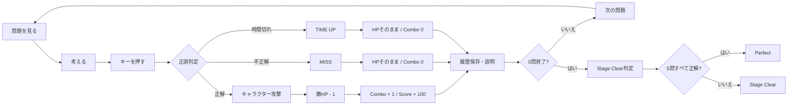

この図をゲーム処理の最重要ルールとして扱います。


``` text
問題を見る → 考える → キーを押す → すぐに正誤判定
                         ↓
          正解 → キャラクター攻撃・HP-1・Combo+1
          不正解 → MISS・Combo0
          時間切れ → TIME UP・Combo0
                         ↓
                       説明
                         ↓
                       次の問題
```

## 4. Chapter / Question / Stage
### Chapter / Pool / Stageの関係

```text
Chapter（学習テーマ）
│
├─ Question Pool（そのChapterの問題群）
│   ├─ Question 1
│   ├─ Question 2
│   ├─ Question 3
│   └─ ...
│
└─ Stage（ゲームとしてプレイする単位）
    ├─ 1問目
    ├─ 2問目
    ├─ 3問目
    ├─ 4問目
    └─ 5問目
```

Question PoolはChapterに属する「出題候補の集まり」です。Stage開始時に、その中から今回プレイする5問を決定します。


-   Chapter：学習テーマ
-   Question：実際に解く問題
-   Stage：5問をゲームとしてプレイする単位

## 5. Chapterの進め方

Chapterは自由に選択できる方式を基本とします。苦手な分野を選んですぐ練習できるようにします。

## 6. 1 Stage = 5問

1 Stageは必ず5問です。

``` text
1問目 → 2問目 → 3問目 → 4問目 → 5問目
```

## 7. 敵HP

1 Stageの敵HPは5です。正解するたびに1減ります。

## 8. プレイ問題数

``` text
5問 = 1 Stage
10問 = 2 Stage
20問 = 4 Stage
```

同じGameSession内では同じ問題を重複させない方針です。

## 9. 問題形式

-   A～Eから1つ
-   A～Gから1つ
-   A～Eから2つ
-   A～Gから2つ
-   A～Gから3つ
-   コード選択 A～Eから1つ
-   コード選択 A～Gから2つ

複数選択は正解の組み合わせと完全一致した場合を正解とします。

## 10. 長い問題への対応
### 画面レイアウトイメージ

```text
┌────────────────────────────────────────────────────────────┐
│ Chapter 1        Stage 1 / 5       TIME 08s               │
├──────────────────────────────┬─────────────────────────────┤
│                              │                             │
│  Javaの問題                  │         Player              │
│                              │            ↓                │
│  次のコードの結果は？        │          ⚔                  │
│                              │                             │
│  A. 10                       │        Enemy                │
│  B. 20                       │        HP █████              │
│  C. 30                       │        Combo ×3             │
│  D. 40                       │        Score 300            │
│                              │                             │
│  [ A ][ B ][ C ][ D ]        │                             │
└──────────────────────────────┴─────────────────────────────┘
```

左側は「考えるための情報」、右側は「ゲームの反応」を担当します。


PC画面を問題部分とゲーム部分に分けます。

``` text
┌─────────────────┬─────────────────┐
│ 問題・選択肢・時間 │ キャラクター・敵   │
│ Java問題         │ Player          │
│ A ...            │ Enemy           │
│ B ...            │ HP / Combo      │
└─────────────────┴─────────────────┘
```

## 11. キーボード操作

単一選択：A～Gを押して回答。複数選択：A～Gで選択しEnterで確定。Esc：一時停止。マウスは補助操作とします。

## 12. 制限時間

問題ごとに`Question.timeLimitSeconds`で管理します。Stage側には別の制限時間を持たせません。

## 13. 正解時

``` text
正解 → 敵HP -1 → Combo +1 → Score +100 → キャラクター攻撃 → 説明 → 次の問題
```

## 14. 不正解時

``` text
MISS → 敵HPそのまま → Combo 0 → Score +0 → 説明 → 次の問題
```

## 15. 時間切れ

``` text
TIME UP → 入力停止 → 時間切れ確定 → HPそのまま → Combo 0 → 履歴保存 → 説明 → 次の問題
```

1問につき回答結果は1回だけ確定します。

## 16. Score

MVPでは、正解+100、不正解+0、時間切れ+0とします。

## 17. Combo

正解で+1、不正解・時間切れで0に戻します。

## 18. Stage Clear

5問すべて回答するとStage終了です。

## 19. Perfect

5問すべて正解すると、敵HP0・Perfect・Stage
Clearです。派手な必殺技はMVP完成後に余裕があれば追加します。

## 20. Stageごとの変化

例：Stage1＝剣士 / Java Guard / 草原、Stage2＝サラリーマン / Java Robot
/ オフィス、Stage3＝忍者 / Code Samurai / 城。ゲーム処理は共通化します。

## 21. 画面遷移図
### Mermaid図

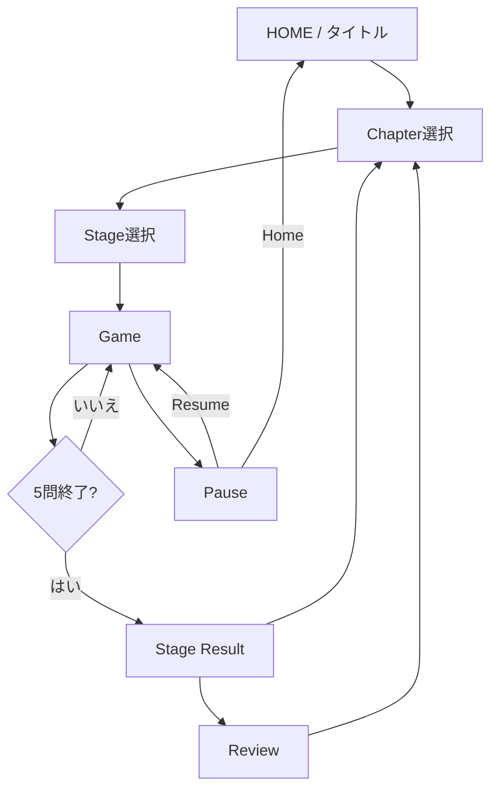


``` text
タイトル → Chapter選択 → Stage選択 → Game → Stage結果 → 復習 → Chapterへ
```

## 22. 画面一覧
### 画面設計で確認すること

```text
HOME
 ↓
Chapter Select
 ↓
Stage Select
 ↓
Game
 ├─ Pause → Resume → Game
 └─ Pause → Home → HOME
 ↓
Stage Result
 ↓
Review
```


-   タイトル
-   Chapter選択
-   Stage選択
-   Game
-   結果
-   復習


## 一時停止の設計

```text
Game
│
└─ Pause
   ├─ Resume → Gameへ戻る
   └─ Home → タイトルへ戻る
```

一時停止中は回答入力とタイマー進行を停止します。Resumeすると、停止前のGame状態に戻ります。

## 23. デザイン方針
### デザイン優先度

```text
読みやすい
   ↓
押しやすい
   ↓
押した結果がすぐ分かる
   ↓
キャラクターが反応する
   ↓
気持ちいい
   ↓
楽しい
```

見た目だけを派手にするのではなく、まず「問題が読みやすい」「答えやすい」「反応が分かる」を優先します。


ポップ、分かりやすい、ゲームらしい、キー入力が気持ちいい、Java問題が読みやすい画面を目指します。Typing
LandやOzawa-Kenは操作テンポの参考とし、キャラクター・ロゴ・画面・素材をコピーしません。

## 24. データの関係
### Mermaid図

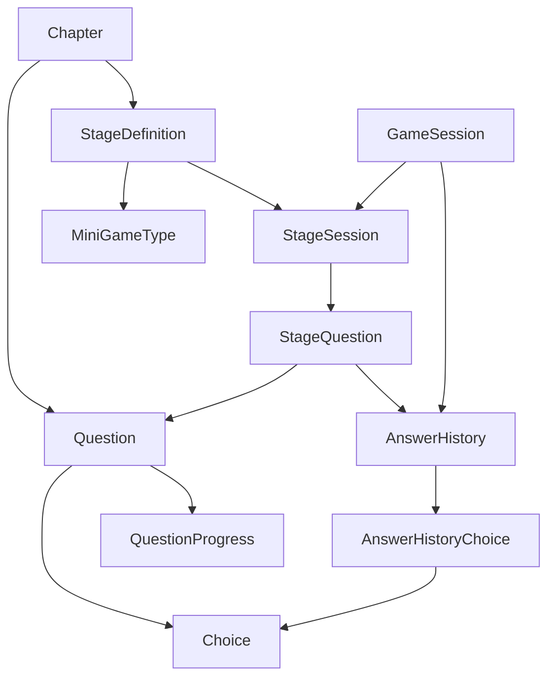

### 重要な関係

```text
StageSession
  ↓
StageQuestion × 5
  ↓
Question
```

これにより「今回のStageで出す5問」を固定できます。


``` text
Chapter
 ├── Question ── Choice
 └── StageDefinition ── MiniGame
             │
             ↓
        StageSession
          │     │
          ↓     ↓
   AnswerHistory GameSession
          ↑
       Question
          │
          ↓
   QuestionProgress

GameSession ── AnswerHistory
```

## 25. システム全体像
### Mermaid図

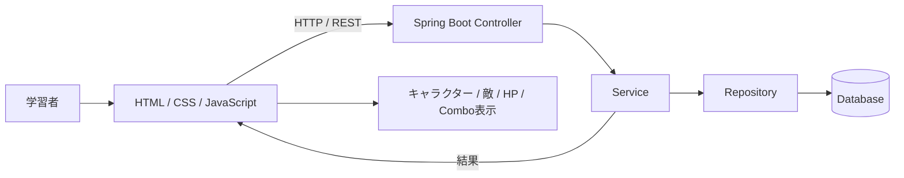

「画面 → API → Java → DB → 結果 → 画面演出」の流れを一つにつなげています。


``` text
学習者
 ↓
HTML / CSS / JavaScript
 ↓ HTTP
Spring Boot / Controller
 ↓
Service
 ↓
Repository
 ↓
Database

Java側の結果
 ↓
画面へ返却
 ↓
キャラクター・敵・HP・Combo更新
```

## 26. 基本アーキテクチャ

``` text
HTML / CSS / JavaScript
        ↓
Controller
        ↓
Service
        ↓
Repository
        ↓
Database
```

Controllerは受付、Serviceはゲームルール、RepositoryはDBとのやり取りを担当します。

## 27. 要求モデル

  ID       要求
  -------- ------------------------------
  REQ-01   Chapterを選択できる
  REQ-02   Stageを開始できる
  REQ-03   問題に回答できる
  REQ-04   正誤判定できる
  REQ-05   制限時間を管理できる
  REQ-06   HP・Combo・Scoreを更新できる
  REQ-07   回答履歴を保存できる
  REQ-08   結果を確認できる
  REQ-09   間違えた問題を復習できる

## 28. Use Case Diagram
### Mermaid図

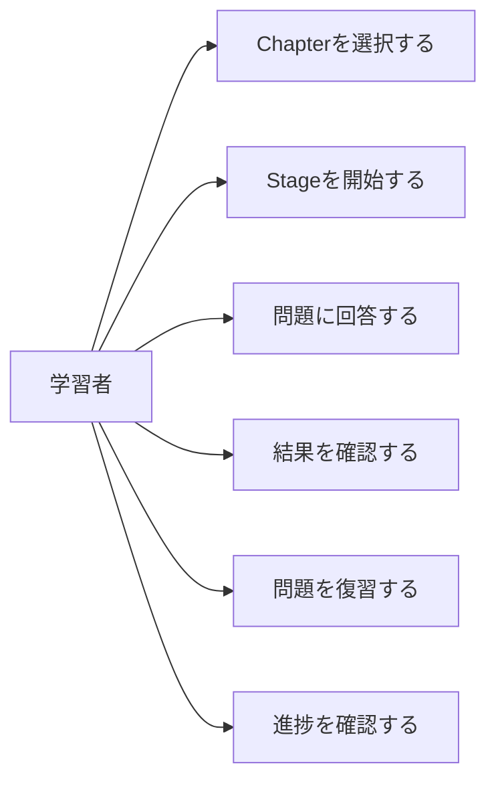

Use Caseは「学習者がシステムを使って何をするか」を表します。


``` text
             ┌──────────────────────────┐
             │ Java Learning System     │
             │                          │
学習者 ────→ │ Chapterを選択する        │
             │ 学習を開始する           │
             │ 問題に回答する           │
             │ Stageを進める            │
             │ 結果を見る               │
             │ 復習する                 │
             │ 進捗を見る               │
             └──────────────────────────┘
```

## 29. ロバストネス分析
### ロバストネス図

```text
┌──────────────────────────────┐
│ Boundary：画面                │
│ Game / Result / Review       │
└──────────────┬───────────────┘
               ↓
┌──────────────────────────────┐
│ Control：処理                 │
│ AnswerController              │
│ AnswerService                 │
│ GameSessionService            │
│ ResultService / ReviewService │
└──────────────┬───────────────┘
               ↓
┌──────────────────────────────┐
│ Entity：データ                │
│ Question / Choice             │
│ StageSession / GameSession    │
│ AnswerHistory / StageQuestion│
└──────────────────────────────┘
```

Boundary = 画面、Control = 処理、Entity = 保存するデータ、という3分割です。


``` text
【Boundary：画面】
Game / Result / Review
        ↓
【Control：処理】
AnswerController
AnswerService
GameSessionService
ReviewService
        ↓
【Entity：データ】
Question
StageSession
GameSession
AnswerHistory
QuestionProgress
```

## 30. シーケンス図：回答判定
### Mermaid図

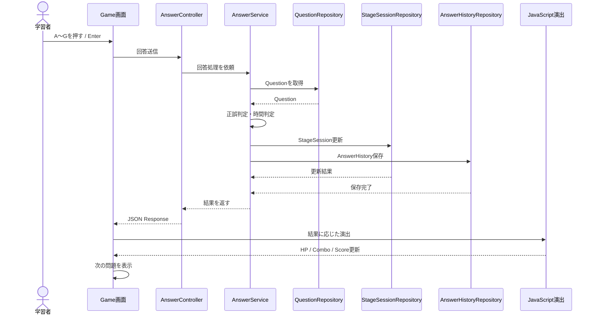

正解・不正解のルールはJava側で確定し、JavaScriptは画面演出を担当します。


``` text
学習者
 ↓
Game画面
 ↓
AnswerController
 ↓
AnswerService
 ↓
Question取得
 ↓
正誤判定
 ↓
StageSession更新
 ↓
AnswerHistory保存
 ↓
GameSession更新
 ↓
結果返却
 ↓
キャラクター演出
 ↓
次の問題
```

正解：HP-1、Combo+1、Score+100。不正解：HP維持、Combo0、Score+0。

## 31. シーケンス図：時間切れ
### Mermaid図

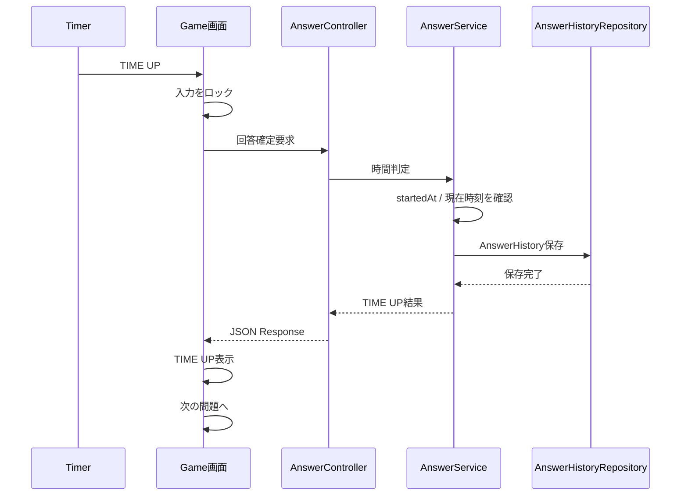

クライアントが「時間切れ」と自己申告するだけではなく、Java側でも時間を確認します。


``` text
Timer → TIME UP → 入力停止 → AnswerController → AnswerService → 履歴保存 → Combo0 → 結果返却 → TIME UP表示 → 次の問題
```

## 32. シーケンス図：Stage進行
### Mermaid図

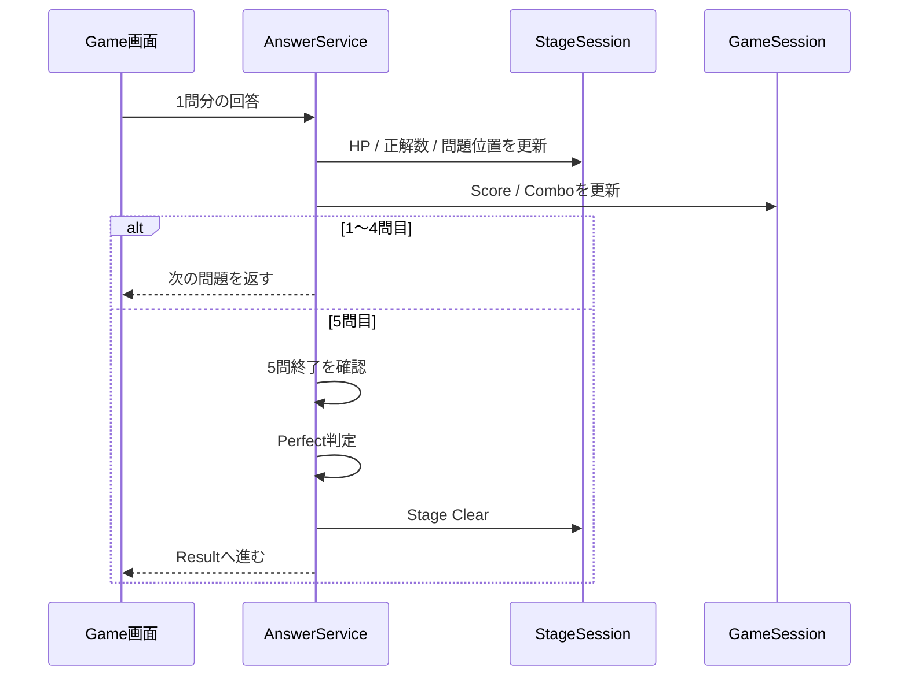

1～4問目は「次の問題」、5問目は「Perfect / Stage Clear判定」という役割分担です。


1～4問目：`回答 → 正誤判定 → HP/Combo/Score更新 → 履歴保存 → 次問題`

5問目：`5問目回答 → 正誤判定 → 履歴保存 → 5問終了 → Perfect判定 → Stage Clear判定 → Result`

## 33. クラス図
### Mermaid図

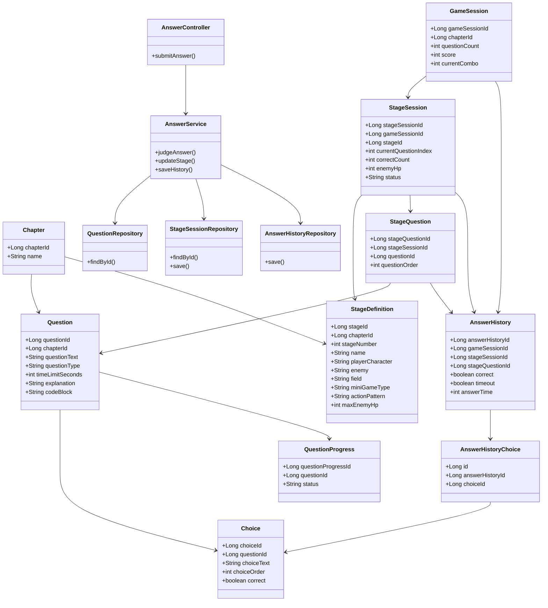

この図は「データを表すクラス」と「回答処理を担当するクラス」を一つの全体像として確認するための図です。


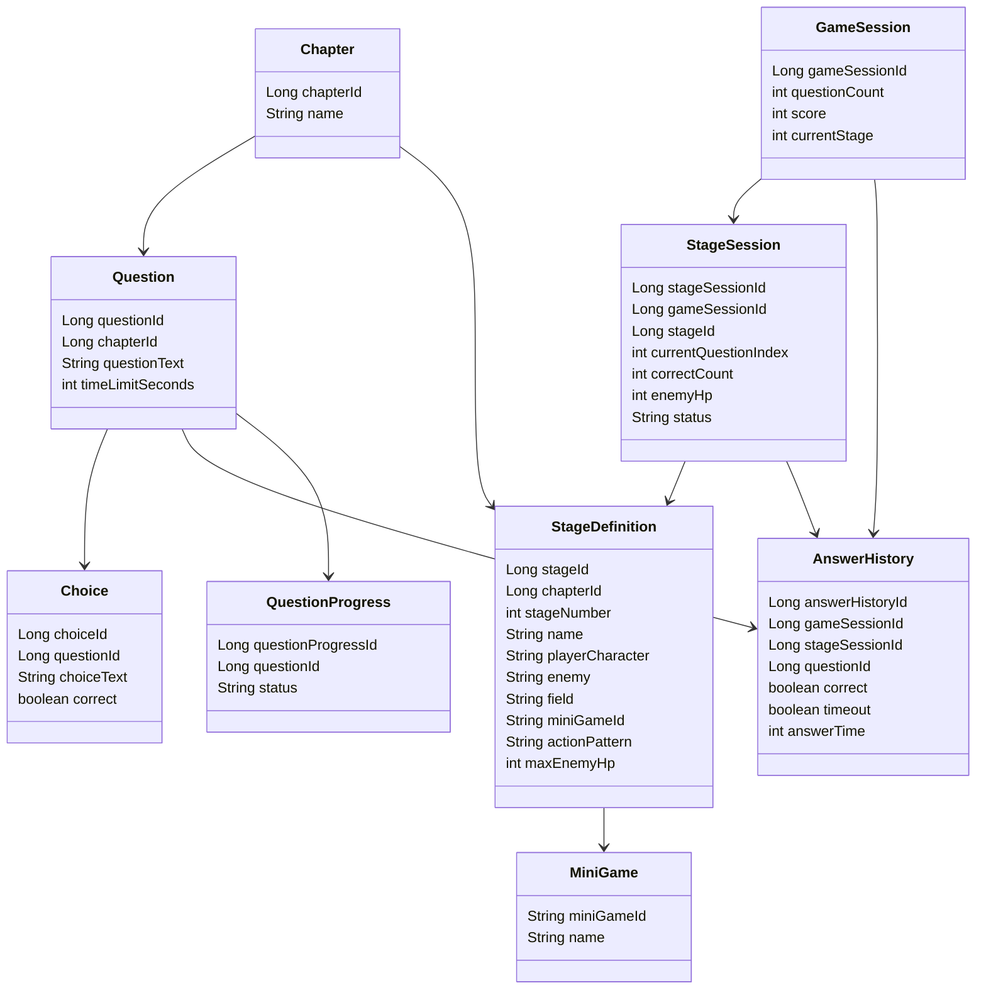

## 33.1 Javaクラス名

Controller：`ChapterController`, `GameSessionController`,
`AnswerController`, `ResultController`, `ReviewController`

Service：`ChapterService`, `GameSessionService`, `AnswerService`,
`ResultService`, `ReviewService`

Repository：`ChapterRepository`, `QuestionRepository`,
`ChoiceRepository`, `StageDefinitionRepository`,
`GameSessionRepository`, `StageSessionRepository`,
`AnswerHistoryRepository`, `QuestionProgressRepository`

Entity：`Chapter`, `Question`, `Choice`, `StageDefinition`,
`GameSession`, `StageSession`, `AnswerHistory`, `QuestionProgress`

## 33.2 詳細クラス図

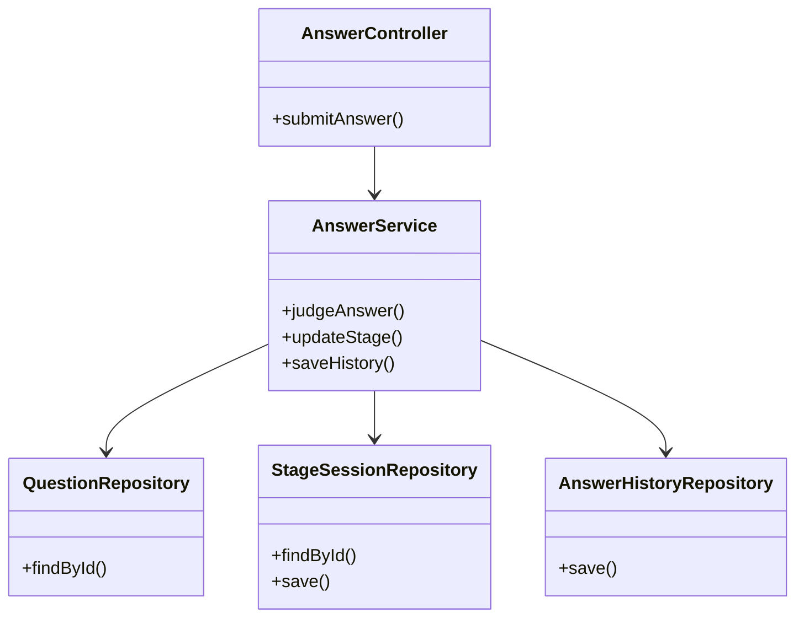

## 34. MiniGame / GameEffectの設計
### QuestionとMiniGameの分離

```text
┌─────────────────────┐
│ Question            │
│ 「何を答えるか」    │
└──────────┬──────────┘
           +
┌──────────▼──────────┐
│ MiniGame            │
│ 「どう遊ぶか」      │
└──────────┬──────────┘
           ↓
┌─────────────────────┐
│ 共通の回答結果      │
│ correct / HP /      │
│ Combo / Score       │
└─────────────────────┘
```

Questionの内容とゲーム演出を分けることで、同じ問題を別のMiniGameでも利用できます。


Questionは「何を答えるか」、MiniGameは「どう遊ぶか」を担当します。

MVP：Code Target、Code Whack-a-Mole、Typing Samurai、Code Breaker。

共通処理は回答判定・Score・Combo・履歴・Stage進行。MiniGameごとの処理は入力方法・キャラクター動作・攻撃演出です。

## 35. REST APIの事前確認
### REST APIの位置付け

```text
┌───────────────┐
│ Browser       │
│ HTML / JS     │
└───────┬───────┘
        │ HTTP / JSON
        ↓
┌───────────────┐
│ Controller    │
└───────┬───────┘
        ↓
┌───────────────┐
│ Service       │
└───────┬───────┘
        ↓
┌───────────────┐
│ Repository / DB│
└───────────────┘
```

APIは「画面とJavaをつなぐ窓口」です。URL、Request、Response、エラー時の扱いを同じ仕様で実装します。


APIは画面とJavaをつなぐ窓口です。

``` text
GET  /api/chapters
GET  /api/stages?chapterId=1
GET  /api/questions/{questionId}
POST /api/answers
GET  /api/results/{gameSessionId}
```

`POST /api/answers` Request：

``` json
{
  "gameSessionId": 1,
  "stageSessionId": 1,
  "questionId": 10,
  "selectedChoices": [2],
  "timeout": false
}
```

Response：

``` json
{
  "correct": true,
  "timeout": false,
  "enemyHp": 4,
  "combo": 1,
  "score": 100,
  "stageClear": false,
  "perfect": false,
  "nextQuestionId": 11
}
```

5問目は`stageClear=true`、5/5は`perfect=true`、次がなければ`nextQuestionId=null`とします。

## 36. 設計整合性チェック

  ルール                      要求   設計   API   実装
  --------------------------- ------ ------ ----- ------
  1 Stage = 5問               ○      ○      ○     確認
  敵HP = 5                    ○      ○      ○     確認
  正解でHP -1                 ○      ○      ○     確認
  不正解でHP維持              ○      ○      ○     確認
  時間切れでHP維持            ○      ○      ○     確認
  正解でCombo +1              ○      ○      ○     確認
  不正解・時間切れでCombo 0   ○      ○      ○     確認
  正解でScore +100            ○      ○      ○     確認
  5問終了でStage Clear        ○      ○      ○     確認
  5/5でPerfect                ○      ○      ○     確認
  回答履歴保存                ○      ○      ○     確認

## 37. 回答処理の共通ルール

``` text
回答受付 → 1回だけ確定 → 正誤判定 → StageSession更新 → GameSession更新 → AnswerHistory保存 → 結果返却
```

最終的な正誤判定はJava側で行います。

## 38. 二重回答防止

キー入力とTIME
UPが同時に発生しても、1問につき1回だけ回答を確定します。画面側で入力をロックし、サーバー側でも重複処理を防止します。

## 39. データモデル

-   Chapter：`chapterId`, `name`, `description`
-   Question：`questionId`, `chapterId`, `questionText`, `questionType`,
    `timeLimitSeconds`, `explanation`
-   Choice：`choiceId`, `questionId`, `choiceText`, `choiceOrder`,
    `correct`
-   StageDefinition：`stageId`, `chapterId`, `stageNumber`, `name`,
    `playerCharacter`, `enemy`, `field`, `miniGameId`, `actionPattern`,
    `maxEnemyHp`
-   GameSession：`gameSessionId`, `questionCount`, `score`,
    `currentStage`, `startedAt`, `endedAt`
-   StageSession：`stageSessionId`, `gameSessionId`, `stageId`,
    `currentQuestionIndex`, `correctCount`, `enemyHp`, `status`,
    `startedAt`, `endedAt`
-   AnswerHistory：`answerHistoryId`, `userId`, `gameSessionId`,
    `stageSessionId`, `questionId`, `correct`, `timeout`, `answerTime`,
    `answeredAt`
-   QuestionProgress：`questionProgressId`, `userId`, `questionId`,
    `status`, `lastAnsweredAt`

## 40. QuestionProgressとAnswerHistory

AnswerHistoryは「過去に何をしたか」、QuestionProgressは「現在どの程度学習できているか」を表します。

## 41. 学習状態

``` text
UNSEEN → REVIEW → CLEAR → MASTERED
```

MASTEREDの具体的条件は実装前に決定します。

## 42. 設計上の基本ルール

-   役割を分ける
-   同じ処理を重複させない
-   必要以上に複雑にしない
-   初心者でも読める名前にする

## 43. 画面とゲーム処理の分離

Java側：正誤判定、HP、Combo、Score、履歴、Stage判定。

JavaScript側：キー入力、画面更新、キャラクター演出、敵アニメーション、表示更新。

## 44. 設計から実装への流れ
### 将来の拡張イメージ

```text
Java Bronze
   ↓
Chapter追加
   ↓
Stage追加
   ↓
Question追加
   ↓
MiniGame追加
   ↓
Java Silver
   ↓
Java Gold
```

問題やChapterなどのデータ追加は既存処理をできるだけ変更せずに行える構造を目指します。新しいMiniGameは新しい処理コードの追加が必要です。


``` text
要求 → Use Case → データモデル → ロバストネス → シーケンス → クラス → REST API → Java実装 → HTML/CSS/JavaScript → テスト
```

## 45. 開発手順

1.  Spring Boot起動確認
2.  DB接続
3.  Entity
4.  Repository
5.  Service
6.  Controller
7.  API確認
8.  HTML/CSS
9.  JavaScript
10. 回答処理
11. Stage処理
12. ゲーム演出
13. 結果
14. 復習
15. テスト・修正

## 46. Git / GitHub

初心者でも変更内容が分かる日本語コミットを使用します。

例：`READMEを初心者向けに更新`、`回答判定処理を追加`、`Stage進行処理を追加`、`ゲーム画面を作成`、`回答履歴の保存処理を追加`

## 47. AI活用方針

AIは補助として使用します。

AIを活用：問題案、解説案、エラー原因調査、設計確認、コードの意味の説明。

自分で理解して行う：Javaコード入力、クラス作成、API実装、HTML/CSS/JavaScript調整、Git操作、テスト、エラー修正。

## 48. 問題データ

既存教材の文章をそのまま大量転載せず、学習用として自分で問題を構成します。

## 49. データ品質

問題文、正解、選択肢、解説、制限時間、複数選択数を確認します。

## 50. テスト

正解、不正解、時間切れ、Perfect、Stage
Clear、二重送信、履歴保存を確認します。

## 51. Must / Should / Could

Must：Chapter、Stage、5問、問題、キーボード回答、正誤、制限時間、HP、Combo、Score、履歴、結果、復習。

Should：ミニゲーム追加、Stage演出、Perfect演出、Time Attack。

Could：Blender 3D、キャラクター成長、ランキング、Java Silver / Gold。

## 52. 拡張方針

Chapter、Stage、Question、MiniGameを追加できる構造を目指します。Java
Silver、Java
Goldも将来的な拡張候補です。問題・Chapter・Stageなどのデータ追加は既存コードをできるだけ変更せずに行える構成を目指します。新しいMiniGameを追加する場合は、新しいゲーム処理のコード実装が必要です。

## 53. MVP

``` text
Chapter選択 → Stage開始 → 5問回答 → 正誤判定 → HP / Combo / Score → キャラクター反応 → 履歴保存 → Stage Clear → 結果 → 復習
```

まずJava Bronze学習ゲームを最後まで完成させることを最優先します。

## 54. 開発スケジュール

``` text
10/02 企画・検討
10/06 要求整理
10/09 分析
10/13 設計
10/14～ プログラミング
10/26 テスト・デバッグ・リファクタリング
10/28 提出物・発表資料
10/29 発表
```

## 55. 実装優先順位

最優先：Question、Answer、Stage、GameSession、AnswerHistory、Result、Review。

次：ゲーム演出、MiniGame追加、デザイン改善。

最後：3D、複雑なエフェクト、ランキング。

## 56. コードを書く前に確認

-   クラス名
-   データ項目
-   API
-   回答処理
-   Stageルール
-   HPルール
-   Perfect条件
-   履歴保存内容

## 57. 画面デザイン前に確認

-   問題文
-   選択肢
-   キー入力
-   タイマー
-   HP
-   Combo
-   キャラクター
-   正解・不正解表示
-   次問題への導線

## 58. 説明するときのポイント

最初は「Java
Bronzeの問題をゲーム形式で解く学習Webアプリです。」と説明します。

次に「正解するとキャラクターが攻撃し、敵のHPが減ります。1Stageは5問で、5問すべて正解するとPerfectになります。」と説明します。

技術説明は「画面はHTML/CSS/JavaScript、サーバー側はJava/Spring
Boot、データはデータベースで管理しています。」とします。

## 59. ポートフォリオで見せるポイント

Java、Spring Boot、データ管理、REST
API、ゲーム処理、画面制作、テストまで一通り経験したことを見せられる作品にします。

## 60. 現在の設計状態

要求、Use
Case、データモデル、データ関係、システム全体像、アーキテクチャ、ロバストネス、シーケンス、クラス図、REST
API、設計整合性を整理済みとします。ここからは設計を増やすより実装を進めます。

## 61. 実装時のルール

1.  小さく動かす
2.  1機能ずつ実装
3.  動いたらコミット
4.  分からないコードは確認
5.  AIコードを理解せず使わない
6.  エラー原因を確認
7.  設計とコードのズレを修正

## 62. 最終コンセプト

``` text
考える → キーを押す → すぐ反応 → キャラクターが動く → 敵HPが変化 → 結果が分かる → 次へ
```

## 63. 今後追加できる要素

新キャラクター、新しい敵、新Stage、新MiniGame、Java Silver、Java
Gold、3Dモデル、エフェクト、キャラクター成長、ランキングなど。MVP完成後に追加します。

## 64. README更新履歴

### 2026/10/07

-   ゲーム基本ループ更新
-   1Stage = 5問に統一
-   敵HP = 5に統一
-   Perfect条件統一
-   正解・不正解・時間切れを統一
-   データ関係、システム全体像、アーキテクチャを整理
-   要求モデル、Use Case、ロバストネス分析を整理
-   回答判定・時間切れ・Stage進行シーケンスを整理
-   クラス図・Javaクラス名を整理
-   REST APIのRequest / Responseを整理
-   設計整合性チェックを追加
-   Git / GitHub運用とAI活用方針を整理
-   実装優先順位を整理

## 65. 用語

  用語               意味
  ------------------ ------------------------
  Chapter            学習テーマ
  Question           問題
  Stage              5問を遊ぶ単位
  GameSession        1回のプレイ全体
  StageSession       現在のStage状態
  AnswerHistory      過去の回答記録
  QuestionProgress   問題ごとの学習状態
  API                画面とJavaをつなぐ窓口
  Controller         リクエスト受付
  Service            ゲームルール処理
  Repository         DBとのやり取り
  Entity             保存するデータ
  Boundary           画面
  Control            処理
  UML                システムを図で表す方法

## 66. READMEの使い方

コードを書くときはクラス名・データ・API・処理順を確認します。デザインするときは画面遷移・ゲーム画面・操作方法を確認します。説明するときは「何を作るか」「なぜ作るか」「どう動くか」「どう作るか」を確認します。

## 67. 開発開始チェック

``` text
□ Spring Boot起動
□ DB接続
□ Entity
□ Repository
□ Service
□ Controller
□ API
□ Question取得
□ Answer送信
□ 正誤判定
□ HP更新
□ Combo更新
□ Score更新
□ AnswerHistory保存
□ 5問でStage Clear
□ 5/5でPerfect
□ 結果画面
```

## 68. 完成の最終目標

Java
Bronzeを勉強したいが、通常の問題演習だけでは続きにくい人が、ゲーム感覚で何度も問題を解けるWebアプリを完成させます。

まずJava
Bronze学習ゲームを最後まで完成させることを最優先とし、3Dモデルや高度なエフェクトなどは完成後の追加機能とします。
