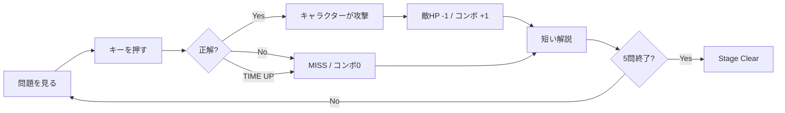
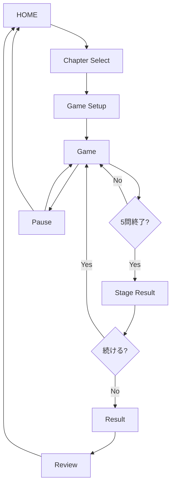
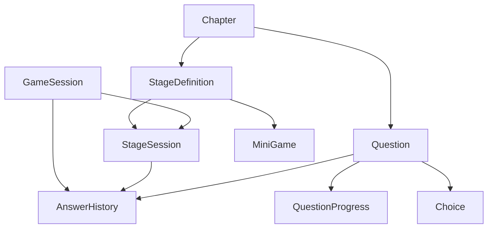
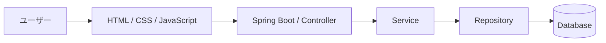
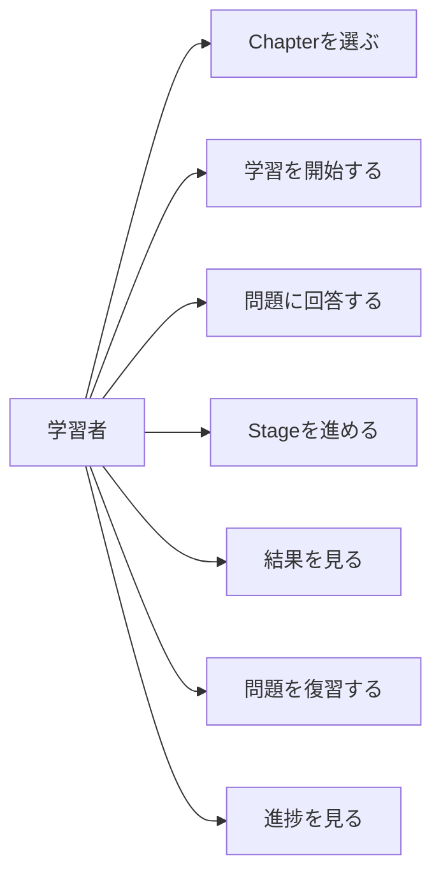
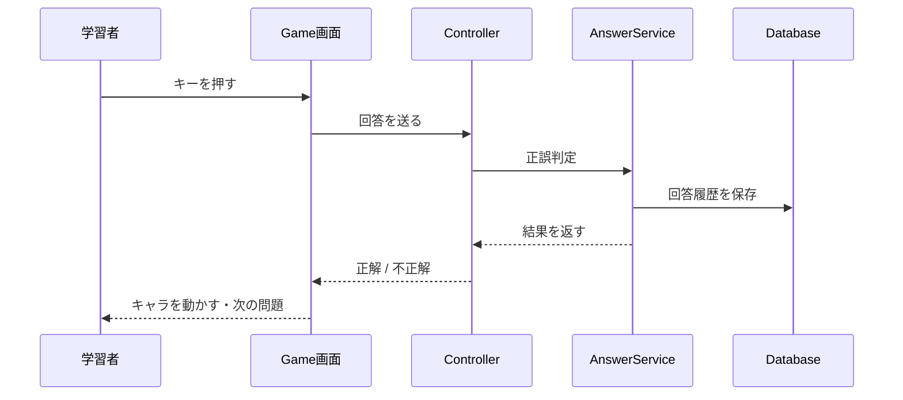
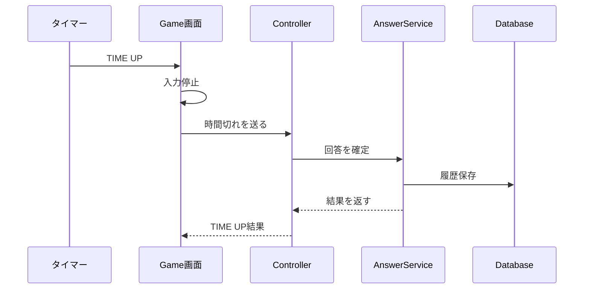
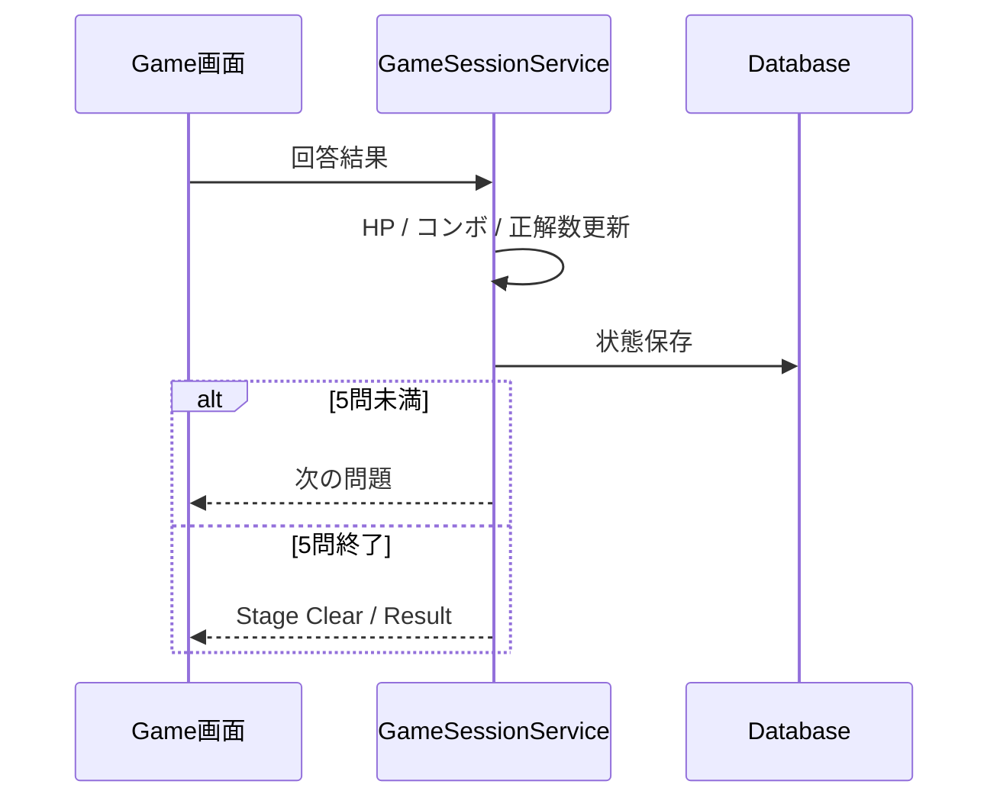
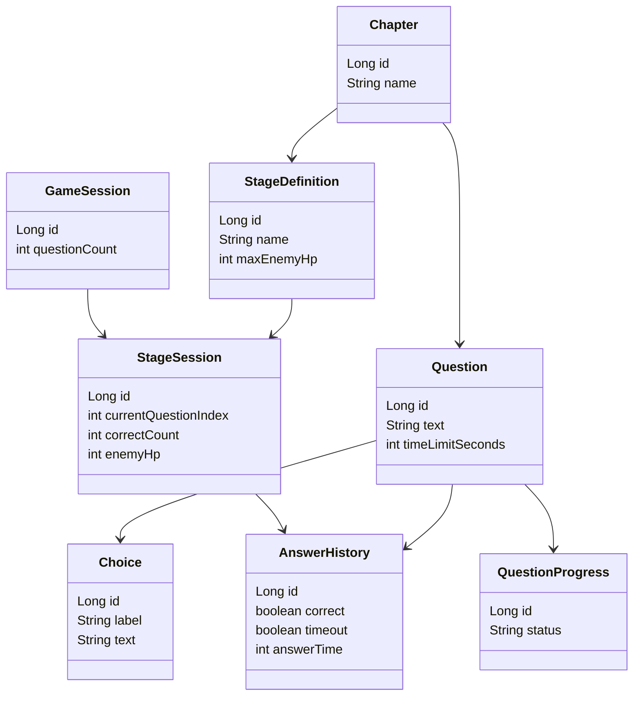

[README(2).md](https://github.com/user-attachments/files/33090922/README.2.md)
# Java Learning System

Java Bronzeを、**問題を解くだけで終わらない「遊びながら学べる体験」**にする学習Webアプリです。

> **考える → キーを押す → 即反応 → キャラクターが動く → 成功 / 失敗 → 気持ちいい → すぐ次**

Java Bronzeを学習している初学者が、問題を繰り返し解きながら、正解・不正解・復習をゲーム感覚で体験できることを目指します。

---

# 0. READMEの読み方

このREADMEは、次の順番で読めるようにしています。

1. **何を作るか**
2. **どのように遊ぶか**
3. **どのような画面・データ・処理で作るか**
4. **実装するときに何を作るか**
5. **今後どこまで拡張できるか**

学校提出用の専門用語の説明を増やすことより、**実際のコードを書く・画面を作る・他の人に説明するために必要な情報を残す**ことを優先します。

---

# 1. プロジェクト概要

| 項目 | 内容 |
|---|---|
| 作品名 | Java Learning System |
| 対象 | Java Bronzeを学習する初学者 |
| 種類 | Java学習支援Webアプリ |
| 学習方法 | 選択式問題 + キーボード操作 + ミニゲーム |
| 1 Stage | 5問 |
| 敵HP | 5 |
| 主な技術 | Java / Spring Boot / HTML / CSS / JavaScript / Database |
| 最優先 | Java Bronze学習ゲームを最後まで完成させる |

---

# 2. 開発背景と解決したい課題

Java資格の学習では、

```text
問題を解く
   ↓
間違える
   ↓
解説を読む
   ↓
もう一度解く
```

という学習を繰り返します。

この方法は知識を身につけるために重要ですが、同じ形式の問題を何度も解くと「勉強しているだけ」という感覚になり、継続しにくくなることがあります。

そこで、問題を解く行為そのものにゲームの反応を加えます。

```text
問題を解く
   ↓
キーを押す
   ↓
キャラクターが動く
   ↓
敵にダメージ
   ↓
コンボ・結果が表示される
   ↓
短い解説
   ↓
次の問題
```

### 解決したいこと

- 問題演習を続けやすくする
- 正解した瞬間に結果が分かるようにする
- キーボード操作でテンポよく回答できるようにする
- 間違えた問題をあとから復習できるようにする

---

# 3. 学習体験の基本ループ

本作品で最も重要なルールです。



### 正解

- 入力を受け付ける
- すぐに正解表示
- キャラクターが攻撃する
- 敵HPを1減らす
- コンボを1増やす
- 短い解説を表示
- 次の問題へ進む

### 不正解

- MISSを表示
- 敵HPは減らさない
- コンボをリセット
- 短い解説を表示
- 次の問題へ進む

### 時間切れ

- TIME UPを表示
- 入力を停止
- 敵HPは減らさない
- コンボをリセット
- 回答履歴を保存
- 解説を表示
- 次の問題へ進む

---

# 4. Chapter・Question Pool・Stageの関係

この3つを分けて考えます。

```text
Chapter
「何を学ぶか」
   ↓
Question Pool
「そのChapterの問題一覧」
   ↓
Stage
「今回は5問を使ってゲームする」
```

### Chapter

学習テーマです。

例：

- 変数
- 演算子
- 条件分岐
- 繰り返し
- 配列

### Question Pool

Chapterに属する問題の集まりです。

### Stage

Question Poolから選ばれた5問を使って、1つのゲームステージをプレイします。

---

# 5. Stageの基本仕様

**1 Stage = 5問 = 敵HP5** を基本ルールとします。

```text
Stage開始
  ↓
1問目 → 正解なら敵HP4
2問目 → 正解なら敵HP3
3問目 → 正解なら敵HP2
4問目 → 正解なら敵HP1
5問目 → 正解なら敵HP0
  ↓
Stage Clear
```

### Perfect

5問すべて正解した場合をPerfectとします。

```text
5問 / 5問 正解
   ↓
敵HP 0
   ↓
Perfect
   ↓
Stage Clear
```

派手な必殺技演出は追加候補であり、MVPではPerfect表示・HP0・Stage Clearまでを完成条件とします。

---

# 6. 5問・10問・20問のプレイ設定

プレイする問題数は変更できます。

| プレイ問題数 | Stage数 |
|---:|---:|
| 5問 | 1 Stage |
| 10問 | 2 Stage |
| 20問 | 4 Stage |

ただし、**1 Stage = 5問**は変えません。

同じGameSession内では、同じ問題が重複して出題されないようにします。

---

# 7. 問題形式

対応する問題形式は次の7種類です。

| 形式 | 内容 |
|---|---|
| A～E 単一選択 | 1つ選ぶ |
| A～G 単一選択 | 1つ選ぶ |
| A～E 複数選択 | 2つ選ぶ |
| A～G 複数選択 | 2つ選ぶ |
| A～G 複数選択 | 3つ選ぶ |
| コード選択 A～E | 1つ選ぶ |
| コード選択 A～G | 2つ選ぶ |

複数選択では、**正解の組み合わせと完全一致した場合のみ正解**とします。

---

# 8. キーボード操作

キーボード入力を中心にします。

### 単一選択

A～Gのキーを押した時点で回答します。

```text
A → 選択肢Aを回答
B → 選択肢Bを回答
...
G → 選択肢Gを回答
```

### 複数選択

```text
A～G → 選択状態を切り替える
Enter → 回答を確定
```

### その他

```text
Esc → Pause
```

マウス操作は補助として残してもよいですが、基本操作はキーボードとします。

---

# 9. 問題の時間制限

問題ごとに制限時間を持たせます。

基本的には、**実際の試験で理想的に回答できる時間を目安**に設定します。

データとしては、問題ごとに `timeLimitSeconds` を持たせます。

```text
Question
 ├─ 問題文
 ├─ 選択肢
 ├─ 正解
 └─ 制限時間
```

MVPでは、Stage側に別の時間設定を持たせず、**Questionの時間を使う**方針とします。

---

# 10. 長い問題への対応

Java Bronzeの問題文やコードが長い場合があります。

そのため、ゲーム画面では「問題を無理に小さく表示する」のではなく、PC画面の中で読みやすく分けます。

```text
┌───────────────────────┬───────────────────────┐
│ 問題・選択肢・タイマー │ キャラクター・敵・HP    │
│                       │                       │
│ Javaの問題文          │       GAME AREA       │
│ A～G                  │                       │
│                       │   Player  →  Enemy    │
└───────────────────────┴───────────────────────┘
```

左側を「学習」、右側を「ゲーム」として分けることで、長い問題でもゲーム部分を邪魔しにくくします。

---

# 11. ゲームUIの基本構成

ゲーム画面には最低限、次を表示します。

- 問題文
- 選択肢
- 残り時間
- プレイヤーキャラクター
- 敵キャラクター
- 敵HP
- コンボ
- 現在の問題数

### 画面イメージ

```text
┌─────────────────────────────────────────────┐
│ Q3 / 5                         TIME 08       │
├──────────────────────┬──────────────────────┤
│ Javaの問題文         │   プレイヤー  → 敵   │
│                      │                      │
│ A. ...               │   HP ███□□  COMBO 2 │
│ B. ...               │                      │
│ C. ...               │                      │
│ D. ...               │                      │
└──────────────────────┴──────────────────────┘
```

---

# 12. Stageごとのキャラクター・敵・フィールド

Stageが変わったとき、ゲームの見た目も変化させます。

例：

| Stage | プレイキャラ | 敵 | フィールド |
|---|---|---|---|
| Stage 1 | 剣士 | Java Guard | 草原 |
| Stage 2 | サラリーマン | Java Robot | オフィス |
| Stage 3 | 忍者 | Code Samurai | 城 |

重要なのは、**キャラクターや見た目が変わっても、問題判定や履歴保存の仕組みは共通にすること**です。

---

# 13. ミニゲーム

MVPでは、複数のミニゲームを用意します。

### MVP候補

- Code Target
- Code Whack-a-Mole
- Typing Samurai型の選択ゲーム
- Code Breaker

どのミニゲームでも、問題を解くことが中心です。

```text
Question
   ↓
正解 / 不正解
   ↓
共通の結果処理
   ├─ HP
   ├─ コンボ
   ├─ スコア
   ├─ 履歴
   └─ 次の問題
```

---

# 14. ミニゲームの拡張方針

新しいミニゲームを追加できる構造を目指します。

ただし、**「新しいミニゲームを追加するときにコードが不要」という意味ではありません。**

### データ追加で増やしやすいもの

- 新しいQuestion
- 新しいChapter
- 新しいStage
- 新しい敵
- 新しいプレイヤー
- Java Silver / Goldの問題

### コード追加が必要なもの

- 新しいMiniGameの動きそのもの
- 新しい特殊入力ルール
- 新しい特殊演出

既存の問題判定・履歴・学習進捗をなるべく変更せず、ミニゲーム部分だけ追加できる構造を目指します。

---

# 15. GameSession・StageSession

プレイ中の状態を管理します。

### GameSession

1回のプレイ全体を管理します。

```text
GameSession
 ├─ 5問  → Stage 1
 ├─ 10問 → Stage 1 + Stage 2
 └─ 20問 → Stage 1～4
```

### StageSession

現在プレイしている1 Stageの状態を管理します。

主な情報：

- 現在何問目か
- 正解数
- 敵HP
- Stage状態
- 開始時刻・終了時刻

---

# 16. 回答履歴と学習進捗

2つを分けて管理します。

### AnswerHistory

「過去に何が起きたか」を保存します。

例：

- どの問題か
- 正解か
- 時間切れか
- 回答時間
- いつ回答したか
- どのGameSession / StageSessionか

### QuestionProgress

「今その問題をどのくらい学習できているか」を管理します。

状態の例：

```text
UNSEEN
   ↓
REVIEW
   ↓
CLEAR
   ↓
MASTERED
```

`MASTERED`になる条件などの細かい値は実装前に決定します。

---

# 17. Result / Review

StageまたはGameSession終了後に結果を表示します。

### Result

- 正解数
- 不正解数
- 時間切れ数
- スコア
- 最大コンボ
- Perfectの有無
- Stage結果

### Review

間違えた問題や復習対象の問題を見返せるようにします。

---

# 18. スコア・コンボ

MVPでは複雑な計算を避けます。

```text
正解       → +100
不正解     → +0
時間切れ   → +0
```

### コンボ

```text
正解 → +1
不正解 → 0に戻す
時間切れ → 0に戻す
```

タイムボーナスなどの高度なスコア計算は完成後の拡張候補です。

---

# 19. Pause / Resume

ゲーム中に一時停止できるようにします。

```text
Game
 ↓
Pause
 ├─ Resume
 └─ Home
```

Pause中は問題への入力とタイマーを止めます。

---

# 20. 画面遷移



---

# 21. 画面一覧

### HOME

- Chapterを選ぶ
- 5 / 10 / 20問を選ぶ
- 学習を開始する

### Chapter Select

- Chapter一覧
- 学習進捗
- 復習対象の確認

### Game Setup

- 出題数
- 難易度やStage設定があれば表示

### Game

- 問題
- 選択肢
- タイマー
- プレイヤー / 敵
- HP / コンボ

### Result

- 成績
- スコア
- Stage結果

### Review

- 間違えた問題
- 解説
- 再挑戦

---

# 22. デザイン方針

目指すのは、**ポップで楽しいゲーム感覚 + 読みやすい学習画面**です。

参考にするのは、操作感やテンポの考え方です。

- Typing Land：キー入力と即時反応の気持ちよさ
- Ozawa-Ken：ゲームらしいテンポと演出
- 写真を大きく使うWebデザイン：画面全体の見せ方

ただし、キャラクター・ロゴ・画面・素材をそのままコピーしません。

### デザイン上の優先順位

1. 問題が読みやすい
2. キーを押した結果がすぐ分かる
3. ゲームらしく動く
4. Stageごとの雰囲気が変わる
5. 派手な演出は最後に追加する

---

# 23. データモデル

実装時に中心となるデータです。

| データ | 役割 |
|---|---|
| Chapter | 学習テーマ |
| Question | 問題本体 |
| Choice | 選択肢 |
| StageDefinition | Stageの設定 |
| StageSession | 現在のStage状態 |
| GameSession | 1回のプレイ全体 |
| AnswerHistory | 回答履歴 |
| QuestionProgress | 学習状態 |
| MiniGame | ミニゲーム設定 |

### StageDefinitionとStageSessionを分ける理由

```text
StageDefinition
「このStageはどういうStageか」

StageSession
「今このStageをどこまで進めているか」
```

この2つを混ぜないことで、設定とプレイ中の状態を分けて管理できます。

---

# 24. データの関係



### 重要な関係

- ChapterはQuestionを持つ
- QuestionはChoiceを持つ
- StageDefinitionはStageの設定を持つ
- GameSessionはStageSessionをまとめる
- AnswerHistoryは回答結果を保存する
- QuestionProgressは学習状態を保存する
- MiniGameはStageの遊び方に関係する

---

# 25. システム全体像



### 役割

**画面**

ユーザーが問題を見て、キーを押します。

**Java側**

問題取得・回答判定・Stage進行・履歴保存などを処理します。

**Database**

問題、回答履歴、学習状態などを保存します。

---

# 26. 基本アーキテクチャ

基本構成は3つの役割に分けます。

```text
画面
HTML / CSS / JavaScript
        ↓
処理
Controller / Service
        ↓
データ
Repository / Database
```

### Controller

画面からのリクエストを受け取ります。

### Service

「何をするか」を決めます。

例：

- 問題を取得する
- 回答を判定する
- Stageを進める
- 結果を計算する

### Repository

Databaseとのやり取りを担当します。

---

# 27. 要求モデル：このシステムでできること

ユーザーがすることを、まず日本語で整理します。

```text
Chapterを選ぶ
    ↓
学習を開始する
    ↓
問題を解く
    ↓
ミニゲームを遊ぶ
    ↓
結果を見る
    ↓
間違えた問題を復習する
```

主な機能：

- Chapter選択
- 学習開始
- 問題回答
- タイムアウト処理
- Stage進行
- 結果表示
- 復習
- 学習進捗確認

---

# 28. Use Case Diagram

READMEでは、細かいUML記号の説明より「誰が何をするか」を分かりやすくします。



---

# 29. ロバストネス分析

ロバストネス分析では、**画面・処理・データ**を分けて考えます。

```text
【画面】
Game画面
Result画面
Review画面
    ↓
【処理】
GameController
AnswerService
GameSessionService
ReviewService
    ↓
【データ】
Question
StageSession
AnswerHistory
QuestionProgress
```

### この図の目的

「画面の処理を全部1つの場所に書かないための整理」です。

---

# 30. シーケンス図：回答判定

1問に回答したときの処理順です。



### 実装上の重要点

回答を受け付けたら入力を一度ロックし、**二重送信を防止**します。

時間切れ処理とキー入力が同時に発生した場合も、1問につき1回だけ結果を確定させます。

---

# 31. シーケンス図：時間切れ



---

# 32. シーケンス図：Stage進行



---

# 33. クラス図

READMEでは「クラスの全部」ではなく、中心となるデータだけを表示します。



### クラス図の見方

```text
Chapter
  ↓
Question
  ↓
Choice
```

は「Chapterの中に問題があり、問題に選択肢がある」という意味です。

---

# 34. ミニゲーム設計

ミニゲームは「問題そのもの」と分けて考えます。

```text
Question
「何を答えるか」

      ＋

MiniGame
「どうやって遊ぶか」

      ↓

Answer Result
「正解 / 不正解」
```

### 共通にする処理

- 回答判定
- スコア計算
- コンボ更新
- 履歴保存
- Stage進行

### ミニゲームごとに変えてよい処理

- キャラクターの動き
- 入力方法
- 攻撃演出
- 成功演出

この分け方により、ゲームを追加しても学習データ側の処理をできるだけ再利用できます。

---

# 35. REST APIの位置付け

APIは、**画面とJava側をつなぐ窓口**です。

例えば、

```text
画面
 ↓
「この回答を送る」
 ↓
API
 ↓
Java
 ↓
正誤判定・保存
 ↓
結果を画面へ返す
```

実装時の候補として、次のようなAPIを用意します。

```text
GET  /api/chapters
GET  /api/questions/{id}
POST /api/answers
GET  /api/results/{gameSessionId}
```

実際のURLやrequest / responseの詳細は、実装時に決定します。

---

# 36. 設計整合性チェック

要求・設計・実装で、次のルールを共通にします。

| ルール | README | 実装 |
|---|---|---|
| 1 Stage = 5問 | ✅ | ✅ |
| 敵HP = 5 | ✅ | ✅ |
| 正解でHP -1 | ✅ | ✅ |
| 正解でコンボ +1 | ✅ | ✅ |
| 不正解でコンボ0 | ✅ | ✅ |
| 時間切れでHP維持 | ✅ | ✅ |
| 5問終了でStage Clear | ✅ | ✅ |
| Perfect = 5問全正解 | ✅ | ✅ |
| 回答履歴を保存 | ✅ | ✅ |

実装時にREADMEのルールとコードの動きがずれていないか確認します。

---

# 37. Java型とDatabase型の対応方針

詳細なDB設計は実装時に確定しますが、基本的にはJavaのデータ型とDBの型を対応させます。

例：

| Java | Databaseの例 |
|---|---|
| `Long` | BIGINT |
| `String` | VARCHAR / TEXT |
| `int` | INT |
| `boolean` | BOOLEAN |
| `LocalDateTime` | DATETIME / TIMESTAMP |

実際のDB製品と設定に合わせて調整します。

---

# 38. 開発で意識すること

難しい設計を増やすことより、次を優先します。

### 責任を分ける

問題取得、回答判定、履歴保存などを無理に1つへまとめない。

### 同じ処理を重複させない

問題判定や結果保存などは共通化する。

### 必要以上に複雑にしない

MVPで使わない機能のために複雑な仕組みを作らない。

---

# 39. Git / GitHubの運用

GitHubは、完成したコードを置くだけでなく、**どのように開発したかを残す場所**として使います。

### Commit

1回のコミットで、何を変えたか分かるようにします。

初心者の場合は日本語でも問題ありません。

例：

```text
READMEを初心者向けに更新
```

説明を付ける場合：

```text
READMEを更新し、ゲーム仕様・設計図・拡張方針を整理しました。
```

### ブランチ

大きな変更や試作をするときは、必要に応じて作業用ブランチを使います。

```text
main
 ├─ feature/game-screen
 ├─ feature/answer-logic
 └─ feature/result-screen
```

MVPでは、複雑なGit運用より、**変更内容が分かるコミットを残すこと**を優先します。

---

# 40. AI活用方針

AIは「全部作ってもらう」ためではなく、**考えるための補助**として使います。

### AIに任せやすいもの

- Java Bronze問題のアイデア出し
- 問題文のたたき台
- エラーの原因候補
- 設計案の比較
- README文章の整理
- テストケースのアイデア

### 自分で理解して行うもの

- Javaコードの入力・修正
- クラスの役割を決める
- DB設計の最終判断
- 画面デザイン
- ゲームルールの最終決定
- Gitへのコミット

### AI利用時のルール

生成されたコードは、そのまま使用せず、**何をしているコードなのか説明できる状態にする**ことを目標にします。

---

# 41. 問題作成・著作権・データ品質

問題はJava Bronze学習用として作成・整理します。

他者の教材やWebサイトの問題文をそのまま大量に転載するのではなく、必要に応じて自分で問題を作成・再構成します。

確認する項目：

- Javaの仕様と矛盾していないか
- 正解が明確か
- 複数選択の正解条件が明確か
- 解説と正解が一致しているか
- 問題文が長すぎないか
- 制限時間が適切か

---

# 42. テスト方針

MVPでは、まず実際に画面を操作して動作を確認します。

### 重点テスト

#### 正解

```text
キー入力
↓
正解
↓
キャラクター攻撃
↓
HP -1
↓
コンボ +1
```

#### 不正解

```text
MISS
↓
HP変化なし
↓
コンボ0
```

#### 時間切れ

```text
TIME UP
↓
入力停止
↓
HP変化なし
↓
コンボ0
↓
履歴保存
```

#### Perfect

```text
5問すべて正解
↓
HP0
↓
Perfect
↓
Stage Clear
```

#### 重複送信

1問に対して結果が2回保存されないことを確認します。

---

# 43. Must / Should / Could

## Must：完成に必須

- Java Bronze問題
- A～E / A～G
- 単一・複数選択
- 問題ごとの制限時間
- 正誤判定
- 解説
- ミニゲーム
- 1 Stage = 5問
- 敵HP5
- スコア
- 回答履歴
- 復習
- Java / Spring Boot
- HTML / CSS / JavaScript
- Database

## Should：余裕があれば追加

- ミニゲーム追加
- コンボ演出強化
- タイムアタック
- Stage演出強化
- Result演出
- 成績グラフ
- サウンド
- アニメーション

## Could：完成後の候補

- Blender 3D
- 複雑なエフェクト
- キャラクター成長
- Java Silver / Gold
- オンラインランキング
- 3Dステージ

最優先は、**Java Bronze学習ゲームを最後まで完成させること**です。

---

# 44. 将来の拡張

このシステムでは、問題・Chapter・Stageなどを追加できる構造を目指します。

```text
Java Bronze
   ↓
Chapter追加
   ↓
Stage追加
   ↓
Question追加
   ↓
Silver / Gold追加
```

### 追加しやすくしたいもの

- Question
- Chapter
- Stage
- キャラクター
- 敵
- フィールド
- MiniGame設定
- Java Silver / Goldの問題

### 将来的な問題管理

最終的には、問題をコードに直接大量に書くのではなく、JSON / CSVなどのデータとして管理する方法も検討します。

---

# 45. MVP完成条件

以下を満たしたら、MVP完成とします。

```text
① Chapterを選べる
        ↓
② 5問のStageを開始できる
        ↓
③ A～Gなどのキーで回答できる
        ↓
④ 正解 / 不正解 / 時間切れを判定できる
        ↓
⑤ 正解時にキャラクターが動く
        ↓
⑥ 敵HPが正しく変化する
        ↓
⑦ 5問でStage Clearできる
        ↓
⑧ Perfectを判定できる
        ↓
⑨ 回答履歴を保存できる
        ↓
⑩ Result / Reviewを表示できる
```

ここまで完成したら、追加演出よりも**安定動作と説明できる状態**を優先します。

---

# 46. 実装フェーズの順番

コードを書く順番を決めておきます。

### Step 1：プロジェクト基本設定

- Spring Boot
- Database接続
- Git管理

### Step 2：Chapter / Question

- Chapter取得
- Question取得
- Choice取得

### Step 3：GameSession / StageSession

- 5問開始
- 現在問題番号
- 敵HP
- 正解数

### Step 4：回答判定

- 単一選択
- 複数選択
- 時間切れ
- 二重送信防止

### Step 5：履歴

- AnswerHistory
- QuestionProgress

### Step 6：ゲーム画面

- 問題表示
- キー入力
- HP表示
- キャラクター表示

### Step 7：ミニゲーム演出

- 攻撃
- MISS
- TIME UP
- コンボ

### Step 8：Result / Review

- 結果表示
- 復習

### Step 9：UI改善

- デザイン
- アニメーション
- 効果音

### Step 10：テスト・修正

- 正解
- 不正解
- 時間切れ
- Stage Clear
- Perfect
- 二重送信

**演出より先に、学習機能とゲーム進行を完成させます。**

---

# 47. 実際にコードを書くときの確認項目

実装中に迷ったら、次を確認します。

### 問題

- このQuestionは何を学ばせる問題か
- 正解は明確か
- 制限時間はあるか

### 回答

- 単一選択か複数選択か
- キー入力をどう受け取るか
- 1問1回だけ確定するか

### Stage

- 今何問目か
- 敵HPはいくつか
- Stage終了条件は5問か

### 結果

- 正解数は正しいか
- スコアは正しいか
- 履歴が保存されているか

### UI

- 問題が読めるか
- キー入力が分かるか
- 正解 / 不正解がすぐ分かるか
- キャラクターが反応するか

---

# 48. デザインするときの確認項目

画面を作るときは、まず見た目より使いやすさを確認します。

```text
読みやすい
   ↓
押しやすい
   ↓
反応が分かる
   ↓
ゲームとして楽しい
```

### 色・装飾

- 問題文と背景を区別する
- 正解 / 不正解を視覚的に分ける
- タイマーを見やすくする
- HPを一目で分かるようにする

### アニメーション

最初から大量に入れず、

```text
正解 → 攻撃
不正解 → MISS
時間切れ → TIME UP
Perfect → 特別演出
```

のように意味があるところから追加します。

---

# 49. 人に説明するときのポイント

先生や企業に説明するときは、難しい言葉を先に並べません。

### まず一言

> Java Bronzeの問題演習にゲーム性を加え、楽しく繰り返し学習できるWebアプリです。

### 次にゲームの流れ

> 1 Stageは5問で、正解するとキャラクターが攻撃し、敵のHPが1減ります。5問すべて正解するとPerfectになります。

### 次に技術

> Java / Spring Bootを中心に、HTML・CSS・JavaScriptとDatabaseを組み合わせています。

### 最後に工夫

> 問題データとゲーム演出を分け、新しい問題やStageを追加しやすくしています。

この4つを説明できれば、READMEの細かい設計用語をすべて暗記する必要はありません。

---

# 50. 学校提出物との対応

学校提出で必要になる資料は、READMEの内容から整理できます。

| 学校で必要な内容 | READMEで対応する場所 |
|---|---|
| 何を作るか | 1～2 |
| どんな問題を解決するか | 2 |
| システム全体像 | 25～26 |
| 要求モデル | 27～28 |
| 分析・整理 | 23～29 |
| 設計モデル | 30～36 |
| 実装方針 | 46～48 |
| テスト | 42 |
| 拡張性 | 14・44 |
| AI活用 | 40 |
| Git / GitHub | 39 |

READMEは学校提出資料そのものではなく、**プロジェクト全体を確認するための中心資料**として使います。

---

# 51. 開発スケジュール

現在の学校スケジュールを目安に、設計を長引かせず実装へ移ります。

| 時期 | 主な内容 |
|---|---|
| 10/2 | 検討項目1～5 |
| 10/6 | 要求整理 |
| 10/9 | 分析 |
| 10/13 | 設計 |
| 10/14～ | プログラミング |
| 10/26 | テスト・デバッグ・リファクタリング |
| 10/28 | 提出物・発表資料 |
| 10/29 | 発表 |

進捗に遅れが出た場合は、Should / Couldを削ってMVP完成を優先します。

---

# 52. 現在の開発方針

現在は、設計を無限に増やす段階ではありません。

```text
仕様を確認
   ↓
必要な画面・データを決める
   ↓
Java / DBの実装
   ↓
画面実装
   ↓
ゲーム反応
   ↓
テスト
```

特に、**Blenderや派手な演出より、Java Bronze学習機能の完成を優先**します。

---

# 53. 実装前に決める項目

大枠は決定していますが、実装時に具体値を決めます。

- 実際のQuestion件数
- Chapterごとの問題配分
- 各Questionの制限時間
- `MASTERED`の判定条件
- Stageの具体的な敵・キャラクター素材
- ミニゲームごとの具体的な入力方法
- 音声・BGMの有無
- 認証をMVPに入れるか
- レスポンシブ対応の範囲
- DBのINDEXや制約
- APIのrequest / response形式

ここで決める内容は、基本仕様を変更するものではなく、**実装に必要な具体値を決める作業**です。

---

# 54. 開発上の基本ルール

1. **Java Bronze学習ゲームを最後まで完成させる。**
2. 仕様を勝手に増やさず、READMEを基準にする。
3. 難しい設計を追加する前に、MVPが完成するか考える。
4. AIが出したコードは内容を理解してから使用する。
5. 動かないときは、まず小さく切り分ける。
6. Gitにこまめにコミットする。
7. READMEと実装の仕様がずれたら更新する。

---

# 55. 最終コンセプト

## Java Learning System

**Javaを、遊びながら身につけよう。**

```text
Java Bronze問題
      ↓
キーボードで回答
      ↓
キャラクターが動く
      ↓
敵にダメージ
      ↓
正解 / 不正解を体感
      ↓
結果を保存
      ↓
復習
```

学習問題だけでも、ゲームだけでもありません。

**「問題を解くこと」と「ゲームで反応すること」を1つの体験にすること**が、この作品の中心です。

---

# 56. README更新履歴

| 日付 | 内容 |
|---|---|
| 2026/10/06 | READMEを再構成。実装・デザイン・説明に必要な内容を中心に整理 |
| 2026/10/06 | 1 Stage = 5問、敵HP5、Perfect、Stageごとのキャラクター変更を反映 |
| 2026/10/06 | 画面遷移、システム全体像、データモデル、クラス図、シーケンス図を簡略化 |
| 2026/10/06 | Python / FastAPI、詳細なSOLID説明、Axiomatic Design、ICONIX詳細説明などをREADMEから整理 |

---

## READMEの方針

このREADMEは「専門用語をたくさん並べた資料」ではなく、

> **自分がコードを書き、画面を作り、動作を説明するための設計メモ兼プロジェクト紹介**

として使います。
