# Java Learning System

> 本READMEは、設計説明だけでなく、Java / Spring Boot / JPA / JavaScriptへそのまま落とし込めるよう、時間管理・JPAリレーション・DTO/API名・Stage進行・Pause/Resume・二重実行・Question選択・Stage Clear条件を実装固定仕様として追加しています。以降のコードはこのREADMEをSource of Truthとして作成します。

Java
Bronzeを学習している初学者を対象とした、ゲーム感覚でJavaの問題を学習できるWebアプリケーションです。

## 1. プロジェクト概要

## 開発に必須の設計図一覧

このREADMEでは、実際にJava / Spring Boot / JavaScript / DBを実装するときに参照する図を、設計の流れに沿って整理しています。

| 図 | 目的 |
|---|---|
| 学習体験の基本ループ | 正解・不正解・時間切れ・攻撃・HP・5問終了のルールを確認する |
| 画面遷移図 | HOMEからGame、Result、Reviewまでの画面の移動を確認する |
| データの関係図 | Entity同士の関係と外部キーの流れを確認する |
| システム全体像 | ユーザー・画面・Spring Boot・DBのつながりを確認する |
| 回答判定シーケンス | 1問を回答したときの処理順を確認する |
| 時間切れシーケンス | TIME UP発生時の処理順を確認する |
| Stage進行シーケンス | 1～4問目と5問目の違いを確認する |
| クラス図 | Entity・Controller・Service・Repositoryの役割と関係を確認する |
| 画面レイアウト | Game画面の配置を確認する |
| 現状課題 vs 本アプリ | 何を解決するアプリなのかを確認する |
| Chapter / Pool / Stage | 学習テーマ・問題群・ゲーム単位の関係を確認する |
| Use Case Diagram | 学習者が何をできるかを確認する |
| ロバストネス分析 | 画面・処理・データを分けて確認する |
| MiniGame分離 | QuestionとMiniGameを分離する理由を確認する |
| REST APIの位置付け | 画面とJavaの通信方法を確認する |
| 一時停止 | Pause / Resume / Homeの状態を確認する |
| 将来の拡張 | BronzeからSilver / Goldへ広げる方法を確認する |
| デザイン優先度 | 読みやすさ・操作性・反応・楽しさの優先順位を確認する |


Java Bronzeの問題をゲーム形式で解くWebアプリです。

基本ループ：

``` text
Chapterを選ぶ
↓
Stage開始
↓
Java問題を表示
↓
キーボードで回答
↓
正解・不正解・時間切れを判定
↓
キャラクターが反応
↓
敵HP・コンボ・スコアを更新
↓
説明
↓
次の問題
↓
5問終了
↓
Stage Clear / Perfect
↓
結果・復習
```

## 2. 作成する理由

### 現状の課題と本アプリ

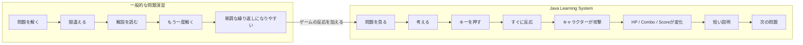

通常の資格学習では「問題を解く→間違える→解説を読む」の繰り返しになりやすいため、問題演習にゲームの反応を加えて、繰り返し学習しやすくすることを目的とします。

## 3. 学習体験の基本ループ

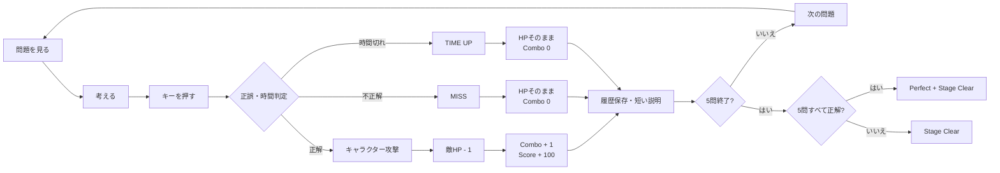

この図をゲーム処理の最重要ルールとして扱います。回答からゲーム上の反応までをできるだけ短くすることを重視します。

## 4. Chapter / Question / Stage

### Chapter / Question / Stageの関係

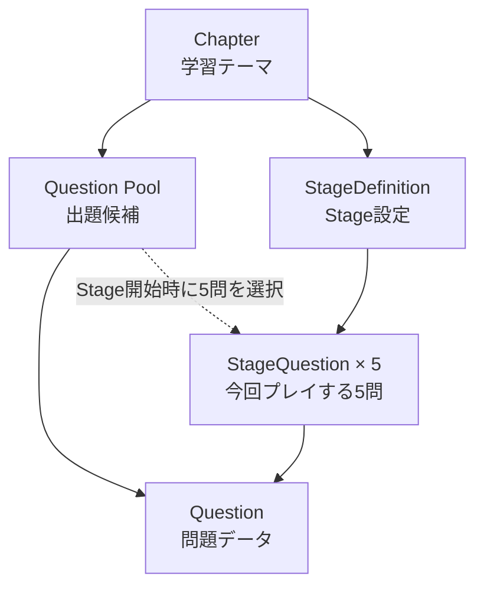

- **Chapter**：学習テーマ
- **Question Pool**：そのChapterで出題できる問題の集まり
- **Question**：実際に解く問題
- **StageDefinition**：キャラクター・敵・フィールド・MiniGameなどのStage設定
- **StageQuestion**：今回のStageで実際に使う5問を固定したデータ

Stageはゲーム中に自動進行します。Stageを個別に選択したり、Stageを自由選択したりする方式はMVPでは採用しません。

Stageを開始すると、Question Poolから5問を選び、`StageQuestion`として1～5問目の順番を固定します。

### 実装上の固定ルール

```text
1 Stage = 5問
敵HP = 5
StageQuestion = 必ず5件
StageNumber / Stageの選択 = 自由選択不可・Stage 1から自動進行
```

## 5. Chapterの進め方

Chapterは自由に選択できます。学習者は自分が学びたい分野を選んで開始します。

Stageはプレイ中に自動で進みます。Chapter選択後に「5問・10問・20問」を選択する画面を設け、その選択内容でGameSessionを開始します。Stageを個別選択する画面は設けません。

5問ならStage 1だけ、10問ならStage 1→Stage 2、20問ならStage 1→Stage 2→Stage 3→Stage 4と自動進行します。

## 6. 1 Stage = 5問

MVPでは1 Stageを必ず5問に固定します。

```text
1問目 → 2問目 → 3問目 → 4問目 → 5問目
```

`StageQuestion`は必ず5件作成し、`questionOrder`は1～5で管理します。

## 7. 敵HP

MVPでは1 Stageの敵HPを必ず5に固定します。

```text
開始：HP 5
正解1回：HP 4
正解2回：HP 3
正解3回：HP 2
正解4回：HP 1
正解5回：HP 0
```

`StageDefinition.maxEnemyHp`は将来の拡張余地として保持しますが、MVPでは必ず5とします。

## 8. プレイ問題数

MVPでは5問・10問・20問から選択します。

```text
5問  = 1 Stage
10問 = 2 Stage
20問 = 4 Stage
```

GameSessionはChapterと5/10/20問の問題数を選択して開始します。開始StageはChapter内のStage 1です。10問・20問の場合は、同じChapter内で`stageNumber`が次のStageへ自動的に進みます。必要なStage数が存在しない場合、そのGameSessionは開始できません。

Stageの解放条件は設けません。

同じGameSession内では、同じQuestionを重複して選出しません。したがって開始時に、必要な問題数以上のQuestionがQuestion Poolに存在することを確認します。

## 9. 問題形式

-   A～Eから1つ
-   A～Gから1つ
-   A～Eから2つ
-   A～Gから2つ
-   A～Gから3つ
-   コード選択 A～Eから1つ
-   コード選択 A～Gから2つ

複数選択は正解の組み合わせと完全一致した場合を正解とします。

## 10. 長い問題への対応

### 画面レイアウトイメージ

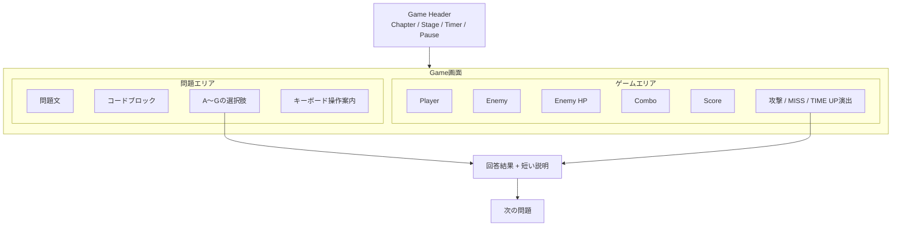

左側は「考えるための情報」、右側は「ゲームの反応」を担当します。問題の読みやすさを優先しながら、回答直後のゲーム反応も見える構成にします。

## 11. キーボード操作

単一選択：A～Gを押して回答。複数選択：A～Gで選択しEnterで確定。Esc：一時停止。マウスは補助操作とします。

## 12. 制限時間

制限時間は問題ごとの `Question.timeLimitSeconds` で管理します。問題が表示されただけではタイマーを開始せず、**Enterを押して問題開始を確定し、Start APIが成功した時点からカウントを開始**します。

Stage側に別の制限時間は持たせません。

### Timer開始の流れ

```text
1. 問題を表示
2. WAITING_TO_START
3. Enter
4. POST /api/stage-questions/{stageQuestionId}/start
5. JavaがstartedAtを記録
6. 200 OKを返す
7. JavaScriptが返却されたremainingTimeMsを基準にTimer表示を開始
```

`WAITING_TO_START`ではTimerが未開始のため、`remainingTimeMs`は`null`で返却します。

`remainingTimeMs == null`の場合、JavaScriptは`timeLimitSeconds × 1000`を初期表示するだけで、カウントダウンを開始しません。`null`を数値計算に直接使用して`NaN`を発生させないようにします。

### 残り時間の計算

サーバーは`StageQuestion.startedAt`、`StageQuestion.pausedAt`、`StageQuestion.totalPausedMs`、現在時刻を使用して残り時間を計算します。

```text
effectiveNow =
    StageQuestion.pausedAt != null
        ? StageQuestion.pausedAt
        : 現在時刻

elapsedMs =
    max(
        0,
        effectiveNow - StageQuestion.startedAt
        - StageQuestion.totalPausedMs
    )

remainingTimeMs =
    max(
        0,
        Question.timeLimitSeconds * 1000
        - elapsedMs
    )
```

上記の日時の差はミリ秒で計算します。Javaでは`Instant`と`Duration.between(...).toMillis()`を使用し、経過時間は`long`で扱います。

Pause中は`StageQuestion.pausedAt`を`effectiveNow`として使用するため、Pause中にRefreshや現在状態の取得を行っても残り時間は減少しません。

`StageSession.pausedAt`もStage全体のPause記録として保持し、Pause開始時には`StageQuestion.pausedAt`と同じ時刻を設定します。ただし、問題ごとの残り時間の計算には`StageQuestion.pausedAt`を使用します。

残り時間の最終値は0未満にしません。

JavaScriptのTimerは表示専用です。JavaScriptのローカル経過時間を正解判定には使用しません。

`GET /api/game-sessions/{gameSessionId}/current`では、Java側がその時点の残り時間を再計算して返します。Refresh後のTimer表示も、この返却値を基準に復元します。

### 時間切れの判定

`POST /api/answers`を受信したとき、Java側で必ず残り時間を再計算します。

サーバー計算で`remainingTimeMs <= 0`の場合はTIME UPとして処理します。画面上では残り時間があっても、通信遅延などによってサーバー側ですでに時間切れになっていれば、TIME UPを優先します。

`selectedChoiceIds`が空配列であることだけを理由にTIME UPにはしません。空配列の回答は、Java側で時間切れが確認された場合に限ってTIME UPとして処理します。時間が残っている場合は`400 INVALID_ANSWER_COUNT`とします。

### 回答時間の計算

`answerTimeMs`は次式で固定します。

```text
answerTimeMs =
    max(
        0,
        answeredAt - startedAt - totalPausedMs
    )
```

`startedAt`、`answeredAt`、`pausedAt`は`Instant`で管理し、`answerTimeMs`の単位はミリ秒です。

回答はPause中には受け付けません。Resume後の回答では、完了したPause時間が`totalPausedMs`に加算されているため、Pause時間を回答時間に含めません。

時間切れの最終判定はJava側だけで行います。

## 13. 正解時

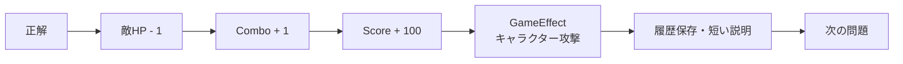

`GameEffect`はJavaScript側の演出処理です。Java側は正誤・時間・HP・Combo・Score・Stage Clear・Perfectを確定し、JavaScriptは受け取った結果だけを演出します。

## 14. 不正解時

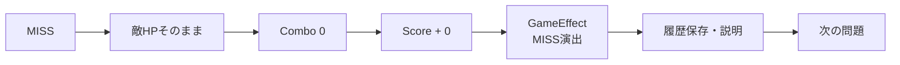

MVPではMISS時にも、敵・背景・UIのいずれかが短く反応する演出を入れます。

## 15. 時間切れ

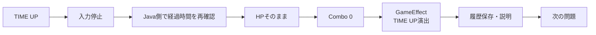

タイマーが0になったら、画面側は入力をロックして回答確定要求を送信します。最終的な時間切れ判定はJava側が行います。

## 16. Score

MVPでは、正解+100、不正解+0、時間切れ+0とします。

ScoreはGameSession単位で累積します。

## 17. Combo

正解で+1、不正解・時間切れで0に戻します。

Comboは**Stage単位**で扱い、Stage開始時に0へリセットします。Stageをまたいで引き継ぎません。

## 18. Stage Clear

5問すべて回答するとStage Clearです。

```text
Stage Clear = 5問を最後までプレイした
Perfect     = 5問すべて正解した
```

0～4問正解でもStage自体はClearします。学習を最後までやり切ることを重視したルールです。

## 19. Perfect

Perfectは**Stage単位**で判定します。

```text
5問すべて正解
↓
敵HP 0
↓
Perfect
↓
Stage Clear
```

10問・20問プレイの場合は、PerfectになったStageの数をGame Resultに表示します。

派手な必殺技演出はMVP完成後の追加機能とし、MVPではPerfect専用エフェクトまでを基本とします。

## 20. Stageごとの変化

Stageごとに、プレイヤー・敵・フィールドを変更します。コードでは名前そのものではなくKeyで管理します。

```text
playerCharacterKey
enemyKey
fieldKey
```

例：

```text
Stage 1
playerCharacterKey = SWORDSMAN
enemyKey            = JAVA_GUARD
fieldKey            = GRASSLAND

Stage 2
playerCharacterKey = SALARYMAN
enemyKey            = JAVA_ROBOT
fieldKey            = OFFICE

Stage 3
playerCharacterKey = NINJA
enemyKey            = CODE_SAMURAI
fieldKey            = CASTLE
```

表示名・画像・アニメーションはKeyからJavaScript側で解決します。

## 21. 画面遷移図

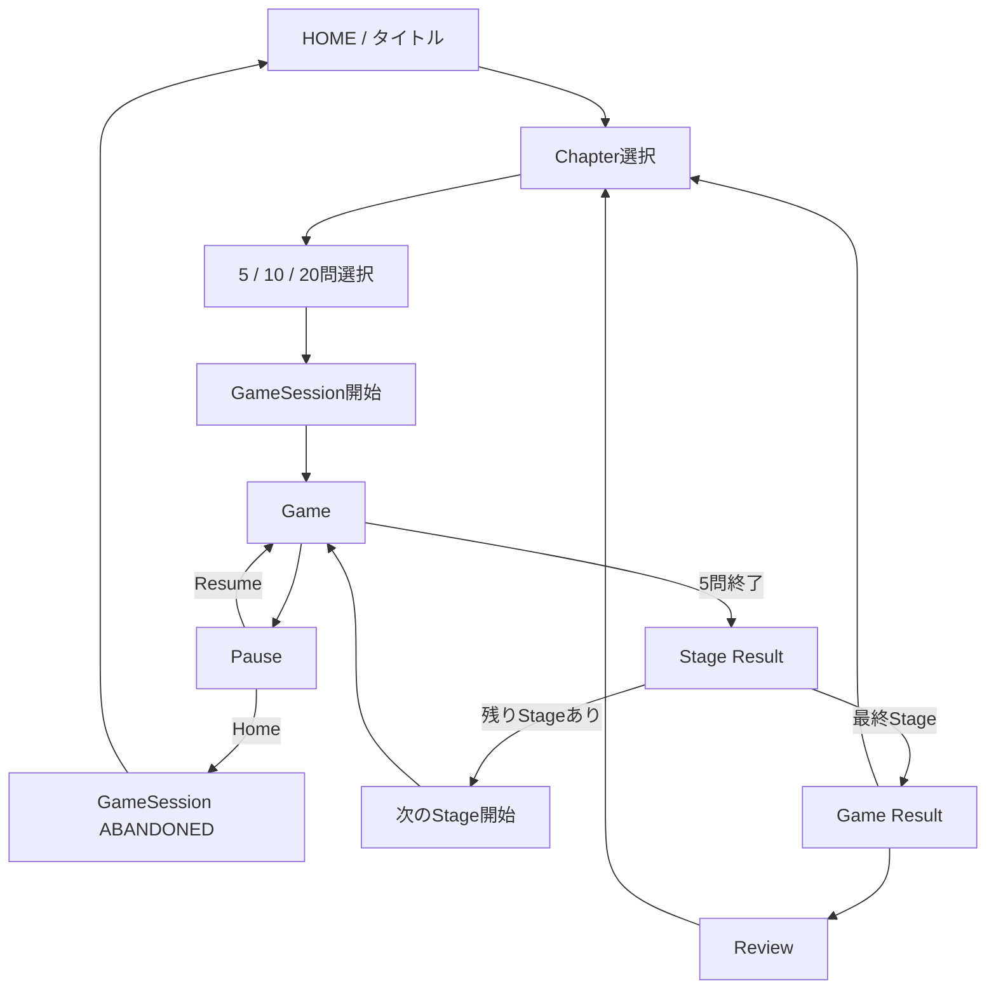

10問・20問ではStage Resultを挟みながら次のStageへ進み、すべてのStageが終了したらGame Resultへ進みます。

Stageは自由選択ではありません。1つのGameSession内ではStage 1から始まり、2～4 Stageが必要な場合は`stageNumber + 1`で自動進行します。

## 22. 画面一覧・一時停止

### 画面一覧

- HOME
- Chapter Select
- Chapter / Question Count Select
- Game
- Pause
- Stage Result
- Game Result
- Review

### 一時停止のルール

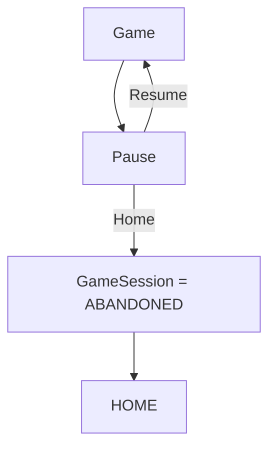

- Pause中は回答入力を受け付けない
- Pause中はタイマーを進めない
- Resumeすると同じStage・同じStageQuestionから再開する
- Homeを選ぶと「セーブされませんがゲームを終了しますか？」と確認し、終了を選んだ場合は現在のGameSessionを`ABANDONED`として終了する
- ABANDONEDのGameSessionは自動復帰しない。終了時点のゲーム内容はセーブしない

### Refresh / ブラウザ再読み込み

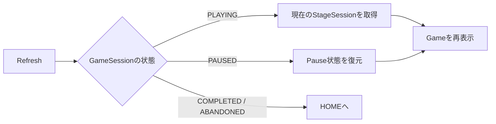

再読み込み・再アクセス時に進行中のGameSessionがある場合は「続きから再開しますか？」と確認します。再開を選んだ場合は現在のStage・問題・Score・Combo・時間状態などを復元します。終了済みとしてABANDONEDにしたゲームは再開しません。

## 23. デザイン方針

### デザイン優先度

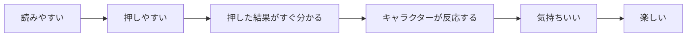

見た目だけを派手にするのではなく、まず「問題が読みやすい」「答えやすい」「反応が分かる」を優先します。

### 回答UIの状態

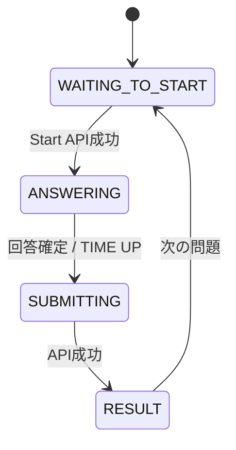

`SUBMITTING`中は、選択肢・Enter・A～Gキーなどの入力をすべてロックします。これにより、連打や二重送信を防ぎます。

`GameEffect`はJavaScript側の演出処理として実装し、Java側から受け取った結果に応じて攻撃・MISS・TIME UP・Perfectなどを表示します。

Stageのプレイヤー・敵・フィールドは`playerCharacterKey`、`enemyKey`、`fieldKey`で管理します。

Typing LandやOzawa-Kenは操作テンポやゲームとしての気持ちよさの参考とし、キャラクター・ロゴ・画面・素材はコピーしません。

## 24. データの関係

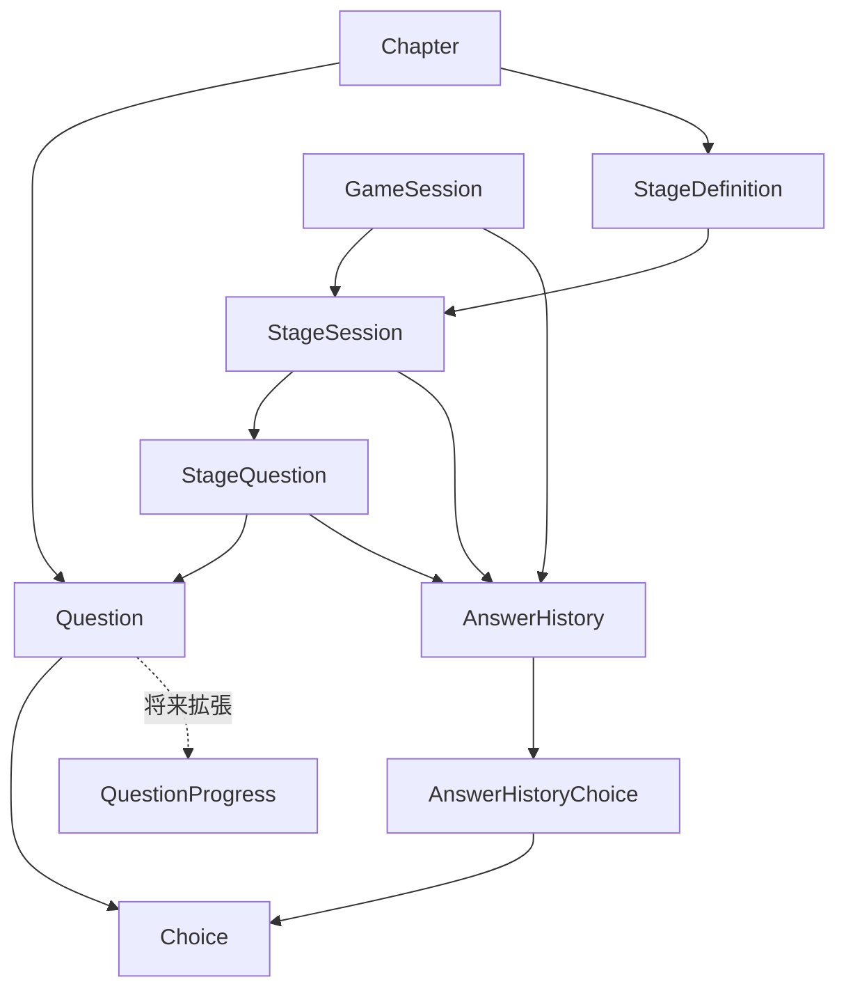

### 実装上の重要な関係

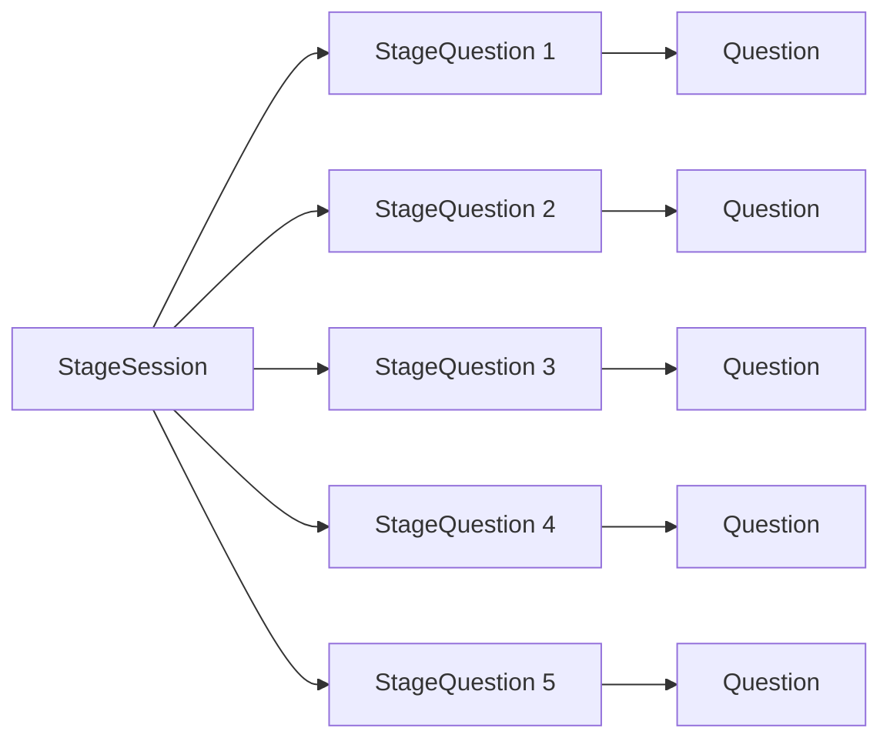

`StageSession → StageQuestion → Question`を、今回のプレイ中の問題を管理する基本構造とします。

`AnswerHistory`には`questionId`を重複保存せず、`stageQuestionId`から対象Questionを特定します。

`AnswerHistoryChoice`は実際に選択したChoiceを記録します。

`QuestionProgress`はMVP外の将来拡張です。

## 25. システム全体像

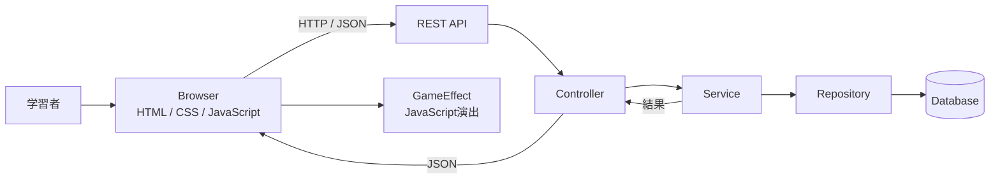

Java側がゲームルールを確定し、JavaScript側は受け取った結果をゲーム演出へ反映します。

## 26. 基本アーキテクチャ

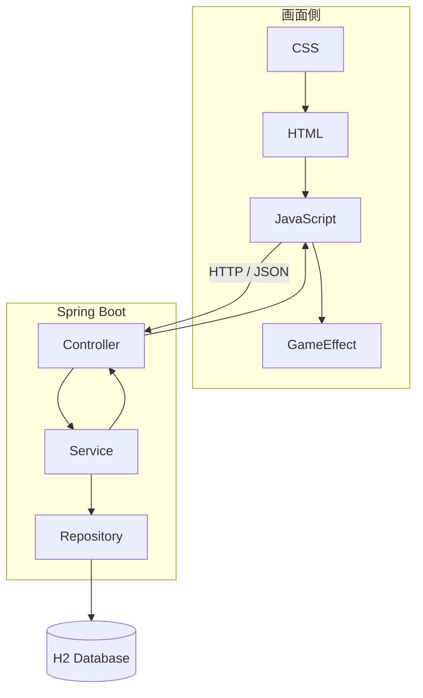

- **Controller**：リクエストを受け取る
- **Service**：正誤・時間・HP・Combo・Score・Stage・Session状態を処理する
- **Repository**：DBとのやり取りを担当する
- **JavaScript**：入力・表示・GameEffectを担当する
- **GameEffect**：JavaScript側の演出処理

画面から直接DBを操作しません。

## 27. 要求モデル

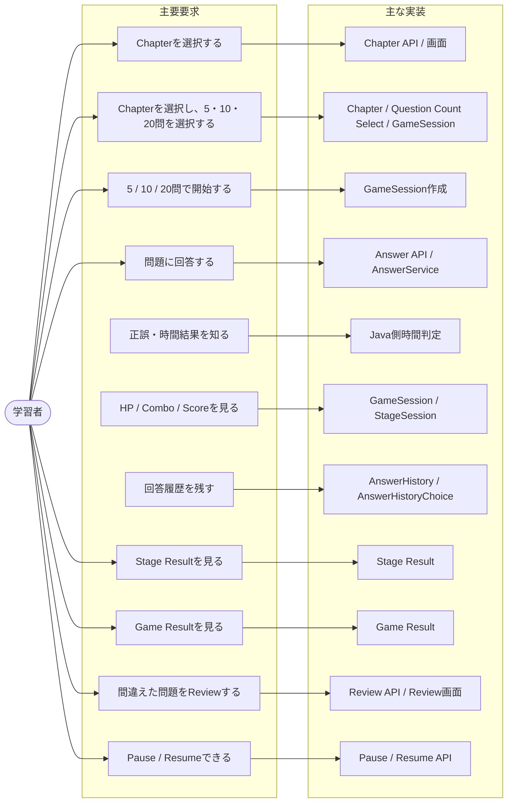
## 28. Use Case Diagram

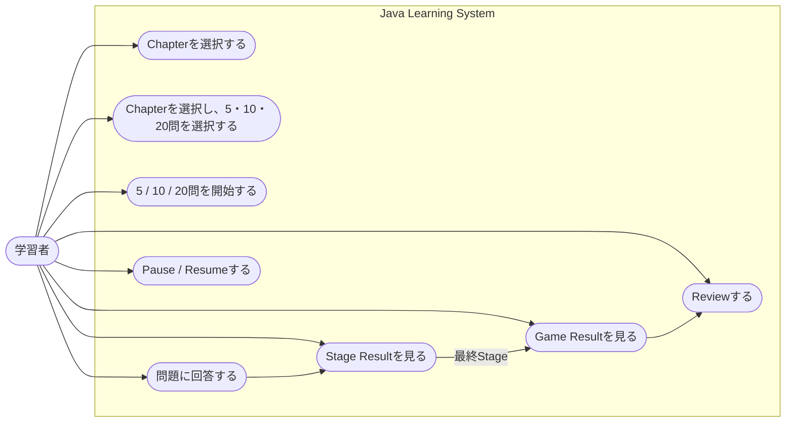
## 29. ロバストネス分析

### ロバストネス図

ロバストネス分析では、**画面・処理・データの責任を分ける**ことで、どこに何のコードを書くのかを整理します。

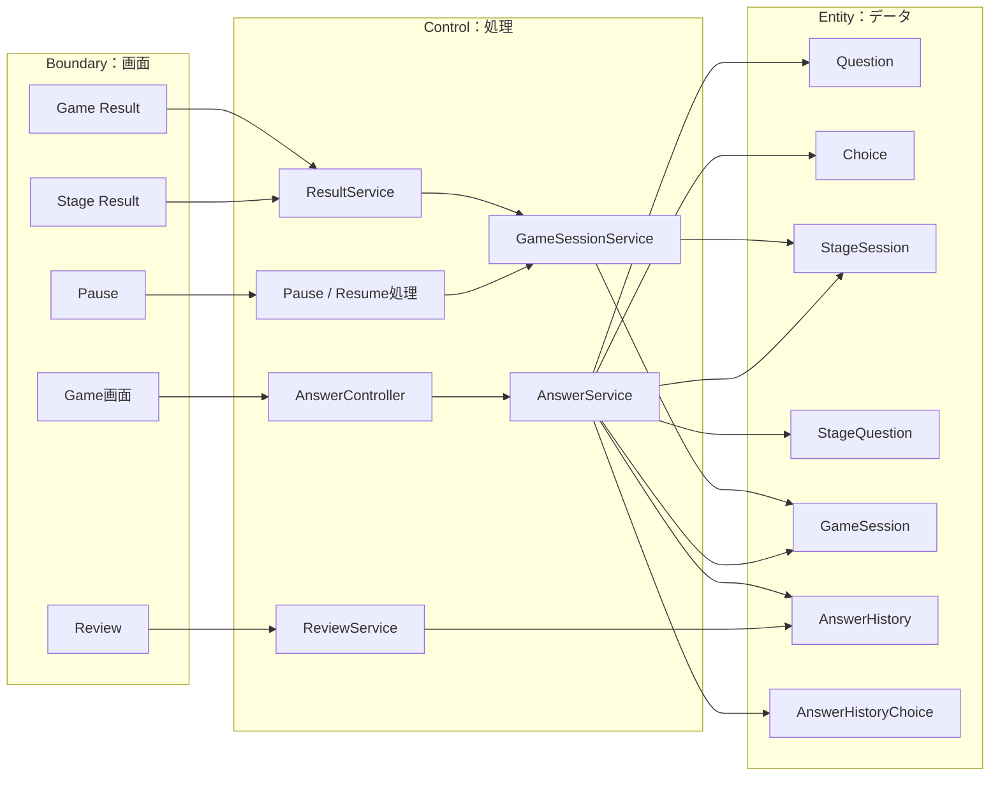
## 30. シーケンス図：回答判定

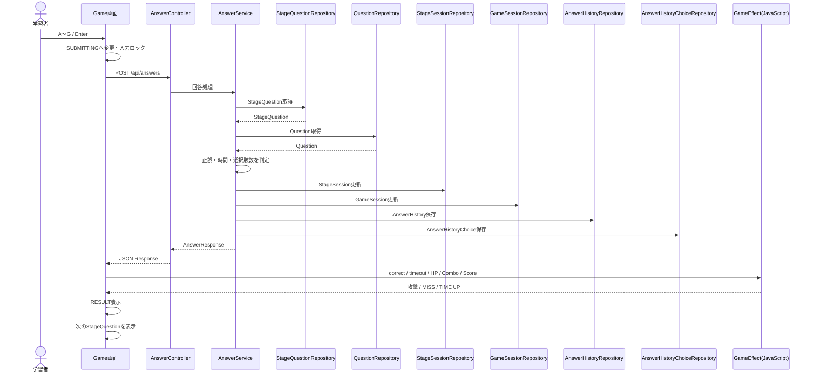

正誤・時間・HP・Combo・Score・Stage Clear・Perfectの最終判定はJava側が担当します。

### 正解・不正解のルール

- 正解：HP-1、Combo+1、Score+100
- 不正解：HP維持、Combo=0、Score+0
- 複数選択：選択されたChoice IDの集合を正解集合と完全一致で比較

## 31. シーケンス図：時間切れ

```mermaid
sequenceDiagram
    participant T as Timer
    participant UI as Game画面
    participant AC as AnswerController
    participant AS as AnswerService
    participant SR as StageSessionRepository
    participant GR as GameSessionRepository
    participant HR as AnswerHistoryRepository
    participant JS as GameEffect(JavaScript)

    T->>UI: 0秒
    UI->>UI: SUBMITTINGへ変更・入力ロック
    UI->>AC: POST /api/answers
    AC->>AS: 回答処理
    AS->>AS: startedAt / totalPausedMs / 現在時刻を確認
    AS->>SR: StageSession更新
    AS->>GR: GameSession更新（Combo=0）
    AS->>HR: AnswerHistory保存
    AS-->>AC: timeout=trueのAnswerResponse
    AC-->>UI: JSON Response
    UI->>JS: TIME UP演出
    UI->>UI: RESULT表示
    UI->>UI: 次のStageQuestionを表示
```

時間切れはクライアントの自己申告ではなく、Java側で実時間を判定します。

## 32. シーケンス図：Stage進行

```mermaid
sequenceDiagram
    participant UI as Game画面
    participant AS as AnswerService
    participant SS as StageSession
    participant GS as GameSession

    UI->>AS: 1問分の回答
    AS->>SS: HP / 正解数 / 問題位置を更新
    AS->>GS: Score / Comboを更新

    alt 1～4問目
        AS-->>UI: 次のStageQuestionを返す
    else 5問目
        AS->>AS: 5問終了を確認
        AS->>AS: Perfect判定
        AS->>SS: StageSession.status = CLEARED
        AS-->>UI: Stage Resultへ
    end
```

### 1～4問目

`回答 → 正誤判定 → HP / Combo / Score更新 → 履歴保存 → 次のStageQuestion`

### 5問目

`5問目回答 → 正誤判定 → 履歴保存 → 5問終了 → Perfect判定 → Stage Clear → Stage Result`

### 10問 / 20問

Stage Result後、まだGameSession内のStageが残っていれば次のStageを開始します。すべて終了したらGame Resultへ進みます。

## 33. クラス図

MVPで実装するEntity・Controller・Service・Repositoryと、状態・問題形式・MiniGame種別をここで固定します。

```mermaid
classDiagram
    class Chapter {
        +Long chapterId
        +String name
        +String description
    }
    class Question {
        +Long questionId
        +Long chapterId
        +QuestionType questionType
        +String questionText
        +int timeLimitSeconds
        +String shortExplanation
        +String detailedExplanation
    }
    class Choice {
        +Long choiceId
        +Long questionId
        +String choiceText
        +int choiceOrder
        +boolean correct
    }
    class StageDefinition {
        +Long stageId
        +Long chapterId
        +int stageNumber
        +String playerCharacterKey
        +String enemyKey
        +String fieldKey
        +MiniGameType miniGameType
        +int maxEnemyHp
    }
    class GameSession {
        +Long gameSessionId
        +Long chapterId
        +int questionCount
        +int totalStageCount
        +int currentStageNumber
        +int score
        +GameSessionStatus status
        +Instant startedAt
        +Instant endedAt
    }
    class StageSession {
        +Long stageSessionId
        +Long gameSessionId
        +Long stageId
        +int currentQuestionIndex
        +int correctCount
        +int enemyHp
        +int combo
        +StageSessionStatus status
        +Instant startedAt
        +Instant endedAt
        +Instant pausedAt
        +long totalPausedMs
    }
    class StageQuestion {
        +Long stageQuestionId
        +Long stageSessionId
        +Long questionId
        +int questionOrder
        +Instant startedAt
        +Instant answeredAt
        +Instant pausedAt
        +long totalPausedMs
    }
    class AnswerHistory {
        +Long answerHistoryId
        +Long gameSessionId
        +Long stageSessionId
        +Long stageQuestionId
        +boolean correct
        +boolean timeout
        +long answerTimeMs
    }
    class AnswerHistoryChoice {
        +Long id
        +Long answerHistoryId
        +Long choiceId
    }
    class AnswerController {
        +submitAnswer()
    }
    class AnswerService {
        +judgeAnswer()
        +updateStage()
        +saveHistory()
    }
    class GameSessionService {
        +createSession()
        +pause()
        +resume()
        +abandon()
    }
    class StageQuestionRepository {
        +findById()
    }
    class QuestionRepository {
        +findById()
    }
    class StageSessionRepository {
        +findById()
        +save()
    }
    class GameSessionRepository {
        +findById()
        +save()
    }
    class AnswerHistoryRepository {
        +save()
    }
    class AnswerHistoryChoiceRepository {
        +save()
    }
    class QuestionType {
        <<enumeration>>
        SINGLE_A_E
        SINGLE_A_G
        MULTIPLE_2_A_E
        MULTIPLE_2_A_G
        MULTIPLE_3_A_G
        CODE_SINGLE_A_E
        CODE_MULTIPLE_2_A_G
    }
    class MiniGameType {
        <<enumeration>>
        TYPING_SAMURAI
        CODE_TARGET
    }
    class GameSessionStatus {
        <<enumeration>>
        PLAYING
        PAUSED
        COMPLETED
        ABANDONED
    }
    class StageSessionStatus {
        <<enumeration>>
        PLAYING
        PAUSED
        CLEARED
        ABANDONED
    }

    Chapter --> Question
    Question --> Choice
    Chapter --> StageDefinition
    StageDefinition --> MiniGameType
    GameSession --> StageSession
    StageSession --> StageDefinition
    StageSession --> StageQuestion
    StageQuestion --> Question
    GameSession --> AnswerHistory
    StageSession --> AnswerHistory
    StageQuestion --> AnswerHistory
    AnswerHistory --> AnswerHistoryChoice
    AnswerHistoryChoice --> Choice
    Question --> QuestionType
    GameSession --> GameSessionStatus
    StageSession --> StageSessionStatus
    AnswerController --> AnswerService
    AnswerService --> StageQuestionRepository
    AnswerService --> QuestionRepository
    AnswerService --> StageSessionRepository
    AnswerService --> GameSessionRepository
    AnswerService --> AnswerHistoryRepository
    AnswerService --> AnswerHistoryChoiceRepository
```

`QuestionProgress`はMVPのクラス図・Entity・Repositoryには含めません。将来の学習進捗機能で追加します。

## 33.1 Javaクラス名

### Controller

`ChapterController`, `GameSessionController`, `AnswerController`, `ResultController`, `ReviewController`

### Service

`ChapterService`, `GameSessionService`, `AnswerService`, `ResultService`, `ReviewService`

### Repository（MVP）

`ChapterRepository`, `QuestionRepository`, `ChoiceRepository`, `StageDefinitionRepository`, `GameSessionRepository`, `StageSessionRepository`, `StageQuestionRepository`, `AnswerHistoryRepository`, `AnswerHistoryChoiceRepository`

### Entity（MVP）

`Chapter`, `Question`, `Choice`, `StageDefinition`, `GameSession`, `StageSession`, `StageQuestion`, `AnswerHistory`, `AnswerHistoryChoice`

### Enum（MVP）

`QuestionType`, `MiniGameType`, `GameSessionStatus`, `StageSessionStatus`

### 将来拡張

`QuestionProgress`はMVPでは実装しません。学習進捗機能を追加するときにEntity・Repository・Serviceを追加します。

## 33.2 回答処理の詳細クラス図

回答を送信したときに実際に呼び出すJavaクラスだけを抜き出した図です。

```mermaid
classDiagram
    class AnswerController {
        +submitAnswer()
    }
    class AnswerService {
        +judgeAnswer()
        +updateStage()
        +saveHistory()
    }
    class StageQuestionRepository {
        +findById()
    }
    class QuestionRepository {
        +findById()
    }
    class StageSessionRepository {
        +findById()
        +save()
    }
    class GameSessionRepository {
        +findById()
        +save()
    }
    class AnswerHistoryRepository {
        +save()
    }
    class AnswerHistoryChoiceRepository {
        +save()
    }

    AnswerController --> AnswerService
    AnswerService --> StageQuestionRepository
    AnswerService --> QuestionRepository
    AnswerService --> StageSessionRepository
    AnswerService --> GameSessionRepository
    AnswerService --> AnswerHistoryRepository
    AnswerService --> AnswerHistoryChoiceRepository
```

## 34. MiniGame / GameEffectの設計

### Question / MiniGame / GameEffectの分離

```mermaid
flowchart LR
    Q[Question<br/>何を答えるか]
    M[MiniGame<br/>どう遊ぶか]
    J[AnswerService<br/>共通の回答判定]
    FX[GameEffect<br/>JavaScript側の演出]
    R[結果<br/>correct / HP / Combo / Score / History]

    Q --> J
    M --> J
    J --> R
    R --> FX
```

Questionは「何を答えるか」、MiniGameは「どう遊ぶか」、GameEffectは「結果をどう見せるか」を担当します。

MVPの`MiniGameType`は`TYPING_SAMURAI`と`CODE_TARGET`の2種類です。`CODE_WACK_A_MOLE`と`CODE_BREAKER`は将来拡張としてのみ扱い、MVPのEnum実装には含めません。

### MVP MiniGame

- `TYPING_SAMURAI`
- `CODE_TARGET`

MVPではこの2種類を実装します。`CODE_WACK_A_MOLE`と`CODE_BREAKER`は将来追加候補です。

MiniGameを追加する場合は新しいゲーム処理コードを実装します。問題データやStageデータの追加だけで新しいMiniGameが生まれる設計ではありません。

### GameEffect

GameEffectはJavaScript側で実装します。

- 攻撃アニメーション
- MISS演出
- TIME UP演出
- HP表示更新
- Combo表示更新
- Perfect演出
- Stage終了演出

## 35. REST APIの事前確認

### REST APIの位置付け

```mermaid
flowchart LR
    B[Browser<br/>HTML / CSS / JavaScript]
    API[REST API]
    C[Controller]
    S[Service]
    R[Repository]
    DB[(Database)]

    B -->|HTTP Request / JSON| API
    API --> C
    C --> S
    S --> R
    R --> DB
    S --> C
    C -->|JSON Response| B
```

APIは画面とJavaをつなぐ窓口です。

### 主ゲームAPI（正規仕様）

```text
POST /api/game-sessions
POST /api/stage-questions/{stageQuestionId}/start
GET  /api/game-sessions/{gameSessionId}/current
GET  /api/stage-questions/{stageQuestionId}
POST /api/answers
POST /api/stage-sessions/{stageSessionId}/pause
POST /api/stage-sessions/{stageSessionId}/resume
POST /api/game-sessions/{gameSessionId}/advance-stage
GET  /api/game-sessions/{gameSessionId}/result
GET  /api/game-sessions/{gameSessionId}/review
```

補助APIとして、Chapter一覧取得とHome終了時のABANDONED処理を実装できます。これらは上記の「主ゲームAPI」には含めません。

```text
GET  /api/chapters
POST /api/game-sessions/{gameSessionId}/abandon
```

`/abandon`はHome終了時にのみ使用し、再開対象にはしません。

### APIで使うIDのルール

ゲーム中は`QuestionId`ではなく`StageQuestionId`を基準にします。

```text
StageSession
   ↓
StageQuestion
   ↓
Question
```

したがって、`nextStageQuestionId`も必ず**StageQuestion ID**です。

### POST /api/game-sessions

Request：

```json
{
  "chapterId": 1,
  "questionCount": 10
}
```

Response：

```json
{
  "gameSessionId": 1001,
  "chapterId": 1,
  "questionCount": 10,
  "totalStageCount": 2,
  "currentStageNumber": 1,
  "status": "PLAYING"
}
```

`questionCount`は5・10・20だけを許可します。

### POST /api/stage-questions/{stageQuestionId}/start

Request bodyは不要です。

成功条件：`startedAt == null` かつ`answeredAt == null`かつ対象StageSessionが`PLAYING`。

このAPIを呼ぶまでTimerは開始しません。`start`成功後にだけJavaScriptが表示Timerを開始します。

処理：

```text
startedAt = Instant.now()
StageQuestionを保存
200 OK
→ JavaScriptがTimer開始
```

Response：

```json
{
  "stageQuestionId": 3001,
  "startedAt": "2026-10-08T00:00:00Z",
  "remainingTimeMs": 20000
}
```

すでに開始済みの問題を再StartしてTimerをリセットしてはいけません。

### GET /api/game-sessions/{gameSessionId}/current

現在プレイ中の状態を取得します。Refresh後の復元にも使用します。
`remainingTimeMs`はJava側で現在時刻から再計算して返します。`WAITING_TO_START`ではTimer未開始のため`remainingTimeMs`は`null`、`ANSWERING`ではサーバー計算値を返します。Refresh後もJavaScriptはこの値を基準に表示Timerを再開します。

Response：

```json
{
  "gameSessionId": 1001,
  "stageSessionId": 2001,
  "stageQuestionId": 3001,
  "questionState": "ANSWERING",
  "questionNumber": 1,
  "totalQuestionsInStage": 5,
  "remainingTimeMs": 20000,
  "enemyHp": 5,
  "combo": 0,
  "score": 0,
  "gameSessionStatus": "PLAYING",
  "stageSessionStatus": "PLAYING",
  "question": {
    "questionId": 501,
    "questionType": "SINGLE_A_E",
    "questionText": "...",
    "timeLimitSeconds": 20,
    "shortExplanation": "...",
    "codeBlock": "...",
    "choices": [
      {"choiceId": 12, "choiceText": "A", "choiceOrder": 1},
      {"choiceId": 13, "choiceText": "B", "choiceOrder": 2}
    ]
  },
  "playerCharacterKey": "SWORDSMAN",
  "enemyKey": "JAVA_GUARD",
  "fieldKey": "GRASSLAND",
  "miniGameType": "CODE_TARGET"
}
```

`Choice.correct`はクライアントへ返しません。

### POST /api/answers

Request：

```json
{
  "stageQuestionId": 3001,
  "selectedChoiceIds": [12]
}
```

複数選択：

```json
{
  "stageQuestionId": 3001,
  "selectedChoiceIds": [12, 15]
}
```

時間切れ：

```json
{
  "stageQuestionId": 3001,
  "selectedChoiceIds": []
}
```

`timeout`はRequestに持たせません。時間切れかどうかはJava側で`startedAt`、`pausedAt`、`totalPausedMs`、現在時刻から判定します。

### POST /api/answers のResponse

`score`はGameSessionの累積Scoreです。`stageScore`は現在Stageで得たScoreです。

通常の正解：

```json
{
  "correct": true,
  "timeout": false,
  "enemyHp": 4,
  "combo": 1,
  "score": 100,
  "effectType": "HIT",
  "stageCorrectCount": 1,
  "stageScore": 100,
  "maxCombo": 1,
  "stageClear": false,
  "perfect": false,
  "nextStageQuestionId": 3002
}
```

不正解：

```json
{
  "correct": false,
  "timeout": false,
  "enemyHp": 5,
  "combo": 0,
  "score": 0,
  "effectType": "MISS",
  "stageCorrectCount": 0,
  "stageScore": 0,
  "maxCombo": 0,
  "stageClear": false,
  "perfect": false,
  "nextStageQuestionId": 3002
}
```

時間切れ：

```json
{
  "correct": false,
  "timeout": true,
  "enemyHp": 5,
  "combo": 0,
  "score": 0,
  "effectType": "TIME_UP",
  "stageCorrectCount": 0,
  "stageScore": 0,
  "maxCombo": 0,
  "stageClear": false,
  "perfect": false,
  "nextStageQuestionId": 3002
}
```

5問目でStage Clear / Perfect：

```json
{
  "correct": true,
  "timeout": false,
  "enemyHp": 0,
  "combo": 5,
  "score": 500,
  "effectType": "PERFECT",
  "stageCorrectCount": 5,
  "stageScore": 500,
  "maxCombo": 5,
  "stageClear": true,
  "perfect": true,
  "nextStageQuestionId": null
}
```

`effectType=PERFECT`はStage 5問目かつ5/5正解のときのみ使用します。

### その他のResponse DTO

Game Result画面は、結果を確認するエリアとReviewへ進むためのエリアを分けて表示します。Reviewへ進むことで、各問題の詳しい振り返りを行えます。

`ResultResponse`：

```json
{
  "gameSessionId": 1001,
  "questionCount": 20,
  "totalStageCount": 4,
  "completedStageCount": 4,
  "totalCorrectCount": 15,
  "totalScore": 1500,
  "perfectStageCount": 2,
  "status": "COMPLETED"
}
```

`ReviewResponse`：

```json
{
  "items": [
    {
      "stageQuestionId": 3001,
      "questionText": "...",
      "selectedChoiceIds": [12],
      "correctChoiceIds": [15],
      "correct": false,
      "timeout": false,
      "answerTimeMs": 8420,
      "detailedExplanation": "..."
    }
  ]
}
```

`ErrorResponse`：

```json
{
  "code": "ALREADY_ANSWERED",
  "message": "この問題はすでに回答されています。"
}
```

### HTTPステータス

| Status | 意味 | 例 |
|---|---|---|
| `200 OK` | 正常処理 | 回答、Pause、Resume、Result取得など |
| `400 Bad Request` | リクエスト不正 | 必須項目不足、無効なquestionCount |
| `404 Not Found` | 対象なし | StageQuestionが存在しない |
| `409 Conflict` | 状態不整合 | すでに回答済み、PAUSED中に回答など |

## 35.1 実装固定仕様（AIコーディング用 Source of Truth）

この節は、**実際にJava / Spring Boot / JPA / JavaScriptを実装するときの最優先ルール**です。クラス図・過去の図・例示JSONと内容が異なる場合、この節を正とします。

### 35.1.1 状態と責任範囲

問題1問の状態は次の4段階で固定します。

```text
WAITING_TO_START
    ↓ Enter
POST /api/stage-questions/{stageQuestionId}/start
    ↓ 200 OK
ANSWERING
    ↓ 回答キー / Enter / TIME UP
SUBMITTING
    ↓ POST /api/answers
RESULT
    ↓ 次の問題
WAITING_TO_START
```

- `WAITING_TO_START`：問題は表示済みだがTimerは開始しない
- `ANSWERING`：Timer表示中。単一選択はキー入力で送信、複数選択はEnterで送信
- `SUBMITTING`：送信中。A～G・Enter・送信操作をすべてロック
- `RESULT`：回答結果とGameEffectを表示し、次問題またはStage Resultへ進む

正誤・時間・HP・Combo・Score・Stage Clear・PerfectはJava側が正です。JavaScriptは入力・表示・Timer表示・演出だけを担当します。

### 35.1.2 日時型・経過時間の型

```text
日時        = java.time.Instant
経過時間    = Long（ミリ秒）
秒数        = Integer / int
```

`startedAt`、`answeredAt`、`pausedAt`、`endedAt`は`Instant`で統一します。`totalPausedMs`、`answerTimeMs`、`remainingTimeMs`はミリ秒の`Long`で統一します。

IDは全Entityで`Long`を使用し、DBの自動採番（`GenerationType.IDENTITY`）を基本とします。`answerHistoryId`の大小だけを最新判定の根拠にはしません。最新のAnswerHistoryは`answeredAt DESC`、同値の場合は`answerHistoryId DESC`で決定します。
### 35.1.3 JPAリレーション固定

MVPの関連は次のとおりです。

```text
Chapter 1 ── * Question
Question 1 ── * Choice
Chapter 1 ── * StageDefinition
GameSession 1 ── * StageSession
StageDefinition 1 ── * StageSession
StageSession 1 ── 5 StageQuestion
StageQuestion * ── 1 Question
GameSession 1 ── * AnswerHistory
StageSession 1 ── * AnswerHistory
StageQuestion 1 ── 0..1 AnswerHistory
AnswerHistory 1 ── * AnswerHistoryChoice
AnswerHistoryChoice * ── 1 Choice
```

JPA実装方針：

- 子Entity側の`@ManyToOne`を基本とする
- MVPでは不要な双方向リレーションを作らない
- ControllerからEntityを直接JSON返却しない。必ずDTOを使用する
- `CascadeType.ALL`を安易に付けない
- 親Entityの削除によって問題マスタまで消える設計にしない

推奨する基本形：

```java
@ManyToOne(fetch = FetchType.LAZY)
@JoinColumn(name = "chapter_id", nullable = false)
private Chapter chapter;
```

`Long chapterId`などのFK列を単なるprimitive値として重複保持するのではなく、JPA上の関連をEntityとして表現します。APIのJSONではIDだけをDTOとして返します。

### 35.1.4 Entityの正規項目

MVP Entityは**9クラス固定**です。追加Entityを勝手に作りません。

```text
Chapter
- chapterId
- name
- description

Question
- questionId
- chapterId（JPAではChapterへの@ManyToOne）
- questionType
- questionText
- codeBlock
- timeLimitSeconds
- shortExplanation
- detailedExplanation

Choice
- choiceId
- questionId（JPAではQuestionへの@ManyToOne）
- choiceText
- choiceOrder
- correct（サーバー専用。APIに出さない）

StageDefinition
- stageId
- chapterId（JPAではChapterへの@ManyToOne）
- stageNumber
- playerCharacterKey
- enemyKey
- fieldKey
- miniGameType
- maxEnemyHp

GameSession
- gameSessionId
- chapterId（JPAではChapterへの@ManyToOne）
- questionCount
- totalStageCount
- currentStageNumber
- score
- status
- startedAt
- endedAt

StageSession
- stageSessionId
- gameSessionId（JPAではGameSessionへの@ManyToOne）
- stageId（JPAではStageDefinitionへの@ManyToOne）
- currentQuestionIndex
- correctCount
- enemyHp
- combo
- status
- startedAt
- endedAt
- pausedAt
- totalPausedMs

StageQuestion
- stageQuestionId
- stageSessionId（JPAではStageSessionへの@ManyToOne）
- questionId（JPAではQuestionへの@ManyToOne）
- questionOrder
- startedAt
- answeredAt
- pausedAt
- totalPausedMs

AnswerHistory
- answerHistoryId
- gameSessionId
- stageSessionId
- stageQuestionId
- correct
- timeout
- answerTimeMs

AnswerHistoryChoice
- id
- answerHistoryId
- choiceId
```

`QuestionProgress`はMVPでは作成しません。`actionPattern`もMVP仕様から削除し、実装しません。

### 35.1.5 時間管理の正規ルール

Timerは**問題表示時ではなくStart API成功後**に開始します。

```text
1. 問題を表示
2. WAITING_TO_START
3. Enter
4. POST /api/stage-questions/{id}/start
5. JavaがstartedAtを記録
6. 200 OKを返す
7. JavaScriptがTimer表示を開始
```

サーバーの残り時間は次の式で計算します。

```text
remainingTimeMs
= timeLimitSeconds * 1000
  - (currentTime - startedAt - totalPausedMs)
```

`remainingTimeMs`の最終値は0未満にせず0として扱います。

JavaScriptのTimerは表示用です。JavaScriptのローカル経過時間を正解判定に使用しません。

回答API受信時にはJava側で必ず再計算します。通信遅延によって画面上は残り時間があっても、サーバー計算で0以下ならTIME UPです。

`WAITING_TO_START`ではTimerが未開始のため`remainingTimeMs`は`null`で返却します。`remainingTimeMs == null`の場合、JavaScriptは`timeLimitSeconds × 1000`を初期表示するだけでカウントダウンを開始しません。`POST /api/stage-questions/{stageQuestionId}/start`が`200 OK`を返した後に、返却された`remainingTimeMs`を基準として表示Timerを開始します。`null`を数値計算に直接使用して`NaN`を発生させません。

`answerTimeMs`は次式で固定します。

```text
answerTimeMs
= answeredAt - startedAt - totalPausedMs
```

経過時間が何らかの理由で負数になった場合は`0L`として扱い、時間切れの確定はJava側だけで行います。

### 35.1.6 Start APIの二重実行防止

`POST /api/stage-questions/{stageQuestionId}/start`は次の場合だけ成功します。

```text
startedAt == null
answeredAt == null
StageSession.status == PLAYING
```

すでに`startedAt`が設定されている問題を再StartしてTimerをリセットしてはいけません。再Startは`409 INVALID_GAME_STATE`とします。

### 35.1.7 Pause / Resumeの正規ルール

Pauseは`ANSWERING`中だけ可能です。WAITING_TO_START、SUBMITTING、RESULTではPauseできません。

Pause時：

```text
StageSession.pausedAt = 現在時刻
StageQuestion.pausedAt = 現在時刻
StageSession.status = PAUSED
```

Resume時：

```text
pauseDuration = currentTime - pausedAt
StageSession.totalPausedMs += pauseDuration
StageQuestion.totalPausedMs += pauseDuration
StageSession.pausedAt = null
StageQuestion.pausedAt = null
StageSession.status = PLAYING
```

問題の`remainingTimeMs`と`answerTimeMs`には**StageQuestion.totalPausedMs**を使用します。StageSession.totalPausedMsはStage全体の一時停止時間の記録として保持します。

### 35.1.8 回答APIの正規処理順

`POST /api/answers`は`@Transactional`で処理します。

```text
1. StageQuestionを取得
2. AnswerHistoryが既に存在するか確認
3. 存在する場合は409 ALREADY_ANSWERED
4. selectedChoiceIdsが空配列なら、Choice検索をせずTIME UPとして処理
5. 空配列でない場合、Java側でremainingTimeMsを再計算
6. 0以下ならTIME UPとして処理
7. TIME UPでなければQuestionTypeに応じて選択数を検証
8. Choiceを取得して正解集合と完全一致で判定
9. StageSessionを更新
10. GameSessionを更新
11. AnswerHistoryを保存
12. AnswerHistoryChoiceを保存
13. 5問目ならStage Clear / Perfectを確定
14. AnswerResponseを返す
```

TIME UPは`correct=false`、HP変更なし、Combo=0、Score加算なしです。

複数選択は**集合の完全一致**です。順番は無視し、部分点はありません。必要数より少ない／多い回答は400です。ただし`selectedChoiceIds=[]`は上記の4番で先にTIME UPとして処理します。

### 35.1.9 二重回答防止の3層構造

```text
第1層：JavaScript
→ SUBMITTING中はA～G / Enterをロック

第2層：Service
→ AnswerHistory存在チェック
→ 存在すれば409 ALREADY_ANSWERED

第3層：DB
→ AnswerHistory.stageQuestionId UNIQUE
```

DB UNIQUEはレースコンディションに対する最終防衛線です。

回答処理のトランザクション単位は次です。

```text
StageSession更新
→ GameSession更新
→ AnswerHistory保存
→ AnswerHistoryChoice保存
```

途中で失敗した場合はトランザクション全体をロールバックします。

### 35.1.10 Stage進行の正規ルール

```text
GameSession開始
↓
Stage 1を作成
↓
StageQuestionを5件作成
↓
Stage 1をプレイ
↓
5問目回答
↓
Stage Result
↓
残りStageあり？
 ├─ Yes → POST /api/game-sessions/{id}/advance-stage
 │         ↓
 │       次StageSession作成
 │       StageQuestionを5件作成
 │         ↓
 │       次StageのGameへ
 └─ No  → Game Result
```

GameSession開始時に20問すべてのStageQuestionを一括作成しません。**最初はStage 1の5件だけ作成し、以後はadvance-stageで5件ずつ作成**します。

ただしGameSession開始時には、Chapterの未使用問題数が`questionCount`以上あることを確認します。不足する場合は`409 INSUFFICIENT_QUESTIONS`としてGameSessionを作成しません。

`advance-stage`は次の条件でのみ成功します。

```text
- 現在StageSession.status == CLEARED
- GameSessionに未作成の次Stageが存在する
- 次Stageが同一GameSession内でまだ作成されていない
```

同じStageを二重作成しないため、DBに`UNIQUE(gameSessionId, stageId)`を設定します。

### 35.1.11 Stage Clear / Perfectの正規ルール

Stage Clearは**敵HPではなく5問回答完了**で判定します。

```text
5問すべて回答完了
→ StageSession.status = CLEARED
→ Stage Result
```

Perfectは次の条件だけです。

```text
StageQuestion 5件のcorrectがすべてtrue
→ perfect = true
→ effectType = PERFECT
```

4/5正解、3/5正解などでもStageはClearします。敵HPは5から正解数に応じて減りますが、Stage Clear条件そのものではありません。

Perfectによる追加Scoreはありません。通常どおり正解1問につき+100です。

### 35.1.12 Question選択アルゴリズム

同一GameSession内では同じQuestionを再利用しません。

問題をStage用に選ぶときは、まず現在GameSessionで既に使用したQuestionを除外します。その後、**全過去回答履歴のうちQuestionごとの最新AnswerHistory**を確認します。Questionごとの「最新AnswerHistory」は、`answeredAt DESC`、同値の場合は`answerHistoryId DESC`で1件を決定します。`answerHistoryId`の最大値だけでは最新判定しません。

優先順位：

```text
1. UNANSWERED
   AnswerHistoryが1件もない

2. REVIEW
   最新AnswerHistoryが
   correct=false または timeout=true

3. CLEARED
   最新AnswerHistoryが
   correct=true かつ timeout=false
```

選択手順：

```text
1. Chapter内のQuestionを取得
2. 現在GameSessionですでに使用したQuestionを除外
3. Questionごとの最新AnswerHistoryを確認
4. UNANSWERED / REVIEW / CLEAREDへ分類
5. UNANSWERED → REVIEW → CLEAREDの順に取得
6. 各グループ内をシャッフル
7. 必要数5件を選択
8. 5件未満しか残らなければ409 INSUFFICIENT_QUESTIONS
9. questionOrder=1～5でStageQuestionを作成
```

### 35.1.13 API / DTOの命名固定

`CurrentGameResponse`は、現在の問題状態を`questionState`で返します。

Javaクラス名・JSONキー・JavaScriptの参照名を次の名前から変更しません。

```text
GameSessionCreateRequest
- chapterId
- questionCount

AnswerRequest
- stageQuestionId
- selectedChoiceIds

AnswerResponse
- correct
- timeout
- enemyHp
- combo
- score
- effectType
- stageClear
- perfect
- stageCorrectCount
- stageScore
- maxCombo
- nextStageQuestionId

CurrentGameResponse
- gameSessionId
- stageSessionId
- stageQuestionId
- questionState
- questionNumber
- totalQuestionsInStage
- remainingTimeMs
- enemyHp
- combo
- score
- gameSessionStatus
- stageSessionStatus
- question
- playerCharacterKey
- enemyKey
- fieldKey
- miniGameType

StartStageQuestionResponse
- stageQuestionId
- startedAt
- remainingTimeMs

AdvanceStageResponse
- gameSessionId
- currentStageNumber
- stageSessionId
- stageQuestionId
- status

ResultResponse
- gameSessionId
- questionCount
- totalStageCount
- completedStageCount
- totalCorrectCount
- totalScore
- perfectStageCount
- status
```

回答時の演出結果は`effectType`で固定します。

```text
HIT
MISS
TIME_UP
PERFECT
```

`PERFECT`は5問目かつ5/5正解のときに使用し、それ以外の正解は`HIT`です。

### 35.1.14 ErrorResponse / HTTPステータス固定

```json
{
  "code": "ALREADY_ANSWERED",
  "message": "この問題はすでに回答されています。"
}
```

主なHTTPステータス：

| Status | code例 | 用途 |
|---|---|---|
| 200 | - | 正常 |
| 400 | INVALID_REQUEST / INVALID_ANSWER_COUNT | 入力不正 |
| 404 | NOT_FOUND | ID不存在 |
| 409 | ALREADY_ANSWERED | 二重回答 |
| 409 | INVALID_GAME_STATE | 状態不正 |
| 409 | INSUFFICIENT_QUESTIONS | 問題不足 |

### 35.1.15 DB UNIQUE制約固定

最低限、次をDB制約として定義します。

```text
UNIQUE(stageSessionId, questionOrder)
UNIQUE(stageSessionId, questionId)
UNIQUE(stageQuestionId)                       // AnswerHistory
UNIQUE(answerHistoryId, choiceId)             // AnswerHistoryChoice
UNIQUE(gameSessionId, stageId)                 // StageSession
```

同一GameSession内のQuestion再利用禁止はService側で制御します。

### 35.1.16 Repositoryの最小責務

AIがRepositoryに不要な処理を追加しないよう、MVPで必要なDB操作を次で固定します。

```text
ChapterRepository
- findAll()
- findById()

QuestionRepository
- findByChapterId()
- findById()

ChoiceRepository
- findByQuestionIdOrderByChoiceOrder()

StageDefinitionRepository
- findByChapterIdAndStageNumber()

GameSessionRepository
- findById()
- save()

StageSessionRepository
- findById()
- existsByGameSessionIdAndStageId()
- save()

StageQuestionRepository
- findById()
- findByStageSessionIdAndQuestionOrder()
- findByStageSessionIdOrderByQuestionOrder()
- saveAll()

AnswerHistoryRepository
- existsByStageQuestionId()
- findByStageQuestionQuestionIdOrderByAnsweredAtDescAnswerHistoryIdDesc()
- save()

AnswerHistoryChoiceRepository
- saveAll()
### 35.1.17 実装時の絶対ルール

```text
READMEの正規仕様と異なるフィールド・Enum・APIをAIが勝手に追加しない
EntityをControllerから直接返さない
QuestionProgressをMVPで作らない
actionPatternを作らない
LocalDateTimeに戻さない
answerTimeとanswerTimeMsを混在させない
QuestionIdとStageQuestionIdを混同しない
JavaScriptだけで正解・時間・Scoreを確定しない
Stageを自由選択できる処理を作らない
GameSession開始時に全StageQuestionを一括生成しない
```

## 36. 設計整合性チェック

| ルール | 要求 | 設計 | API | 実装 |
|---|---:|---:|---:|---:|
| Stageは自動進行 | ○ | ○ | ○ | 確認 |
| 1 Stage = 5問 | ○ | ○ | ○ | 確認 |
| StageQuestion = 5件 | ○ | ○ | ○ | 確認 |
| 敵HP = 5 | ○ | ○ | ○ | 確認 |
| 正解でHP -1 | ○ | ○ | ○ | 確認 |
| 不正解でHP維持 | ○ | ○ | ○ | 確認 |
| 時間切れでHP維持 | ○ | ○ | ○ | 確認 |
| 正解でCombo +1 | ○ | ○ | ○ | 確認 |
| Stage開始でCombo 0 | ○ | ○ | ○ | 確認 |
| 正解でScore +100 | ○ | ○ | ○ | 確認 |
| 5問終了でStage Clear | ○ | ○ | ○ | 確認 |
| 5/5でPerfect | ○ | ○ | ○ | 確認 |
| PerfectはStage単位 | ○ | ○ | ○ | 確認 |
| 回答履歴保存 | ○ | ○ | ○ | 確認 |
| StageQuestionで5問固定 | ○ | ○ | ○ | 確認 |
| AnswerHistoryChoice保存 | ○ | ○ | ○ | 確認 |
| miniGameTypeで統一 | ○ | ○ | ○ | 確認 |
| playerCharacterKey等で管理 | ○ | ○ | ○ | 確認 |
| GameEffectはJavaScript | ○ | ○ | ○ | 確認 |
| nextStageQuestionIdはStageQuestionId | ○ | ○ | ○ | 確認 |
| POST /api/answers Response固定 | ○ | ○ | ○ | 確認 |
| HTTPステータス固定 | ○ | ○ | ○ | 確認 |
| Pauseでタイマー停止 | ○ | ○ | ○ | 確認 |
| Submit中は入力ロック | ○ | ○ | ○ | 確認 |
| DB重複制約あり | ○ | ○ | ○ | 確認 |
| Answer処理は@Transactional | ○ | ○ | ○ | 確認 |
| QuestionProgressはMVP外 | ○ | ○ | ○ | 確認 |

## 37. 回答処理の共通ルール

```mermaid
flowchart LR
    A[回答受付] --> B[入力ロック / SUBMITTING]
    B --> C[StageQuestion確認]
    C --> D[Question取得]
    D --> E[正解・時間・選択数判定]
    E --> F[StageSession更新]
    F --> G[GameSession更新]
    G --> H[AnswerHistory保存]
    H --> I[AnswerHistoryChoice保存]
    I --> J[AnswerResponse返却]
    J --> K[JavaScript GameEffect]
    K --> L[次のStageQuestion]
```

すべての更新は`AnswerService`のトランザクション内で処理します。

## 38. 二重回答防止

二重回答は、画面・Java・DBの3段階で防止します。

```mermaid
flowchart TD
    A[キー入力 / TIME UP] --> B[SUBMITTINGへ変更]
    B --> C[入力ロック]
    C --> D[POST /api/answers]
    D --> E{未回答?}
    E -->|Yes| F[処理実行]
    E -->|No| G[409 Conflict]
```

### UI側

回答送信中はA～G、Enter、送信ボタンを無効化します。

### Service側

対象の`StageQuestion`に対する回答済み状態を確認します。

### DB側

`AnswerHistory.stageQuestionId`を一意にして、同じStageQuestionに2件の回答履歴を保存できないようにします。

### トランザクション

`StageSession更新 → GameSession更新 → AnswerHistory保存 → AnswerHistoryChoice保存`を1つの`@Transactional`処理として扱います。

## 39. データモデル

READMEのクラス図と実装するEntityの項目を完全に一致させます。以下がMVPの正規データモデルです。

### Chapter

`chapterId`, `name`, `description`

### Question

`questionId`, `chapterId`, `questionType`, `questionText`, `codeBlock`, `timeLimitSeconds`, `shortExplanation`, `detailedExplanation`

### Choice

`choiceId`, `questionId`, `choiceText`, `choiceOrder`, `correct`

### StageDefinition

`stageId`, `chapterId`, `stageNumber`, `playerCharacterKey`, `enemyKey`, `fieldKey`, `miniGameType`, `maxEnemyHp`

### GameSession

`gameSessionId`, `chapterId`, `questionCount`, `totalStageCount`, `currentStageNumber`, `score`, `status`, `startedAt`, `endedAt`

### StageSession

`stageSessionId`, `gameSessionId`, `stageId`, `currentQuestionIndex`, `correctCount`, `enemyHp`, `combo`, `status`, `startedAt`, `endedAt`, `pausedAt`, `totalPausedMs`

`currentQuestionIndex`は**1～5**で管理します。

### StageQuestion

`stageQuestionId`, `stageSessionId`, `questionId`, `questionOrder`, `startedAt`, `answeredAt`, `pausedAt`, `totalPausedMs`

`questionOrder`は**1～5**で、1 Stageあたり必ず5件です。

### AnswerHistory

```text
AnswerHistory
├─ answerHistoryId
├─ gameSessionId
├─ stageSessionId
├─ stageQuestionId
├─ correct
├─ timeout
└─ answerTimeMs
```

`answerTimeMs`の単位は**ミリ秒**です。

`StageQuestion → Question`で対象問題を特定できるため、MVPでは`questionId`をAnswerHistoryに重複保存しません。Question選択時もこの関連をJOINして、Questionごとの最新AnswerHistoryを判定します。

### AnswerHistoryChoice

`id`, `answerHistoryId`, `choiceId`

複数選択問題を含め、実際に選ばれたChoiceを保存します。

### QuestionProgress

MVPでは実装しません。将来拡張です。

## 40. QuestionProgressとAnswerHistory

MVPでは`AnswerHistory`だけを使って復習します。

- **AnswerHistory**：過去に何を回答したか
- **QuestionProgress**：その問題をどの程度習得しているか。将来実装

この2つを分離し、MVPのデータ構造を複雑にしません。

## 41. 学習状態

`QuestionProgress`はMVPでは使用しません。

将来追加する場合は、例えば以下を利用できます。

```text
UNSEEN → REVIEW → CLEAR → MASTERED
```

MASTEREDになる条件は、学習進捗機能を実装する段階で決定します。

## 42. 設計上の基本ルール

- 役割を分ける
- 同じ処理を重複させない
- 必要以上に複雑にしない
- Javaのクラス名とREADMEのクラス名を一致させる
- 画面から直接DBを操作しない
- 正誤・時間・HP・Combo・ScoreはJava側を正とする
- GameEffectはJavaScript側だけで担当する
- キャラクター・敵・フィールドはKeyで管理する

### Enum / Status

- `QuestionType`
- `MiniGameType`
- `GameSessionStatus`
- `StageSessionStatus`

## 43. 画面とゲーム処理の分離

### Java側

- 正誤判定
- 時間切れ判定
- HP更新
- Combo更新
- Score更新
- Stage Clear / Perfect判定
- GameSession / StageSession状態更新
- AnswerHistory保存

### JavaScript側

- キー入力
- 入力ロック
- Timer表示
- 画面更新
- キャラクターアニメーション
- 敵・背景アニメーション
- GameEffect
- HP / Combo / Score表示

**JavaScriptだけで正解やScoreを確定しません。**

## 44. 設計から実装への流れ

```mermaid
flowchart LR
    A[要求] --> B[Use Case]
    B --> C[データモデル]
    C --> D[ロバストネス]
    D --> E[シーケンス]
    E --> F[クラス]
    F --> G[REST API / DTO]
    G --> H[Java実装]
    H --> I[HTML / CSS / JavaScript]
    I --> J[テスト]
```

各図を「何となく作る」のではなく、前の設計を次の設計へつなげるために使用します。

### 実装開始前の最終チェック

1. **時間管理**：Start API成功後にTimer開始。remainingTimeMsはJava計算。
2. **JPAリレーション**：子Entity側の`@ManyToOne(fetch = LAZY)`を基本とする。
3. **DTO/API名**：JSONキー・DTOフィールド・JavaScript参照名を固定。
4. **Stage進行**：Stage 1をGameSession開始時に作成し、以後はadvance-stageで5問ずつ作成。
5. **Pause/Resume**：StageQuestionとStageSessionのPause時間を個別に累積。
6. **二重実行**：UIロック + Service事前チェック + DB UNIQUE。
7. **Question選択**：UNANSWERED → REVIEW → CLEARED、同一GameSession内重複なし。
8. **Stage Clear**：5問回答完了でClear。敵HP0はClear条件ではない。
9. **Perfect**：Stage 5/5のみ。追加点なし。
10. **TIME UP**：空配列はChoice検索前にTIME UP処理。
11. **Entity固定**：MVP 9 Entity。`QuestionProgress` / `actionPattern`は実装しない。
12. **状態**：`WAITING_TO_START → ANSWERING → SUBMITTING → RESULT`を固定。

## 45. 開発手順

1. Spring Boot起動確認
2. DB接続
3. Entity / Enum
4. Repository
5. Service
6. Controller / DTO
7. `GET /api/game-sessions/{id}/current`まで確認
8. `POST /api/answers`を実装
9. 正解でHP 5→4までを実装
10. JavaScript GameEffectを実装
11. Stage Clear / Perfect
12. Stage Result / Game Result
13. Pause / Resume / Refresh / Abandon
14. Review
15. テスト・修正

### 最初の縦切り

```text
Question
 ↓
Repository
 ↓
Question API
 ↓
Game画面
 ↓
Answer API
 ↓
AnswerService
 ↓
HP 5 → 4
 ↓
GameEffect
```

最初から全機能を一気に作らず、「1問回答してHPが減る」までを縦に完成させてから広げます。

## 46. Git / GitHub

初心者でも変更内容が分かる日本語コミットを使用します。

例：`READMEを初心者向けに更新`、`回答判定処理を追加`、`Stage進行処理を追加`、`ゲーム画面を作成`、`回答履歴の保存処理を追加`

## 47. AI活用方針

AIは補助として使用します。

AIを活用：問題案、解説案、エラー原因調査、設計確認、コードの意味の説明。

自分で理解して行う：Javaコード入力、クラス作成、API実装、HTML/CSS/JavaScript調整、Git操作、テスト、エラー修正。

## 48. 問題データ

既存教材の文章をそのまま大量転載せず、学習用として自分で問題を構成します。

## 49. データ品質

問題文、正解、選択肢、解説、制限時間、複数選択数を確認します。

## 50. テスト

### 必須テスト

- 正解：HP-1 / Combo+1 / Score+100
- 不正解：HP維持 / Combo0 / Score変化なし
- TIME UP：HP維持 / Combo0
- 5問目：Stage Clear判定
- 5/5：Perfect / HP0
- 複数選択：正解集合と完全一致
- Submit中：キー入力が無効
- 同時送信：409またはDB制約で二重保存されない
- Pause：タイマー停止
- Resume：Pause時間を除外して再開
- Refresh：現在状態を復元
- Home：GameSession / StageSessionをABANDONED
- 10問：2 Stage完了
- 20問：4 Stage完了
- Stage 1から自動進行する

### APIテスト

- `200 OK`
- `400 Bad Request`
- `404 Not Found`
- `409 Conflict`

## 51. Must / Should / Could

### Must

- Chapter選択
- 5 / 10 / 20問の選択
- Stage 1からの自動進行
- 1 Stage 5問
- 敵HP5
- 問題表示
- キーボード回答
- 正誤判定
- Java側時間判定
- HP / Combo / Score
- Stage Result / Game Result
- AnswerHistory
- AnswerHistoryChoice
- Review
- Pause / Resume / Refresh / Abandon
- 二重回答防止
- Typing Samurai型 / Code Target

### Should

- Perfect演出
- MISS時の敵 / 背景反応
- Stage開始演出
- Reviewからの再挑戦

### Could

- MiniGame種類追加
- Blender 3D
- キャラクター成長
- ランキング
- Java Silver / Gold

## 52. 拡張方針

```mermaid
flowchart LR
    B[Java Bronze] --> C[Chapter追加]
    C --> S[Stage追加]
    S --> Q[Question追加]
    Q --> M[MiniGame追加]
    M --> SI[Java Silver]
    SI --> GO[Java Gold]
```

データ追加は既存コードへの影響をできるだけ小さくします。

- Chapter / Question / Stage：データ追加中心
- 新MiniGame：新しいゲーム処理コードが必要
- Silver / Gold：Question / Chapter / Stageを追加する方向で拡張

## 53. MVP

```text
Chapter選択
↓
5 / 10 / 20問を選択
↓
GameSession開始
↓
Stage 1から自動進行
↓
StageQuestionを5問作成
↓
Game
↓
回答
↓
Javaで正誤・時間判定
↓
HP / Combo / Score更新
↓
JavaScript GameEffect
↓
Stage Result
↓
次Stage（10 / 20問の場合）
↓
Game Result
↓
Review
```

MVPでは、**StageQuestion = 5、敵HP = 5**を固定します。MiniGameはTyping Samurai型とCode Targetの2種類から開始します。

## 54. 開発スケジュール

```text
10/02 企画・検討
10/06 要求整理
10/09 分析
10/13 設計
10/08～10/15 Java Bronzeの問題データ・回答判定・タイマー・Stage進行などのコア機能を完成させて動作確認
10/16～ UI・デザイン・演出の充実
10/26 テスト・デバッグ・リファクタリング
10/28 提出物・発表資料
10/29 発表
```

設計を追加し続けず、**このREADMEの実装固定仕様をSource of Truthとして実装へ移ります。**

## 55. 実装優先順位

### 最優先：10月15日まで

- Question / Choice
- Chapter / Question Pool
- StageDefinition / StageQuestion
- GameSession / StageSession
- AnswerHistory / AnswerHistoryChoice
- AnswerController / AnswerService
- `POST /api/answers`
- タイマーとJava側時間判定
- HP / Combo / Score
- Stage自動進行
- 5 / 10 / 20問のGameSession
- 問題を最後まで実際に動かすこと

### その後

- Stage Result / Game Result
- Review
- Pause / Resume / Refresh / Abandonの仕上げ
- UI / CSS / デザイン充実
- Perfect演出
- MISS時の敵 / 背景反応

### 最後

- キャラクター追加
- 敵追加
- MiniGame追加
- 3D
- Java Silver / Gold
- ランキング

## 56. コードを書く前に確認

### 最終12項目チェック

- [x] Stageは自動進行
- [x] MVPはStageQuestion = 5
- [x] MVPは敵HP = 5
- [x] playerCharacterKey / enemyKey / fieldKeyで管理
- [x] miniGameTypeで統一
- [x] GameEffectはJavaScript側
- [x] Pause時間を`pausedAt` / `totalPausedMs`で管理
- [x] Stage ResultとGame Resultを分離
- [x] 10 / 20問はStageを複数回進行
- [x] ComboはStage開始で0
- [x] PerfectはStage単位
- [x] QuestionTypeをEnum化
- [x] GameSessionStatus / StageSessionStatusをEnum化
- [x] currentQuestionIndexは1～5
- [x] answerTimeMsはミリ秒
- [x] API DTOを固定
- [x] DB UNIQUE制約を固定
- [x] AnswerServiceを@Transactionalにする
- [x] Submit中は入力ロック
- [x] Refresh / Pause / Home / Abandonの状態を固定

### 実装前に迷わないための正規仕様

```text
Chapter / 5・10・20問選択       = 自由
StageQuestion   = 1～5の5件
Enemy HP        = 5
Combo           = Stage開始時0
Perfect         = Stage単位
currentQuestionIndex = 1～5
answerTimeMs     = ms
miniGameType    = MiniGameType Enum
playerCharacterKey / enemyKey / fieldKey = Key文字列
GameEffect      = JavaScript
```

## 57. 画面デザイン前に確認

- 問題文とコードが読みやすい
- A～Gの選択肢が押しやすい
- 複数選択の選択状態が明確
- Timerが見える
- HPが見える
- Comboが見える
- Scoreが見える
- キャラクターが見える
- 正解・MISS・TIME UPがすぐ分かる
- SUBMITTING中は入力できない
- Pause中はタイマーが止まって見える
- Stage Result / Game Resultの役割が分かる
- 次のStage / Reviewへの導線が分かる

## 58. 説明するときのポイント

最初は難しい用語ではなく、

> Java Bronzeの問題をゲーム形式で解く学習Webアプリです。

と説明します。

次に、

> 正解するとキャラクターが攻撃し、敵のHPが減ります。1 Stageは5問で、5問すべて正解するとPerfectになります。Stageは自由選択せず、Stage 1から自動進行します。

と説明します。

技術説明は、

> 画面はHTML/CSS/JavaScript、サーバー側はJava/Spring Boot、データはデータベースで管理しています。正誤判定やゲームルールはJava、演出はJavaScriptが担当します。

と説明します。

## 59. ポートフォリオで見せるポイント

この作品では、単にJavaの問題を表示するだけでなく、

```text
要求整理
↓
画面設計
↓
データ設計
↓
Java / Spring Boot
↓
REST API
↓
JavaScriptゲーム演出
↓
DB保存
↓
テスト
```

まで一通り経験したことを見せます。

特に「Javaでゲームルールを確定し、JavaScriptで結果を演出する」という責任分担を説明できるようにします。

## 60. 現在の設計状態

要求、Use Case、データモデル、データ関係、システム全体像、アーキテクチャ、ロバストネス、シーケンス、クラス図、REST API、DTO、状態遷移、二重回答防止、DB制約、MVP範囲を整理済みとします。

### コーディング開始前の最終状態

```text
要求
 ↓
画面
 ↓
データ
 ↓
処理
 ↓
API / DTO
 ↓
Javaクラス
 ↓
JavaScript演出
 ↓
テスト
```

ここからは設計を増やすより、実装とテストに進みます。

設計がバグを完全にゼロにするわけではありませんが、README・設計・API・コードで別々のルールが生まれることを防ぐことを目的とします。

## 61. 実装時のルール

1. 小さく動かす
2. 1機能ずつ実装する
3. まず1問の縦切りを完成させる
4. 動いたらコミットする
5. 分からないコードは確認する
6. AI生成コードを理解せず使わない
7. JavaScriptだけで正解やScoreを確定しない
8. DB制約とTransactionで重複・中途半端な保存を防ぐ
9. 設計とコードがズレたらどちらかを修正する

## 62. 最終コンセプト

```text
考える
↓
キーを押す
↓
SUBMITTING
↓
Javaで即判定
↓
GameEffect
↓
キャラクターが動く
↓
敵HPが変化
↓
結果が分かる
↓
次へ
```

「考える → キーを押す → すぐ反応 → 次へ」のテンポを保ち、Java Bronze学習をゲームとして繰り返せるようにします。

## 63. 今後追加できる要素

- 新キャラクター
- 新しい敵
- 新Stage
- 新MiniGame
- Java Silver
- Java Gold
- 3Dモデル
- より派手なエフェクト
- キャラクター成長
- ランキング
- QuestionProgressによる学習進捗

MVP完成後に追加します。

## 64. README更新履歴

### 2026/10/08

- Stage自動進行を正式仕様化
- MVPのStageQuestion = 5、敵HP = 5を固定
- MVPのMiniGameをTyping Samurai型＋Code Targetの2種類に絞り、追加MiniGameは将来拡張へ整理
- ゲーム終了時はセーブせず、HOMEへ戻る前に終了確認を行う仕様を追加
- Refresh / 再アクセス時は再開確認を行い、選択した場合は現在状態を復元する仕様を整理
- 10/15までにコアの問題・回答・動作を完成させ、UI・デザインを後から充実させる優先順位を追加
- Pause時間を`pausedAt` / `totalPausedMs`で管理する方針を追加
- Stage Result / Game Resultを分離
- ComboをStage開始時に0へリセット
- PerfectをStage単位に統一
- QuestionType / StatusをEnum化
- currentQuestionIndexを1～5に統一
- answerTimeMsをミリ秒に統一
- REST API Request / Response DTOを整理
- HTTP 200 / 400 / 404 / 409を固定
- Submit中の入力ロックを仕様化
- DB UNIQUE制約と`@Transactional`を仕様化
- Refresh / Pause / Resume / Home / Abandonの状態を仕様化
- playerCharacterKey / enemyKey / fieldKeyを正式採用
- GameEffectをJavaScript側の責任として整理

### 2026/10/07

-   ゲーム基本ループ更新
-   1Stage = 5問に統一
-   敵HP = 5に統一
-   Perfect条件統一
-   正解・不正解・時間切れを統一
-   データ関係、システム全体像、アーキテクチャを整理
-   要求モデル、Use Case、ロバストネス分析を整理
-   回答判定・時間切れ・Stage進行シーケンスを整理
-   クラス図・Javaクラス名を整理
-   REST APIのRequest / Response / HTTPステータスを整理
-   nextStageQuestionIdをStageQuestion IDとして統一
-   設計整合性チェックを追加
-   Git / GitHub運用とAI活用方針を整理
-   実装優先順位を整理

## 65. 用語

  用語               意味
  ------------------ ------------------------
  Chapter            学習テーマ
  Question           問題
  Stage              5問を遊ぶ単位
  GameSession        1回のプレイ全体
  StageSession       現在のStage状態
  AnswerHistory      過去の回答記録
  QuestionProgress   問題ごとの学習状態
  API                画面とJavaをつなぐ窓口
  Controller         リクエスト受付
  Service            ゲームルール処理
  Repository         DBとのやり取り
  Entity             保存するデータ
  Boundary           画面
  Control            処理
  UML                システムを図で表す方法

## 66. READMEの使い方

コードを書くときはクラス名・データ・API・処理順を確認します。デザインするときは画面遷移・ゲーム画面・操作方法を確認します。説明するときは「何を作るか」「なぜ作るか」「どう動くか」「どう作るか」を確認します。

## 67. 開発開始チェック

``` text
□ Spring Boot起動
□ DB接続
□ Entity
□ Repository
□ Service
□ Controller
□ API
□ Question取得
□ Answer送信
□ 正誤判定
□ HP更新
□ Combo更新
□ Score更新
□ AnswerHistory保存
□ 5問でStage Clear
□ 5/5でPerfect
□ 結果画面
```

## 68. 最終仕様のチェック

実装開始前に、以下がすべて同じ仕様になっていることを確認します。

```text
README
 ↕
データモデル
 ↕
クラス図
 ↕
シーケンス図
 ↕
REST API / DTO
 ↕
Java実装
 ↕
JavaScript実装
```

特に以下を1つでも別ルールにしないことを最終チェックとします。

- StageはGameSession開始後に自動進行
- 1 Stage = 5問
- StageQuestion = 5件
- 敵HP = 5
- ComboはStage開始時0
- PerfectはStage単位
- `miniGameType`で統一
- Keyでキャラクター等を管理
- GameEffectはJavaScript
- `StageSession → StageQuestion → Question`
- `AnswerHistory → AnswerHistoryChoice → Choice`
- `nextStageQuestionId`はStageQuestion ID
- 時間切れ判定はJava側
- Submit中は入力ロック
- Pause中はタイマー停止
- 二重回答はUI / Service / DBで防止
- `@Transactional`で回答処理を一括確定
- 最新AnswerHistoryは`answeredAt DESC → answerHistoryId DESC`で決定

## 69. 完成の最終目標

Java
Bronzeを勉強したいが、通常の問題演習だけでは続きにくい人が、ゲーム感覚で何度も問題を解けるWebアプリを完成させます。

まずJava
Bronze学習ゲームを最後まで完成させることを最優先とし、3Dモデルや高度なエフェクトなどは完成後の追加機能とします。
