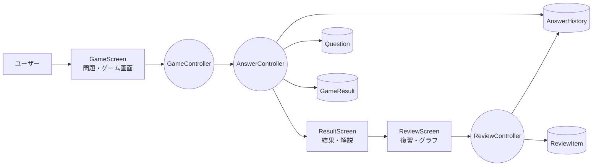
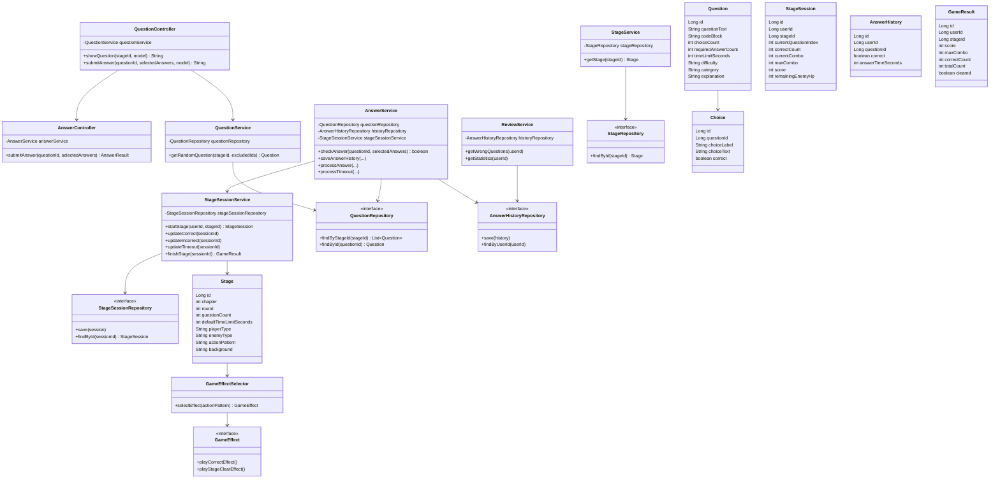
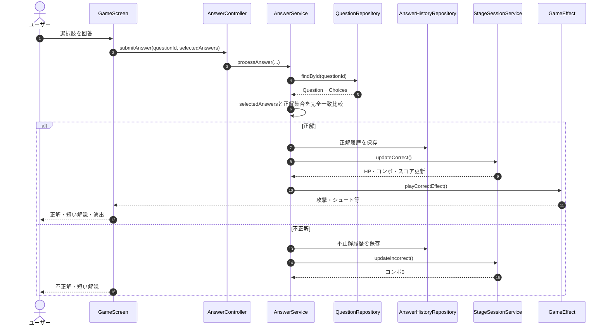
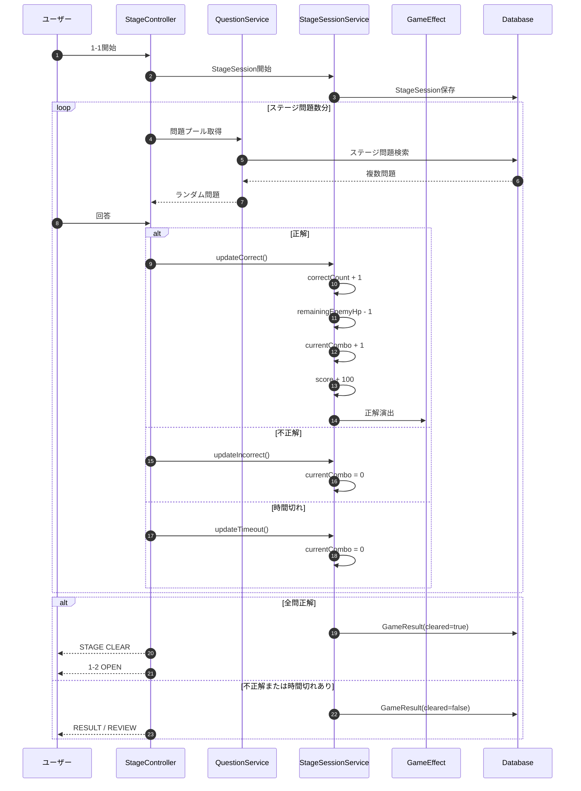
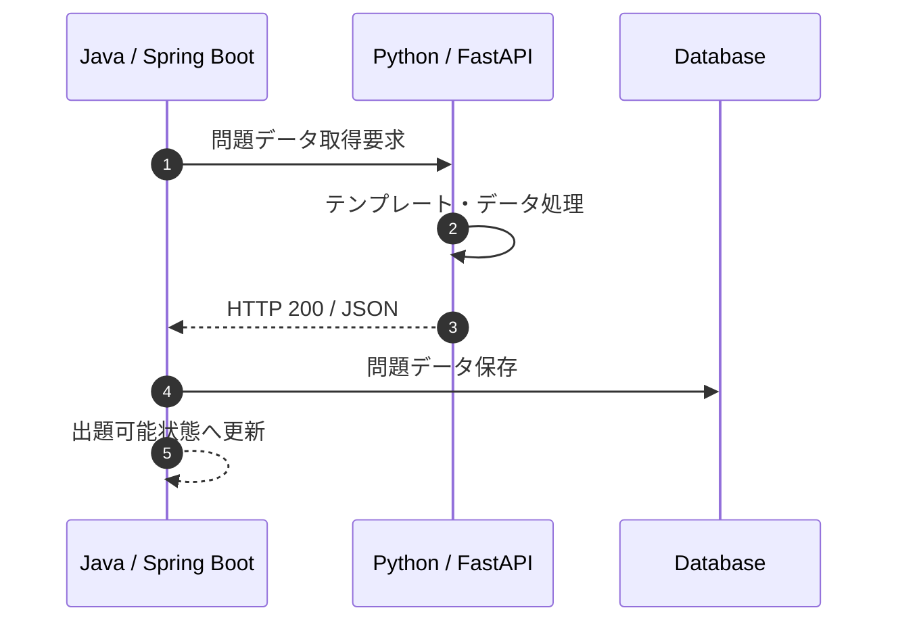

[Java_Learning_System_README_完成版.md](https://github.com/user-attachments/files/33040744/Java_Learning_System_README_.md)
# Java Learning System
## ゲーム要素を取り入れたJava学習管理Webシステム

> **Javaを1問解くたび、ゲームが進む。**

Java Bronzeを学習している初学者を対象に、**問題演習・ミニゲーム・回答履歴・復習・成績分析**を組み合わせたJava学習管理Webシステムを開発する。

単なる「Java問題集」ではなく、Javaの知識を使って短いゲームを次々クリアしながら学ぶ体験を目指す。

---

## 0. このREADMEの読み方

初心者・先生には前半、SE/SES・エンジニアには後半が読みやすい構成にしている。

```text
概要
 ↓
課題・目的
 ↓
機能・画面・ゲーム体験
 ↓
使用技術
 ↓
システム構成
 ↓
要求・分析・設計
 ↓
UML / ロバストネス / クラス / シーケンス
 ↓
開発方法・AI活用・テスト
 ↓
スケジュール・進捗・拡張
```

---

# 1. プロジェクト概要

## 1.1 何を作るのか

Java Bronzeを学習する初学者向けの学習支援Webアプリケーションを開発する。

ユーザーはJavaの問題に回答し、正解するとキャラクターが攻撃したり、シュートしたり、魚を釣ったり、レースで相手を追い抜いたりするなど、回答結果がゲーム内の出来事として表現される。

## 1.2 コンセプト

> **「Java Bronzeの問題を解いている」ではなく、「Javaの知識を使ってゲームをクリアしている」と感じる学習体験を作る。**

中心となる考え方は、

**「問題が変わる → 操作・演出が変わる → 学習体験が変わる」**

である。

## 1.3 ターゲットユーザー

- Java Bronzeを学習している初学者
- Javaの基本文法を繰り返し練習したい人
- 問題集だけでは学習が続きにくい人
- 自分の苦手分野や過去の回答を確認したい人

---

# 2. 開発背景と解決したい課題

## 2.1 課題

一般的な資格学習は、

```text
問題を解く
  ↓
間違える
  ↓
解説を読む
  ↓
もう一度解く
```

という反復になりやすい。

そのため、

- 問題演習が単調になりやすい
- 同じ問題を繰り返すと答えを覚えてしまう
- 間違えた問題をもう一度解くモチベーションが下がる
- 自分の苦手分野が分かりにくい
- 長いコード・問題文をゲーム画面にそのまま表示すると読みにくい

という課題がある。

## 2.2 解決策

本システムでは、

```text
問題を解く
  ↓
正誤判定
  ↓
短い解説
  ↓
正解ならゲーム演出
  ↓
スコア・コンボ・ステージ進行
  ↓
全問終了
  ↓
グラフ・データ・問題・解説で振り返る
  ↓
間違えた問題を復習・再挑戦
```

という流れを作る。

学習機能を中心に置きながら、ゲームによる視覚的なフィードバックで反復学習を続けやすくする。

---

# 3. 学習フロー

## 3.1 全体フロー

```text
HOME
  ↓
CHAPTER / STAGE選択
  ↓
StageSession開始
  ↓
問題をランダム出題
  ↓
制限時間内に回答
  ↓
正誤判定
  ↓
短い解説
  ↓
正解ならゲーム演出
  ↓
スコア・コンボ・敵HPなど更新
  ↓
次の問題
  ↓
全問終了
  ↓
STAGE CLEAR または RESULT
  ↓
間違えた問題を振り返る
  ↓
復習・リベンジ
```

## 3.2 ステージ例

4問構成の1-1を例にすると、正解1回につき敵HPを1減らす。

```text
1-1 START
   ↓
問題① → 正解 → Enemy HP -1
   ↓
問題② → 正解 → Enemy HP -1
   ↓
問題③ → 正解 → Enemy HP -1
   ↓
問題④ → 正解 → Enemy HP -1
   ↓
Enemy HP = 0
   ↓
✨ STAGE CLEAR ✨
   ↓
1-2 OPEN
```

### ステージ状態の考え方

`Stage` は「ステージの定義」、`StageSession` は「ユーザーがそのステージをプレイしている状態」と分ける。

```text
Stage
 └─ マスターデータ
    ・4問構成
    ・忍者
    ・Java Robot A

StageSession
 └─ プレイ中の状態
    ・現在何問目か
    ・正解数
    ・現在コンボ
    ・最大コンボ
    ・スコア
    ・残りHP
```

これにより、ステージの固定情報と、プレイ中に変化する値を混ぜない。

## 3.3 ステージクリア条件

MVPでは、

```text
ステージ内の全問題を回答
AND
全問題を正解
↓
STAGE CLEAR
```

を基本仕様とする。

1問でも不正解または時間切れがあった場合、そのプレイはクリアにならず、RESULT → REVIEW / REVENGEへ進む。

## 3.4 不正解時

```text
不正解
 ↓
Enemy HPは減らさない
 ↓
コンボを0
 ↓
スコア加算なし
 ↓
短い解説
 ↓
次の問題
```

ステージ終了後、間違えた問題を確認して再挑戦できる。

## 3.5 時間切れ時

```text
タイマー = 0
 ↓
入力をロック
 ↓
不正解として確定
 ↓
回答履歴を保存
 ↓
コンボを0
 ↓
解説を表示
 ↓
次の問題
```

部分点は与えない。
# 4. 問題仕様

## 4.1 問題形式

以下の選択形式を対象とする。

- A～E / 1つ選択
- A～G / 1つ選択
- A～E / 2つ選択
- A～G / 2つ選択
- A～G / 3つ選択
- コード選択 A～E / 1つ選択
- コード選択 A～G / 2つ選択

問題形式は必要に応じて拡張する。

## 4.2 短い問題

例：

```java
int score = 80;
```

**scoreの型は？**

```text
A int
B double
C String
D boolean
```

## 4.3 長文問題

短い問題だけに限定せず、Java Bronzeで想定されるような長い問題文・長いコードにも対応する。

例：

```text
次のプログラムを実行した場合、
コンソールに表示される結果として
正しいものを選択してください。
```

画面は、

```text
┌──────────────────────────────────┐
│          問題エリア              │
│                                  │
│  問題文・Javaコード・選択肢       │
│                                  │
├──────────────────────────────────┤
│          ゲーム演出エリア          │
│                                  │
│       プレイヤー VS 敵            │
│                                  │
└──────────────────────────────────┘
```

のように、**問題を読むための領域とゲーム演出の領域を分離**する。

これにより、長文問題でもゲーム性を維持する。

---

# 5. 制限時間・スコア・コンボ

## 5.1 問題ごとの制限時間

回答時間は1つの固定値ではなく、**問題ごとに設定する**。

考慮する要素：

- 問題文の長さ
- コード量
- 問題の難易度
- 学習分野
- 想定回答時間
- Java Bronze試験で必要になる時間感覚

基本的な実装上の責務は `Question.timeLimitSeconds` に持たせる。

## 5.2 Stageの標準時間との関係

章・ステージごとに時間感覚を変えたい場合に対応できるよう、`Stage.defaultTimeLimitSeconds` を持たせる。

ただし、実際にその問題へ適用する時間は次の優先順位とする。

```text
Question.timeLimitSeconds が設定されている
        ↓
その問題の個別制限時間を使用

Question側に個別設定がない
        ↓
Stage.defaultTimeLimitSeconds を使用
```

これにより、「1問ごとに違う制限時間」と「章・ステージによる時間設定」の両方に対応する。

実際の試験仕様を参考にした数値は、実装時点の公式情報を確認して設定する。

## 5.3 コンボ

基本ルール：

```text
正解       → currentCombo + 1
不正解     → currentCombo = 0
時間切れ   → currentCombo = 0
```

ステージ終了時には `maxCombo` を保存する。

## 5.4 スコア

MVPでは複雑な計算式を避け、次のシンプルな方式を基本案とする。

```text
正解       → +100
不正解     → +0
時間切れ   → +0
```

残り時間ボーナスなどは、MVP完成後の拡張候補とする。
# 6. ステージ内ランダム出題

同じ1-1を繰り返しても同じ問題順にならないように、ステージごとに問題プールを持たせる。

```text
1-1 Question Pool
├ Q001
├ Q002
├ Q003
├ Q004
├ Q005
├ Q006
└ ...
```

1回目：

```text
Q002 → Q005 → Q001 → Q004
```

2回目：

```text
Q006 → Q003 → Q002 → Q005
```

のようにランダム化する。

将来的には、直前に出題した問題の連続出題を避けるなどのルールも追加候補とする。

---

# 7. 回答後のフィードバック

## 7.1 解説

回答後は、まずシンプルな解説を表示する。

例：

```text
✅ 正解！

intは整数を扱うためのデータ型です。
```

長い解説はゲーム画面に詰め込まず、詳細な復習画面で確認できる構成を目指す。

## 7.2 正解演出

正解すると、毎回気持ちよいフィードバックを出す。

```text
✨ GREAT! ✨

🥷 クナイ発射！

💥 HIT!!

Enemy HP -1
```

候補：

- 正解エフェクト
- キャラクターアニメーション
- 効果音
- スコア加算
- コンボ増加
- 敵HP減少
- 画面フラッシュ
- 演出テキスト

## 7.3 ステージクリア演出

全問終了時は、1問正解時とは別にステージクリア演出を表示する。

```text
🎉🎉🎉

      STAGE CLEAR!

         1 - 1

  SCORE       920
  COMBO         4
  正答率      100%

   ★ ★ ★ ★ ★

      NEXT → 1-2
```

---

# 8. ミニゲーム・演出コンセプト

本プロジェクトでは、すべてを別々の巨大なゲームとして作らない。

**問題出題・回答判定は共通化し、「正解イベント」に応じて演出パターンを切り替える。**

```text
Question
   ↓
AnswerService
   ↓
正解イベント
   ↓
┌──────────┬──────────┬──────────┐
│ Attack   │ Shoot    │ Race     │
│ 戦闘     │ スポーツ │ 乗り物   │
└──────────┴──────────┴──────────┘
```

これにより、新しい演出を追加しても問題判定や履歴管理を作り直さなくてよい構造を目指す。

---

## 8.1 戦闘系演出

### 忍者

正解 → クナイを投げる → 敵に命中 → HP -1

### 侍

正解 → 日本刀で斬る → 命中 → HP -1

### サラリーマン

正解 → ビジネスバッグで攻撃 → 命中

### 医者

正解 → 特大注射器で攻撃 → 命中

### 学生

正解 → ノート・教科書などを使って攻撃

### 小学1年生

ランドセルを背負ったキャラクターが、ものさし・教科書・百科事典などを使うコミカルな演出を候補とする。

---

## 8.2 スポーツ系演出

### バスケットボール

正解するたびにシュートし、ゴールする。

```text
問題① → シュート → GOAL!
問題② → シュート → GOAL!
問題③ → シュート → GOAL!
問題④ → シュート → GOAL!
```

### ボウリング

正解するたびにピンを倒し、最後の問題でストライクを狙う。

---

## 8.3 動物系演出

### ペンギン

正解するたびに魚を捕まえる。

全問正解 → FISH GET!

### 釣り人

正解 → HIT! → 魚を引き上げる。

---

## 8.4 乗り物系演出

### 自動車レース

正解するごとに前の車を追い抜き、最後にゴールする。

### 電車レース

正解するごとに他の電車を追い抜き、最後にゴールする。

---

# 9. キャラクター・敵のバリエーション

同じキャラクターや敵だけでは単調になりやすいため、可能な範囲でラウンドごとに見た目を変える。

例：

```text
1-1
プレイヤー：忍者
敵：Java Robot A

1-2
プレイヤー：侍
敵：Java Robot B

1-3
プレイヤー：医者
敵：Java Robot C
```

敵は同じ「Javaロボット」というテーマでも、

- Type A
- Type B
- Type C
- 重装型
- 高速型
- 巨大型
- 宇宙型

などの差分を持たせる候補とする。

**ただし、キャラクター数を増やすこと自体は目的ではない。完成度と期限を優先する。**

---

# 10. 復習・学習管理

## 10.1 全問終了後の振り返り

全問を解き終えたら、正答率だけではなく、間違えた問題を中心に振り返る。

```text
RESULT

10 / 12

正答率 83.3%

得意：変数・演算子
苦手：条件分岐・配列
```

## 10.2 間違えた問題

```text
REVIEW

Q003 条件分岐     ×
Q007 配列         ×
Q010 文字列       ×

[問題を見る]
[解説を見る]
[もう一度解く]
```

## 10.3 グラフ・データ

カテゴリ別に、

- 正答率
- 正解数 / 不正解数
- 回答時間
- 問題数
- 苦手カテゴリ

などを可視化する。

例：

```text
カテゴリ別正答率

変数        ██████████ 100%
演算子      ████████    80%
条件分岐    ██████      60%
配列        █████       50%
```

これにより、「ゲームを遊んだだけ」で終わらず、**次に何を学習すべきかが分かる学習管理システム**にする。

---

# 11. 画面構成

## HOME

写真・3Dビジュアルを大胆に使用する。

```text
JAVA QUEST

Javaを、遊びながら身につけよう。

[ START ]
[ REVIEW ]
[ RECORD ]
[ HELP ]
```

## CHAPTER / STAGE

```text
JAVA WORLD

[ 変数 ]       ★★★
[ 条件分岐 ]   ★★☆
[ 配列 ]       🔒
```

## GAME

```text
SCORE 1250     COMBO ×4     TIME 04

┌────────────────────────────┐
│ int score = 80;            │
│                            │
│ scoreの型は？              │
│                            │
│ [A int]   [B double]       │
│ [C String][D boolean]      │
├────────────────────────────┤
│       🥷         🤖        │
│                         HP │
└────────────────────────────┘
```

## RESULT

```text
RESULT

8 / 10

正答率 80%
得意：変数
苦手：条件分岐

[ REVIEW ]
[ NEXT STAGE ]
```

## REVIEW

```text
REVIEW

間違えた問題
・条件分岐 ×
・演算子   ×
・配列     ×

[問題を見る]
[解説を見る]
[REVENGE]
```

---

# 12. デザイン方針

## 12.1 HOME：おしゃれ・ビジュアル重視

写真を全面的に使ったポートフォリオ系Webサイトのように、

- 大きなビジュアル
- 余白
- 統一されたテーマ
- 少ない要素でも成立する構成

を意識する。

必要に応じてBlenderでオリジナル3D素材を制作する。

## 12.2 GAME：ポップ・ゲーム重視

Typing LandやOzawa-Kenなどから、「楽しく操作できる」「すぐ結果が分かる」というUI/UXの考え方を参考にする。

- 大きなボタン
- ポップなフィードバック
- タイマー
- スコア
- コンボ
- 正解アニメーション
- キーボード操作
- キャラクターアクション

を組み合わせる。

既存作品のキャラクター、画面、ロゴ、名称、素材、具体的なデザインをコピーしない。

## 12.3 REVIEW / RECORD：情報確認を優先

ゲーム画面より落ち着いたUIにして、学習データを読み取りやすくする。

---

# 13. ビジュアル制作

## 第一候補：Blender

候補：

- キャラクター
- Javaロボット
- ステージ
- 背景
- 3Dオブジェクト
- エフェクト素材

ただし、優先順位は、

```text
Java学習システム完成
      ↓
UI完成度を上げる
      ↓
余裕があればBlender
```

とする。

## 第二候補：フリー素材

制作時間が足りない場合はフリー素材も検討する。

候補：

- ソコスト
- ちょうどいいイラスト
- 鉛筆素材
- イラストナビ
- 水彩画イラストフリー素材 sui-sai
- おいしそうなフリーイラスト oisiso
- Pixnote
- ドットイラスト
- dotpict

使用前に、商用利用・改変・クレジット・再配布・GitHub公開などの利用規約を確認する。

---

# 14. データモデル

## 14.1 User

```text
User
├ user_id
├ username
└ ...
```

## 14.2 Question

```text
Question
├ question_id
├ question_text
├ code_block
├ choice_count
├ required_answer_count
├ time_limit_seconds
├ difficulty
├ category
└ explanation
```

`required_answer_count` は、何個の選択肢を選ぶ必要があるかを表す。

```text
1 → 単一選択
2 → 2つ選択
3 → 3つ選択
```

## 14.3 Choice

```text
Choice
├ choice_id
├ question_id
├ choice_label
├ choice_text
└ is_correct
```

正解となる選択肢は `is_correct = true` で管理する。

## 14.4 Stage

`Stage` はマスターデータとして、ステージそのものの固定情報を持つ。

```text
Stage
├ stage_id
├ chapter
├ round
├ question_count
├ default_time_limit_seconds
├ player_type
├ enemy_type
├ action_pattern
└ background
```

## 14.5 StageSession

`StageSession` は、ユーザーが現在プレイしているステージの状態を管理する。

```text
StageSession
├ stage_session_id
├ user_id
├ stage_id
├ current_question_index
├ correct_count
├ current_combo
├ max_combo
├ score
├ remaining_enemy_hp
├ started_at
└ completed_at
```

### HPの扱い

MVPでは、最大HPをステージ問題数から求める。

```text
maximumEnemyHp = Stage.questionCount
remainingEnemyHp = maximumEnemyHp - StageSession.correctCount
```

これにより、`Stage`に「現在HP」を持たせず、プレイ中の可変値は `StageSession` で管理する。

## 14.6 AnswerHistory

```text
AnswerHistory
├ history_id
├ user_id
├ question_id
├ correct
├ answer_time_seconds
└ answered_at
```

複数選択の回答は、文字列1列に押し込めず、選択したChoiceとの関連を別に保持する。

```text
AnswerHistorySelectedChoice
├ history_id
└ choice_id
```

例えばAとCを選択した場合、

```text
history_id = 101
choice_id  = A

history_id = 101
choice_id  = C
```

のように保存する。

## 14.7 GameResult

```text
GameResult
├ result_id
├ user_id
├ stage_id
├ score
├ max_combo
├ correct_count
├ total_count
├ cleared
└ completed_at
```

## 14.8 ReviewItem

```text
ReviewItem
├ review_id
├ user_id
├ question_id
├ latest_correct
├ retry_count
└ last_reviewed_at
```

---

# 15. データ整合性の基本ルール

設計モデルと要求仕様がずれないよう、以下を共通ルールとする。

| 仕様 | 設計上の対応 |
|---|---|
| 単一・複数選択 | `required_answer_count` + `Choice.is_correct` |
| 複数選択判定 | 選択されたChoice集合と正解Choice集合を完全一致比較 |
| 部分点なし | 一部一致では正解にしない |
| 問題ごとの時間 | `Question.time_limit_seconds` |
| Stageの標準時間 | `Stage.default_time_limit_seconds` |
| プレイ中のHP | `StageSession.remaining_enemy_hp` |
| スコア | `StageSession.score` → `GameResult.score` |
| コンボ | `StageSession.current_combo` / `max_combo` |
| 回答履歴 | `AnswerHistory` + `AnswerHistorySelectedChoice` |
| ステージクリア | 全問回答 AND 全問正解 |
| 時間切れ | 不正解扱い、入力ロック、コンボ0 |

この表を、要求モデル・UML・DB実装をつなぐ基準とする。

---
# 15. システム全体像

## 15.1 基本アーキテクチャ

```text
┌────────────────────────────────────┐
│ Web Browser                        │
│ HTML / CSS / JavaScript            │
│ HOME / GAME / RESULT / REVIEW      │
└────────────────┬───────────────────┘
                 │ HTTP / REST
                 ▼
┌────────────────────────────────────┐
│ Java / Spring Boot                 │
│ Controller                         │
│ Service                            │
│ Repository                         │
└────────────────┬───────────────────┘
                 │
                 ▼
┌────────────────────────────────────┐
│ Database                           │
│ Question / Choice / Stage          │
│ History / Result / Review          │
└────────────────────────────────────┘
```

## 15.2 技術スタック

| 技術 | 主な役割 |
|---|---|
| Java | アプリケーションの中心ロジック |
| Spring Boot | Web / API / 業務処理 |
| HTML | 画面構造 |
| CSS | UI・アニメーション |
| JavaScript | タイマー・操作・ゲーム演出・画面制御 |
| SQL / Database | 問題・履歴・成績などの保存 |
| Git / GitHub | ソース管理・変更履歴 |
| Python | 問題データ処理など、必要性がある場合に使用 |
| FastAPI | Python側を採用する場合のAPI候補 |
| Mermaid | UML / 構造図の可視化 |

---

# 16. Python / FastAPIの位置付け

Pythonは「使った実績を増やすため」ではなく、Java本体と役割を分けられる用途がある場合に使う。

候補：

- 問題データの検証
- コード内数値のランダム置換
- 類似問題の生成補助
- 問題データの加工
- 出題データの分析

## 採用する場合の構成


Python連携はMVPの必須条件にせず、**Java / Spring Bootだけでも学習システムが成立する設計**を優先する。

---

# 17. 要求モデル

学校で学習したICONIXの考え方を意識し、ビジネス上の目的からユースケースへ落とし込む。

## 主なユースケース

```text
利用者
 ├ 学習を開始する
 ├ ステージを選択する
 ├ 問題を解く
 ├ 回答する
 ├ 解説を見る
 ├ ゲーム演出を体験する
 ├ ステージをクリアする
 ├ 結果を見る
 ├ 回答履歴を見る
 ├ 苦手分野を確認する
 ├ 間違えた問題を復習する
 └ 再挑戦する
```

### 主要ユースケース：問題に回答する

**事前条件**：学習者がステージを開始している。

**基本フロー**：

1. システムがステージの問題プールから問題を選ぶ。
2. 制限時間とともに問題を表示する。
3. 学習者が選択肢を回答する。
4. システムが正誤判定する。
5. 回答履歴を保存する。
6. 短い解説を表示する。
7. 正解の場合はゲーム演出を実行する。
8. 次の問題へ進む。
9. 全問終了時は結果を集計する。

**事後条件**：回答結果が履歴として保存され、必要に応じて復習対象になる。

---

# 18. ロバストネス分析

Boundary（画面）、Control（処理）、Entity（データ）を分離する。



### Boundary

- GameScreen
- QuestionDisplay
- ChoiceDisplay
- TimerDisplay
- ScoreDisplay
- ComboDisplay
- ResultScreen
- ReviewScreen

### Control

- GameController
- QuestionController
- AnswerController
- ScoreController
- StageController
- ReviewController
- MiniGameController

### Entity

- User
- Question
- Choice
- Stage
- AnswerHistory
- GameResult
- ReviewItem

---

# 19. 設計モデル：3層アーキテクチャ

```text
Controller
   ↓
Service
   ↓
Repository
   ↓
Entity / Database
```

### Controller

画面やHTTPリクエストを受け取り、適切なServiceへ処理を渡す。

### Service

問題取得、正誤判定、スコア計算、ステージ進行、復習データ作成などの業務ロジックを担当する。

### Repository

Databaseとのデータアクセスを担当する。

### Entity

問題・選択肢・履歴・ステージなどのデータを表す。

---

# 20. クラス図（Javaコア領域）

Spring BootのController - Service - Repositoryを基本構造とする。



### 設計上のポイント

- `Question` は問題そのものを表す。
- `Stage` はステージの固定設定を表す。
- `StageSession` はプレイ中の可変状態を表す。
- `AnswerHistory` は個々の回答履歴を表す。
- `GameEffect` は問題判定とは別のゲーム演出を表す。
- 複数選択の正誤判定は `AnswerService` が担当する。
- DBアクセスはRepositoryに集約する。

---
# 21. シーケンス図：回答判定



---
# 22. シーケンス図：ステージ進行



---
# 23. Python / FastAPI連携シーケンス（採用時）

Pythonを採用する場合の参考構成。



Pythonサーバー停止時でもJavaシステム全体が落ちないようにする場合は、Java側で例外処理・フォールバックを設ける。

ただし、これはMVP完成後の拡張候補であり、期限を圧迫する場合は削る。

---

# 24. 設計整合性チェック

実装開始前に、要求・データモデル・クラス図・シーケンス図の間で、同じ仕様が同じルールで表現されているか確認する。

## 24.1 複数選択

要求：A～Gのうち2つ・3つ選択などに対応する。

設計：

```text
Question.requiredAnswerCount
Choice.isCorrect
AnswerHistorySelectedChoice
```

回答判定：

```text
selectedChoiceSet == correctChoiceSet
```

部分点はなし。

## 24.2 ステージHP

要求：1問正解ごとに敵HPを1減らす。

設計：

```text
Stage.questionCount
        ↓
最大HP

StageSession.correctCount
        ↓
残HP = 最大HP - 正解数
```

`enemyCurrentHp` をStageマスターに持たせず、プレイ中の状態として `StageSession` に保持する。

## 24.3 制限時間

要求：問題ごとに時間が異なる。

設計：

```text
Question.timeLimitSeconds
```

Stageに標準値がある場合は、Questionの個別値を優先する。

## 24.4 時間切れ

```text
TIME = 0
 ↓
入力ロック
 ↓
不正解確定
 ↓
履歴保存
 ↓
コンボ0
 ↓
解説
 ↓
次問題
```

## 24.5 ステージクリア

```text
全問回答
AND
全問正解
↓
STAGE CLEAR
```

このチェックを、UML・実装・テストケースの共通基準にする。

---

# 24. SOLID / KISS / DRY

## SOLID

特にSRP（単一責任の原則）を意識する。

例えば、QuestionServiceが、

- 問題取得
- 画面描画
- スコア計算
- DB保存
- 復習処理

をすべて持つ構造を避ける。

必要に応じて、

```text
QuestionService
AnswerService
ScoreService
StageService
ReviewService
MiniGameService
```

などに責務を分ける。

## KISS

必要以上に複雑な仕組みを作らない。

## DRY

正誤判定、タイマー、履歴保存などの共通処理を複数箇所へコピーしない。

---

# 25. REST API候補

```text
GET  /api/questions
GET  /api/questions/{id}
POST /api/answers
GET  /api/results/{stageId}
GET  /api/history
GET  /api/reviews
GET  /api/statistics
```

Python連携を行う場合：

```text
GET /api/v1/questions/generate
```

などを候補とする。

実際のエンドポイントは設計時に確定する。

---

# 26. AI活用方針

生成AIは**開発補助ツール**として利用する。

## AIを利用する部分

- Java問題の案出し
- オリジナル問題のバリエーション作成
- UIアイデア
- 画面構成
- 設計の相談
- エラー原因調査
- コードレビュー
- テスト観点の整理
- READMEの文章整理

## 自分で行う部分

- 要求・仕様の決定
- UML設計
- クラス設計
- Javaコードの入力・実装
- HTML / CSS / JavaScriptの実装
- DB設計
- 実行確認
- デバッグ
- リファクタリング

### 開発サイクル

```text
AIに相談
  ↓
内容を理解
  ↓
自分で判断
  ↓
自分でコードを書く
  ↓
実行
  ↓
エラー
  ↓
AIに原因を相談
  ↓
自分で修正
```

> **「AIに作ってもらった作品」ではなく、「AIを開発補助として使い、自分で設計・実装・完成させた作品」を目指す。**

---

# 27. 問題作成と著作権方針

問題はAIも活用しながら、Java Bronzeの学習範囲を参考に**オリジナル問題**として作成する。

```text
AIで問題案を作成
   ↓
Javaの仕様・動作を自分で確認
   ↓
問題を選別・修正
   ↓
DBへ登録
```

特定の試験問題、問題集、学校教材の文章・解説・画像をそのまま転載しない。

また、既存ゲームのキャラクター・画面・ロゴ・素材などをそのままコピーしない。

フリー素材を利用する場合は、商用利用、改変、クレジット、再配布、GitHub公開などの利用規約を確認する。

READMEには必要に応じて、次の趣旨を明記する。

> 本アプリに収録している問題は、Javaの学習範囲を参考に制作者が作成したオリジナル問題です。特定の試験問題・問題集の文章や解説を転載したものではありません。

---

# 28. 実務を意識した開発方法

## 28.1 アジャイル開発・スクラム的な進め方

学校の納期が決まっているため、1週間程度のタイムボックスで作業範囲を区切り、MVPを優先する。

```text
Backlog
   ↓
Sprint Planning
   ↓
実装
   ↓
動作確認
   ↓
レビュー・振り返り
   ↓
次Sprint
```

スクラムの用語を採用する場合でも、学校の短期間開発に合わせた軽量な運用とする。

## 28.2 Git / GitHub

タスクを機能単位に分解し、Issue / Projectsを利用できる場合は、

```text
Todo
  ↓
In Progress
  ↓
Review
  ↓
Done
```

で管理する。

### コミット例

```text
READMEを更新
トップページを作成
問題表示機能を実装
回答判定機能を実装
回答履歴保存を実装
ゲーム演出を追加
レビュー画面を追加
回答処理のバグを修正
```

コミット単位を細かくし、何を変更したか分かる履歴を残す。

---

# 29. テスト方針

学校のガイダンスにある導通テストを最低限実施し、余裕があれば単体・結合観点も整理する。

## 主要確認項目

- 問題が正しく出題される
- 問題がランダムに選ばれる
- タイマーが動作する
- 正解を正しく判定する
- 複数選択を正しく判定する
- 正解時に演出が出る
- 敵HPが正しく減る
- 全問終了でステージクリアになる
- 回答履歴が保存される
- 間違えた問題が復習対象になる
- グラフ・統計値が正しく表示される
- 次ステージが解放される

---

# 30. Must / Should / Could

## 🔴 MUST

- Java Bronze学習システムとして最後まで完成
- A～E / A～G
- 単一選択 / 複数選択
- 問題ごとの制限時間
- 章・ステージ
- ステージ内ランダム出題
- 正誤判定
- 回答後の短い解説
- 正解時のゲーム演出
- ステージクリア演出
- スコア
- 回答履歴
- 間違えた問題の復習
- グラフ・データによる振り返り
- DB
- Java / Spring Boot
- HTML / CSS / JavaScript

## 🟡 SHOULD

- コンボ
- タイムアタック
- 複数の演出パターン
- バスケ / ボウリング / 釣り / レース等の追加演出
- サウンド
- エフェクト
- 成績グラフ強化
- 問題管理機能
- Pythonによる問題データ処理

## 🟢 COULD

- Blender 3D
- 3Dキャラクター
- 複雑なエフェクト
- キャラクター成長
- Java Silver / Gold
- オンラインランキング
- Python / FastAPIによる類似問題生成

> **追加機能より、本体の完成を優先する。**

---

# 31. MVP完成条件

以下の一連の流れが最後まで動けばMVP完成とする。

```text
HOME
 ↓
CHAPTER
 ↓
STAGE 1-1
 ↓
ランダム問題
 ↓
回答
 ↓
正誤判定
 ↓
短い解説
 ↓
正解ならゲーム演出
 ↓
スコア / コンボ / HP更新
 ↓
次の問題
 ↓
全問終了
 ↓
STAGE CLEAR
 ↓
RESULT
 ↓
間違えた問題の確認
 ↓
解説・グラフ・再挑戦
```

---

# 32. 開発スケジュール

学校の総合演習スケジュールを基準とする。

| 日付 | フェーズ | 内容 |
|---|---|---|
| 10/2 | 企画 | 検討項目1～5 第1版 |
| 10/6 | 要求 | 要求モデル完成 |
| 10/9 | 分析 | 分析モデル完成 |
| 10/13 | 設計 | 設計モデル完成（オプション） |
| 10/14 | 実装 | プログラミング開始 |
| 10/20頃 | Sprint | コア機能・ゲーム機能実装 |
| 10/25頃 | MVP | 一連の学習フローを完成 |
| 10/26 | 品質向上 | 動作確認・デバッグ・リファクタリング |
| 10/28 | 納品 | 納品・発表資料作成 |
| 10/29 | 発表 | プレゼン・実演 |

---

# 33. 現在の開発状況

> 実際の進捗に合わせてこの表を更新する。

| 項目 | 状況 |
|---|---|
| 企画 | ✅ 方針整理済み |
| コンセプト | ✅ 決定 |
| Must / Should / Could | ✅ 整理済み |
| 問題形式 | ✅ 方針決定 |
| ゲーム演出案 | ✅ 整理済み |
| 要求モデル | 🔄 作成中 |
| 分析モデル | ⏳ |
| 設計モデル | ⏳ |
| DB設計 | ⏳ |
| Java / Spring Boot | ⏳ |
| HTML / CSS / JavaScript | ⏳ |
| ゲーム演出 | ⏳ |
| 履歴・復習 | ⏳ |
| テスト | ⏳ |
| Blender / 3D | ⏳ 追加候補 |

---

# 34. 今後の詳細設計で決める項目

基本的な業務ルールは上記で確定した。残りは実装規模・UI・データ量に関する詳細設計で決定する。

- 実際の問題数とQuestion Poolの件数
- Java Bronzeの学習範囲ごとの具体的な問題配分
- 各問題の具体的な制限時間
- 問題の重複出題防止ルール
- スコア演出・残り時間ボーナスをMVPに入れるか
- 具体的なゲーム演出パターンと素材
- 効果音・BGMの有無
- ユーザー認証をMVPに含めるか
- Python / FastAPIをMVPに含めるか
- DBのINDEX・UNIQUE・FKなどの物理設計
- APIの詳細なrequest / response形式
- 長文問題のスクロール量・レスポンシブ表示

**ここにある項目は「基本仕様が未定」という意味ではなく、実装時に具体値を決める詳細設計項目である。**

---
# 35. ポートフォリオとして伝えたいこと

この作品では、ゲームの見た目だけではなく、開発プロセス全体を説明できることを重視する。

### 企画

なぜJava学習システムを作るのか。

### 要求

ユーザーが何をしたいのか。

### 分析

画面・処理・データをどう分けるのか。

### 設計

責務を分離し、拡張しやすくするにはどうするのか。

### 実装

Java / Spring Boot / JavaScript / DBをどう連携させるのか。

### 品質

Git、テスト、デバッグ、リファクタリングをどう行うのか。

### AI

AIをどこに使い、どこを自分で判断・実装したのか。

---

# 36. SES / SE向けの技術的な見どころ

本システムでは、

- Java / Spring Boot
- 3層アーキテクチャ
- DB設計
- REST API
- UML
- ロバストネス図
- シーケンス図
- クラス図
- SOLID
- KISS
- DRY
- Git / GitHub
- アジャイル的なタスク管理
- AIの開発補助利用
- UI / UX
- データ分析・復習

を、小規模な一つのWebシステムの中で実践する。

特に、

> **問題データとゲーム演出を分離し、正解イベントを共通化する。**

ことで、新しい演出を追加しても問題判定・回答履歴・学習管理への影響を抑える設計を目指す。

---

# 37. 最終コンセプト

## JAVA QUEST
### Javaを、遊びながら身につけよう。

**Java Bronze学習 × 選択式問題 × 時間制限 × ランダム出題 × ゲーム演出 × 成績管理 × 復習**

を組み合わせたJava学習管理システム。

1問正解するたびに、

```text
🥷 攻撃
🏀 シュート
🎣 釣る
🎳 倒す
🏎️ 追い抜く
🚆 追い抜く
🐧 捕まえる
```

など、ゲーム内の世界が動く。

全問終了後には、

```text
正答率
回答時間
苦手カテゴリ
間違えた問題
問題文
解説
再挑戦
```

を確認できる。

**「答えること」と「ゲームが進むこと」を一つにつなげることで、反復学習を続けやすくする。**

---

# 38. 開発上の基本ルール

1. まず動くものを作る。
2. 1つの機能を完成させてから次へ進む。
3. AIの出力を理解せずコピーしない。
4. エラーは原因を理解してから修正する。
5. 共通処理をコピーして増やさない。
6. 必要以上に機能を増やさない。
7. 既存作品の文章・キャラクター・画面をそのままコピーしない。
8. Blender等の追加要素より本体完成を優先する。
9. 未実装の機能を実装済みとしてREADMEに書かない。
10. READMEは開発状況に合わせて更新する。

---

# 39. README更新履歴

## 2026/10/05

- Java Bronze学習管理システムとして全体方針を整理
- 短い問題だけでなく長文問題にも対応する方針を追加
- 問題ごと・章ごとの制限時間を設定する方針を整理
- ステージ内で問題をランダム出題する方針を追加
- 正解1回ごとに敵HPを減らすステージ進行を整理
- 正解時の派手な演出、ステージクリア演出を追加
- 忍者・侍・サラリーマン・医者・学生・小学生などのキャラクター案を整理
- バスケ・ペンギン・釣り・ボウリング・自動車レース・電車レース等の演出案を整理
- 問題処理とゲーム演出を分離する設計方針を追加
- 回答後の短い解説を追加
- 全問終了後のグラフ・データ・問題・解説による振り返りを追加
- ロバストネス図・クラス図・シーケンス図を追加
- Spring Boot 3層アーキテクチャを整理
- Python / FastAPI連携を「採用時の拡張構想」として整理
- AI活用方針を整理
- アジャイル的な開発・Git / GitHubによるタスク管理方針を追加
- 初心者とSE / SESの双方が読みやすい「概要 → 機能 → 設計 → 実装」の順番に整理
- 複数選択・HP・時間切れ・ステージクリア条件など、要求と設計モデルの整合性を整理

---

## License / Notes

本リポジトリに含まれるコード・問題データ・画像・3D素材等については、各ファイル・素材のライセンスおよび利用規約を確認したうえで利用・公開する。
