[Java_Learning_System_README_64plus_初心者向け図解版_20261006.md](https://github.com/user-attachments/files/33090085/Java_Learning_System_README_64plus_._20261006.md)
# JAVA QUEST（仮称）
## ゲーム要素を取り入れたJava学習管理Webシステム

> **Javaの問題を1問解くたび、ゲームの世界が動く。**

Java Bronzeを学習している初学者を対象に、**問題演習・ゲーム演出・回答履歴・復習・成績分析**を組み合わせた学習支援Webシステムを開発する。

単なる「Java問題集」ではなく、問題への回答そのものをゲーム内アクションへ変換し、**「学ぶ → 答える → 世界が動く → 振り返る → もう一度解く」**という流れを一つの体験として提供する。

---

# 0. READMEの読み方

> **このREADMEは、最初から全部理解・暗記する必要はありません。まずは1～23で「何を作るか」を理解し、24以降の設計図は「どう作るか」を確認する資料として使います。**

このREADMEは、学校の卒業制作資料としても、GitHubのポートフォリオとしても読めるように構成している。

```text
プロジェクト概要
  ↓
開発背景・課題
  ↓
ゲーム仕様・UI
  ↓
問題・学習管理
  ↓
使用技術・システム構成
  ↓
要求モデル
  ↓
分析モデル
  ↓
設計モデル
  ↓
UML・ロバストネス・シーケンス・クラス図
  ↓
SOLID / KISS / DRY
  ↓
開発方法（Waterfall / Agile）
  ↓
AI活用・問題作成方針
  ↓
テスト
  ↓
MVP・スケジュール・拡張
```

初心者は前半から順に読むことで「何を作るのか」を理解でき、SE / SESの方は後半の設計・実装・品質管理まで確認できる構成とする。

---

# 1. プロジェクト概要

## 1.1 何を作るのか

Java Bronzeを学習する初学者向けのゲーム要素付き学習管理Webアプリケーションを開発する。

学習者はChapterを自由に選択し、そのChapterに登録された問題から5問・10問・20問を選択してプレイする。

問題は優先度を考慮しながらランダムに出題され、正解するとゲーム内のキャラクターや世界が動く。

```text
Chapterを選ぶ
   ↓
5 / 10 / 20問を選ぶ
   ↓
問題を抽選
   ↓
問題に回答
   ↓
正解 → ゲームアクション
不正解 → MISS
時間切れ → TIME UP
   ↓
短い解説
   ↓
次の問題
   ↓
Stage Clear
   ↓
RESULT / REVIEW
```

## 1.2 コンセプト

> **「Javaの問題を解いている」のではなく、「Javaの知識を使ってゲームを進めている」と感じられる学習体験を作る。**

中心となる設計思想は、

**「問題が変わる → 操作・演出が変わる → 学習体験が変わる」**

である。

## 1.3 ターゲット

- Java Bronzeを学習している初学者
- Javaの基本文法を繰り返し練習したい人
- 問題集だけでは学習が続きにくい人
- 自分の苦手分野や回答履歴を確認したい人

---

# 2. 開発背景と解決したい課題

## 2.1 従来の問題演習

一般的な資格学習は、

```text
問題を解く
  ↓
間違える
  ↓
解説を読む
  ↓
もう一度解く
```

という反復になりやすい。

その結果、

- 問題演習が単調になりやすい
- 同じ問題を繰り返すと答えの形だけ覚えてしまう
- 間違えた問題をもう一度解くモチベーションが下がる
- 自分の苦手分野が分かりにくい
- 長い問題文やコードをそのままゲーム画面に置くと視認性が低下する

という課題がある。

## 2.2 このシステムでの解決

本システムでは、

```text
問題
 ↓
回答
 ↓
正誤判定
 ↓
短いフィードバック
 ↓
正解ならゲーム世界が動く
 ↓
次の問題
 ↓
結果・苦手分野を確認
 ↓
復習
```

とする。

ゲームは「問題の合間に置く休憩」ではなく、**問題への回答結果を視覚的に表現するフィードバック層**として扱う。

つまり、

> **問題を解くこと自体が、ゲームを進める操作になる。**

これにより、単純な問題集との差別化を図る。

---

# 3. 学習体験の基本ループ

## 3.1 まず「1 Stage = 5問」と考える

この作品の基本は、**5問を1つの小さなゲームバトルとして進めること**です。

```text
① Chapterを選ぶ
        ↓
② 5 / 10 / 20問を選ぶ
        ↓
③ Stage開始
   敵は1体・HP5
        ↓
④ 問題を見る
        ↓
⑤ 考える → キーを押す
        ↓
⑥ すぐに正誤が分かる
       ┌─────────────┐
       │             │
      正解           不正解 / 時間切れ
       ↓             ↓
  キャラが攻撃       MISS / TIME UP
       ↓             ↓
   敵HP -1         敵HPそのまま
       └──────┬──────┘
              ↓
          短い解説
              ↓
          次の問題
              ↓
           5問終了？
            ↓     ↓
           No     Yes
            ↓      ↓
        次の問題  Stage Clear
                     ↓
             5問すべて正解？
                ↓        ↓
               Yes       No
                ↓         ↓
             PERFECT     CLEAR
                ↓         ↓
             次Stage / Result
```

### 3.2 このゲームの「気持ちよさ」

Typing Landなどを参考にするのは、**キーを押したら画面がすぐ反応すること**です。

```text
考える
 ↓
キーを押す
 ↓
即反応
 ↓
キャラクターが動く
 ↓
成功 / MISS
 ↓
すぐ次へ
```

長い待ち時間を作らず、学習のテンポを保つことを重要な設計方針とします。

### 3.3 5問の意味

1問ごとにゲームが完全に終わるのではなく、**同じ敵との5問バトルが続きます。**

```text
問題1 → 正解 → HP4
問題2 → 正解 → HP3
問題3 → 正解 → HP2
問題4 → 正解 → HP1
問題5 → 正解 → HP0 → PERFECT
```

そのため、**問題を解くこと = Stageを攻略すること**になります。

---

# 4. Chapter・Question Pool・Stageの関係

先生から指摘された「ChapterとStageとQuestionはどういう関係なのか」を、今回の仕様では次のように整理する。

## 4.1 結論

```text
Chapter
  ↓
Question Pool
  ↓
プレイヤーが5 / 10 / 20問を選択
  ↓
今回のPlay Session
  ↓
5問単位でStageに分割
  ↓
Question
```

重要なのは、**Questionが常に特定Stageに固定所属するわけではない**ことである。

同じChapterの問題は問題プールとして管理し、プレイ開始時に問題を抽選する。

## 4.2 Chapter

「何を学ぶか」を表す大きな学習単位。

例：

```text
Chapter 1：変数
Chapter 2：演算子
Chapter 3：条件分岐
Chapter 4：繰り返し
Chapter 5：配列
```

Chapterには教材側の難易度を1～5で設定する。

```text
★☆☆☆☆
★★☆☆☆
★★★☆☆
★★★★☆
★★★★★
```

## 4.3 Question Pool

各Chapterが持つ問題の集合。

例：

```text
Chapter 3「条件分岐」
  └─ Question Pool
      ├ Q001
      ├ Q002
      ├ Q003
      ├ ...
      └ Q050
```

## 4.4 Stage

Stageは「Chapterに固定で存在する4問・5問の問題箱」ではなく、**1回のプレイを区切るための実行単位**とする。

基本ルール：

```text
5問プレイ
  → Stage 1

10問プレイ
  → Stage 1 / Stage 2

20問プレイ
  → Stage 1 / Stage 2 / Stage 3 / Stage 4
```

つまり、

> **1 Stage = 5問**

とする。

## 4.5 Stageの難易度

Stage 1を簡単、Stage 4を難しくするような固定ルールは基本仕様にしない。

理由は、**Chapter自体が学習テーマと難易度を持っているため**である。

Chapter内の問題には個別に、

```text
EASY
NORMAL
HARD
```

を持たせる。

プレイ時にはそのChapterの問題を優先順位付きで抽選し、Stageによって機械的に難易度を上げない。

---

# 5. Chapter Selectと学習進捗

## 5.1 Chapterを自由に選択

プレイヤーは学習したいChapterを自由に選ぶ。

```text
CHAPTER SELECT

┌────────────────────┐
│ 01 変数             │
│ 難易度 ★★☆☆☆       │
│ 習得率 82%          │
│ 41 / 50問クリア     │
│ 要復習 4問          │
└────────────────────┘

┌────────────────────┐
│ 02 条件分岐         │
│ 難易度 ★★★☆☆       │
│ 習得率 68%          │
│ 34 / 50問クリア     │
│ 要復習 7問          │
└────────────────────┘
```

## 5.2 ★と正答状況は別物として扱う

```text
★ = 教材側の難易度
% = プレイヤーの学習状況
```

これを分離する。

例えば、

```text
配列
難易度 ★★★★☆

習得率 61%
30 / 50問クリア
```

と表示する。

## 5.3 Chapter Hover / 詳細表示

マウスを乗せた場合は、

- 正解数
- 回答数
- 正答率
- 習得率
- 未回答数
- 要復習数
- 平均回答時間
- 最終プレイ日

などを確認できるようにする。

---

# 6. 出題数設定

Chapterを選択した後、

```text
このChapterを何問プレイしますか？

[ 5問 ]   [ 10問 ]   [ 20問 ]
```

から選択する。

ただし、Chapterの問題数より多い選択肢は無効化する。

例：

```text
Chapter内の問題：8問

[ 5問 ]   [ 10問 🔒 ]   [ 20問 🔒 ]
```

## 6.1 プレイ時間の目安

```text
5問  → クイック
10問 → スタンダード
20問 → フル
```

と表示してもよい。

---

# 7. ランダム出題と学習優先度

## 7.1 完全ランダムにはしない

「ランダム」といっても、学習上重要な問題を優先する。

問題の学習状態：

```text
UNSEEN
まだ一度も正解していない / 未出題

REVIEW
間違えたため復習が必要

CLEAR
一度正解した

MASTERED
連続して正解し、定着状態とみなす
```

## 7.2 出題優先順位

```text
① UNSEEN
   ↓
② REVIEW
   ↓
③ CLEAR
   ↓
④ MASTERED
```

各グループ内ではランダムにする。

これにより、

> 「まだできない問題」や「最近間違えた問題」を優先しながら、既にできる問題も完全には消さない

設計とする。

## 7.3 同一プレイ内の重複

同じプレイ中は、同じQuestionを二度出題しない。

```text
Question Pool
   ↓
優先度で候補化
   ↓
ランダム抽選
   ↓
同一プレイ内は重複なし
```

## 7.4 問題を一度正解した後、もう一度間違えた場合

「過去に正解した」という履歴は残す。

しかし、**現在の学習状態はREVIEWに戻す**。

```text
CLEAR
  ↓ 不正解
REVIEW

MASTERED
  ↓ 不正解
REVIEW
```

つまり、

> 過去の成功履歴と現在の定着状態を分離する。

---

# 8. 問題形式

以下をMVPの対象とする。

- A～E / 1つ選択
- A～G / 1つ選択
- A～E / 2つ選択
- A～G / 2つ選択
- A～G / 3つ選択
- コード選択 A～E / 1つ選択
- コード選択 A～G / 2つ選択

## 8.1 問題データ

```text
Question
├ questionId
├ questionText
├ codeBlock
├ choiceCount
├ requiredAnswerCount
├ timeLimitSeconds
├ difficulty
├ category
└ explanation
```

## 8.2 Choice

```text
Choice
├ choiceId
├ questionId
├ choiceLabel
├ choiceText
└ isCorrect
```

## 8.3 複数選択の正誤判定

部分点はなし。

```text
selectedChoiceSet == correctChoiceSet
```

完全一致した場合のみ正解とする。

---

# 9. 短い問題と長文問題

## 9.1 短い問題

```java
int score = 80;
```

**scoreの型は？**

```text
A int
B double
C String
D boolean
```

## 9.2 長文問題

問題文やコードが長い場合にも対応する。

ゲーム性を維持しながら読みやすくするため、画面領域を分ける。

```text
┌──────────────────────────────┬─────────────────────────────┐
│                              │                             │
│      QUESTION AREA           │        GAME AREA            │
│                              │                             │
│ 問題文                       │ キャラクター                │
│ Javaコード                   │ 背景                        │
│ 選択肢                       │ アクション                  │
│ 解説                         │ HP / GAME PROGRESS         │
│                              │ COMBO / TIMER              │
└──────────────────────────────┴─────────────────────────────┘
```

PCは横長画面を利用し、**左を学習、右をゲーム**の2ペイン構成を基本とする。

スマートフォン等では縦積みに変更できるレスポンシブ構成を検討する。

---

# 10. ゲームUIの設計思想

## 10.1 PC向け2ペイン

```text
┌──────────────────────────────────────────────────────────┐
│ JAVA QUEST                Chapter 03 / Stage 2 / 07 / 10 │
│                                           TIME 12.4 sec   │
├───────────────────────────────┬──────────────────────────┤
│                               │                          │
│         QUESTION              │        GAME WORLD        │
│                               │                          │
│ int x = 10;                   │            🥷            │
│ int y = 3;                    │           ⚔️             │
│                               │                      🤖  │
│ x % y の結果は？              │                          │
│                               │     GAME PROGRESS       │
│ A 0                           │     ███████░░░           │
│ B 1                           │                          │
│ C 3                           │     COMBO ×4            │
│ D 10                          │                          │
│ E エラー                      │                          │
├───────────────────────────────┴──────────────────────────┤
│        A          B          C          D          E       │
└──────────────────────────────────────────────────────────┘
```

## 10.2 ゲーム画面の目的

画面の空白を無理に埋めるのではなく、**右側をゲーム世界として成立させる**。

参考とするのは、

- 入力に対する即時フィードバック
- キャラクターの継続的な動き
- ステージ進行の視覚化
- 正解・失敗が一瞬で分かるUI
- 大きな操作要素
- ポップな演出

などである。

Typing LandやOzawa-Kenなどは、**UI/UXの考え方やゲームとしてのテンポの参考**とし、キャラクター、画面、ロゴ、具体的な素材・デザインはコピーしない。

---

# 11. タイマー・スコア・コンボ

## 11.1 問題ごとの制限時間

回答時間は**問題ごと**に設定します。

```text
Question
 └ 制限時間
```

考慮するもの：

- 問題文の長さ
- コード量
- 問題の難しさ
- 問題形式
- 想定回答時間

MVPでは、**Questionに設定した時間を唯一の基準**とします。

「Stageの時間」「問題の時間」の2種類を作らず、最初は1つに絞ることで、実装を分かりやすくします。

## 11.2 コンボ

```text
正解       → コンボ +1
不正解     → コンボ 0
時間切れ   → コンボ 0
```

## 11.3 スコア

MVPではシンプルにします。

```text
正解       → +100
不正解     → +0
時間切れ   → +0
```

残り時間ボーナスなどは余裕があれば追加します。

---

# 12. 正解・不正解・時間切れの挙動

## 12.1 正解

```text
正解
 ↓
CORRECT
 ↓
ゲームアクション
 ↓
スコア +100
 ↓
COMBO +1
 ↓
GameProgress更新
 ↓
短い解説
 ↓
次問題
```

## 12.2 不正解

```text
不正解
 ↓
MISS!
 ↓
ゲーム進行なし
 ↓
COMBO = 0
 ↓
スコア加算なし
 ↓
短い解説
 ↓
次問題
```

## 12.3 時間切れ

```text
TIME = 0
 ↓
入力ロック
 ↓
TIME UP!
 ↓
不正解として確定
 ↓
回答履歴保存
 ↓
COMBO = 0
 ↓
短い解説
 ↓
次問題
```

---

# 13. Stageのクリア仕様

現在の推奨仕様：

> **5問すべて回答したらStage Clear。5問すべて正解ならPerfect。**

これにより、1問間違えただけでゲーム全体が止まることを防ぐ。

```text
5問終了
 ↓
STAGE CLEAR

5 / 5
 ↓
PERFECT!

4 / 5
 ↓
STAGE CLEAR
```

不正解問題はその後のRESULT / REVIEWで確認する。

## 13.1 20問プレイ

```text
20問
 ↓
Stage 1：5問
Stage 2：5問
Stage 3：5問
Stage 4：5問
```

---

# 14. Game ProgressとHP

## 14. Game ProgressとHP

今のMVPで一番大切なのは、**敵HPを正解数に合わせて減らすこと**です。

```text
Stage開始
 ↓
敵HP = 5
 ↓
正解
 ↓
敵HP -1
```

5問すべて正解すると、

```text
HP 5 → 4 → 3 → 2 → 1 → 0
                         ↓
                      PERFECT
```

### 14.1 将来の別ゲーム

将来的に釣り・レース・スポーツなどを追加するときは、「HP」以外の進み方も使えます。

```text
釣り    ：魚を1匹GET
レース  ：1台追い抜く
バスケ  ：1ゴール決める
```

これらをまとめて「ゲームの進み具合」として扱う考え方が `GameProgress` です。

ただし、**MVPではまず敵HP5のゲームを完成させることを優先**します。

---

# 15. ミニゲーム・演出

問題判定とゲーム演出を分離する。

```text
Question
   ↓
AnswerService
   ↓
CorrectEvent
   ↓
MiniGameSelector
   ↓
GameEffect
```

## 15.1 候補

### 🥷 忍者

正解 → クナイ → 命中 → GameProgress +1

### ⚔️ 侍

正解 → 斬撃 → 命中

### 🏀 バスケット

正解 → ドリブル → シュート → GOAL!

### 🎳 ボウリング

正解 → ボール → ピンを倒す

### 🎣 釣り

正解 → キャスト → HIT → 魚を釣る

### 🐧 ペンギン

正解 → 魚を捕まえる

### 🏎️ 自動車

正解 → 加速 → 1台追い抜く

### 🚆 電車

正解 → 加速 → 他の電車を追い抜く

## 15.2 演出バリエーション

同じゲームでも動きが完全に同じにならないようにする。

例：

```text
忍者
通常攻撃
飛び斬り
手裏剣
突進
```

などのバリエーションを作る。

新しいゲームを20個作ることより、**4種類程度のゲームをしっかり作り込むことを優先**する。

---

# 16. キャラクター・ビジュアル

## 16.1 キャラクター案

- 忍者
- 侍
- サラリーマン
- 医者
- 学生
- 小学生
- その他オリジナルキャラクター

## 16.2 敵・相手

ゲームごとに、

```text
Java Robot A
Java Robot B
Java Robot C
```

などのオリジナルデザインを候補とする。

ただし、キャラクター数を増やすこと自体を目的にしない。

**完成度・視認性・期限を優先する。**

---

# 17. 回答後のフィードバック

## 17.1 プレイ中の短い解説

例：

```text
✅ CORRECT!

intは整数を扱うためのデータ型です。
```

ゲームテンポを壊さないよう、プレイ中は短くする。

## 17.2 詳細解説

復習画面では、

- 問題文
- コード
- 選択肢
- 正解
- 自分の回答
- 詳細解説
- 関連カテゴリ

まで確認できるようにする。

---

# 18. Result / Review

## 18.1 Result

```text
RESULT

16 / 20

正答率 80%
平均回答時間 8.4秒
最大COMBO 7

得意：変数・演算子
苦手：条件分岐・配列

要復習：4問

[ REVIEW ]
[ NEXT STAGE ]
```

## 18.2 カテゴリ別分析

```text
カテゴリ別正答率

変数       ██████████ 100%
演算子     ████████    80%
条件分岐   ██████      60%
配列       █████       50%
```

## 18.3 復習

```text
REVIEW

Q003 条件分岐 ×
Q007 配列     ×
Q010 文字列   ×

[問題を見る]
[解説を見る]
[もう一度解く]
```

復習時には、以前とは別のミニゲームで同じ問題を解くことも可能にする。

例：

```text
初回
Q001 → 🎯 Target

復習
Q001 → 🥷 Typing Samurai
```

これにより、**同じ問題を単純に再表示するだけではなく、別の操作体験として再学習できる**。

---

# 19. Chapter進捗・学習状態

## 19.1 QuestionProgress

問題ごとの最新学習状態を管理する。

```text
QuestionProgress
├ questionId
├ userId
├ firstAnsweredAt
├ lastAnsweredAt
├ attemptCount
├ correctCount
├ incorrectCount
├ consecutiveCorrect
└ currentStatus
```

`currentStatus`：

```text
UNSEEN
REVIEW
CLEAR
MASTERED
```

## 19.2 状態遷移

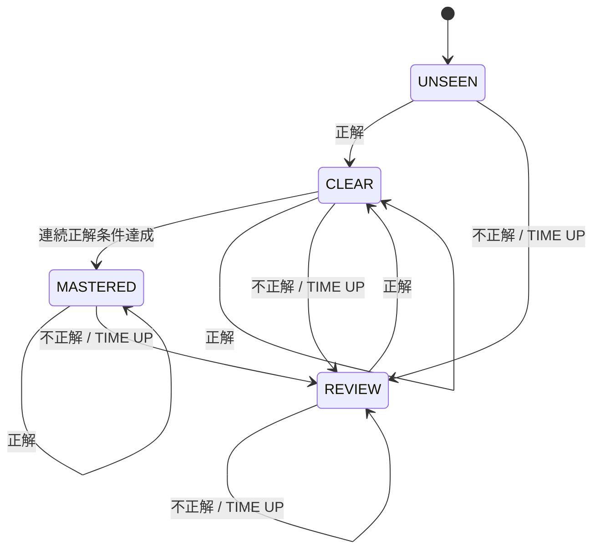

---

# 20. Pause / Resume / Home

ゲーム中は画面右上のPauseボタンまたはキーボードで一時停止できる。

推奨操作：

```text
Esc → Pause
P   → Pause
```

右クリックについては、ブラウザ標準のコンテキストメニューと競合するため、基本操作には採用せず、必要に応じて補助機能として検討する。

## 20.1 Pause画面

```text
┌─────────────────────┐
│       PAUSE         │
│                     │
│     [ RESUME ]      │
│     [ RESTART ]     │
│     [ HOME ]        │
└─────────────────────┘
```

HOMEへ戻る場合は、

```text
ゲームを中断しますか？

[ YES ] [ NO ]
```

と確認する。

途中までの回答履歴は保存し、未完了のプレイはStage Clearとして扱わない。

---

# 21. 画面遷移

## 21. 画面遷移図

画面遷移図は、**「次にどこへ進むのか」**を表す地図です。

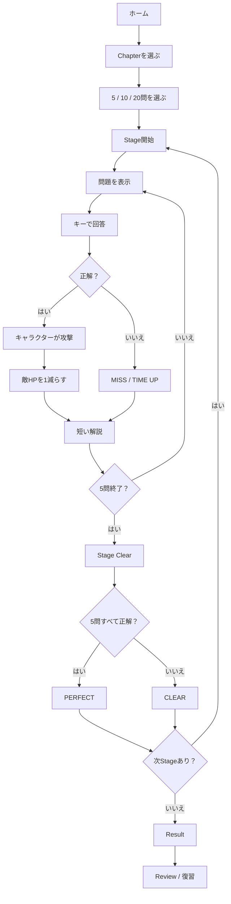

### 21.1 図の見方

- 四角 = 画面や処理
- 「？」の形 = 条件を確認する場所
- 矢印 = 次に進む方向

この図で覚えるべきことは、**「Chapterを選ぶ → Stageで5問 → 結果 → 復習」**という流れです。

---

# 22. HOME / Chapter Select / Game / Result / Review UI

## HOME

```text
JAVA QUEST

Javaを、遊びながら身につけよう。

[ START ]
[ REVIEW ]
[ RECORD ]
[ HELP ]
```

大きなビジュアルを使い、作品の世界観を最初に伝える。

## Chapter Select

```text
JAVA WORLD

[ 変数 ]       ★★☆☆☆   習得率82%
[ 条件分岐 ]   ★★★☆☆   習得率68%
[ 配列 ]       ★★★★☆   習得率54%
```

## Game

```text
SCORE 1250    COMBO ×4    TIME 12.4

┌───────────────────┬───────────────────┐
│ QUESTION          │ GAME              │
│                   │                   │
│ Javaコード        │ 🥷      🤖        │
│ 問題文            │                   │
│ 選択肢            │ GAME PROGRESS     │
│                   │ HP / GOAL / GET   │
└───────────────────┴───────────────────┘
```

## Result

```text
RESULT

8 / 10
正答率 80%

得意：変数
苦手：条件分岐

[ REVIEW ]
[ NEXT STAGE ]
```

## Review

情報量を優先し、問題・回答・正解・解説を読みやすくする。

---

# 23. ビジュアル・デザイン方針

## 23.1 HOME

写真や3Dビジュアルを大きく使った、作品サイトのような見せ方を目指す。

意識する点：

- 大きなビジュアル
- 余白
- 統一されたテーマ
- 過剰な装飾を避ける
- 少ない要素でも成立する構成

## 23.2 GAME

ゲーム画面では、

- 大きな操作UI
- ポップなフィードバック
- Timer
- Score
- Combo
- キャラクターアクション
- 正解演出
- キーボード操作
- 画面遷移の分かりやすさ

を重視する。

## 23.3 REVIEW / RECORD

ゲーム画面より落ち着いたデザインにし、成績データを読みやすくする。

---

# 24. データモデル

## 24. データモデル

データモデルは難しそうに見えますが、簡単にいうと、

> **「このシステムは、何を覚えておく必要がある？」**

を整理したものです。

まずは名前より役割を理解します。

| データ | 簡単な意味 | 例 |
|---|---|---|
| User | 使っている人 | 学習者 |
| Course | 学習コース | Java Bronze |
| Chapter | 勉強するテーマ | 変数、条件分岐 |
| Stage | ステージの設定 | 忍者・城・敵 |
| Question | 問題 | 「intは何型？」 |
| Choice | 選択肢 | A int / B double |
| GameSession | 今回のプレイ全体 | 20問プレイ中 |
| StageSession | 今回の5問バトルの状態 | 3問目・HP2 |
| AnswerHistory | 過去の回答記録 | Q001を不正解 |
| QuestionProgress | 問題の現在の学習状態 | 要復習 |
| GameResult | プレイ結果 | 16/20正解 |

### 24.1 1問答えると何を覚える？

```text
どの問題？
 ↓
何を選んだ？
 ↓
正解？
 ↓
何秒かかった？
 ↓
今のStageは何問目？
 ↓
敵HPはいくつ？
```

これらを保存・管理する「箱」がデータモデルです。

### 24.2 Javaコード上の名前

実際のプログラムでは、上の「箱」を次の英語名で作る予定です。

```text
User             = 利用者
Course           = 学習コース
Chapter          = 学習テーマ
StageDefinition  = Stageの設定
Question         = 問題
Choice           = 選択肢
GameSession      = 今回のプレイ全体
StageSession     = 今回のStageの状態
AnswerHistory    = 回答履歴
QuestionProgress = 問題の現在の学習状態
GameResult       = プレイ結果
```

**英語を暗記することではなく、「この箱は何を入れる箱か」を理解することが大切です。**

---

# 25. データの関係

## 25. データの関係図

この図は、**「どのデータとどのデータがつながっているか」**を表します。

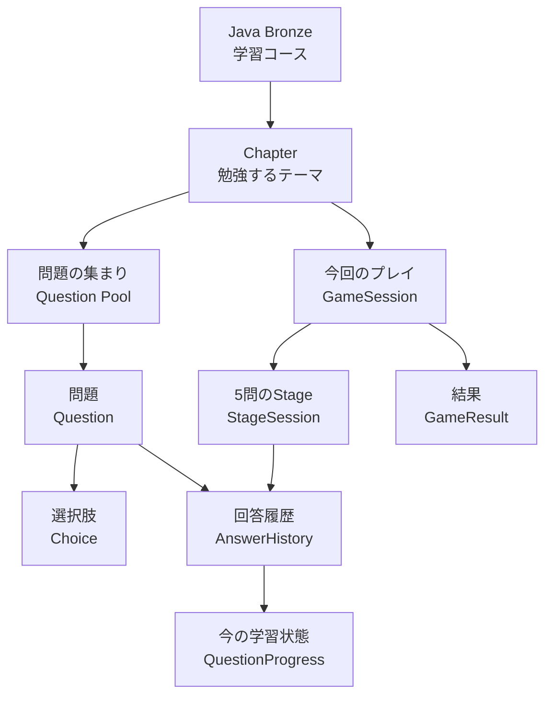

### 25.1 もっと簡単にすると

```text
何を勉強する？
 ↓
Chapter
 ↓
問題を解く
 ↓
その結果を記録する
 ↓
今の苦手・習得状態を更新する
```

一方、プレイそのものは、

```text
Chapter
 ↓
今回のプレイ
 ↓
5問のStage
 ↓
結果
```

と考えます。

**「問題そのもの」と「今回のプレイ結果」を分ける**ことが、この図の一番大事なポイントです。

---

# 26. システム全体像

## 26. システム全体像

システム全体は、まず次の3つに分けて考えます。

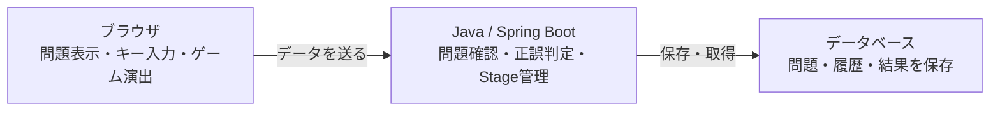

### 26.1 基本アーキテクチャ

初心者は、まずこの3段階だけ覚えれば大丈夫です。

```text
┌─────────────────────────────┐
│ ① 画面                     │
│ ブラウザ                   │
│ HTML / CSS / JavaScript    │
│                            │
│ 問題を表示                 │
│ キー入力を受け取る         │
│ キャラクターを動かす       │
└─────────────┬──────────────┘
              ↓
┌─────────────────────────────┐
│ ② Java側                   │
│ Spring Boot                │
│                            │
│ 正解・不正解を判定         │
│ Stageを進める              │
│ スコアなどを計算           │
└─────────────┬──────────────┘
              ↓
┌─────────────────────────────┐
│ ③ データ保存               │
│ Database                   │
│                            │
│ 問題・回答履歴・結果を保存 │
└─────────────────────────────┘
```

### 26.2 Java側の役割分担

コードが大きくなったら、Java側をさらに分けます。

```text
画面からのお願い
 ↓
Controller
 ↓
Service
 ↓
Repository
 ↓
Database
```

- Controller = 画面からのお願いを受け取る
- Service = どう処理するか考える
- Repository = データを保存・取得する

つまり、**仕事を分担しているだけ**です。

---

# 27. Python / FastAPIの位置付け

Pythonは「使った技術を増やすため」に追加しない。

Java側と役割が異なり、実装効果がある場合にのみ採用する。

候補：

- 問題データ検証
- 問題データ加工
- Javaコード問題の数値変換補助
- 類似問題生成の補助
- 学習データ分析

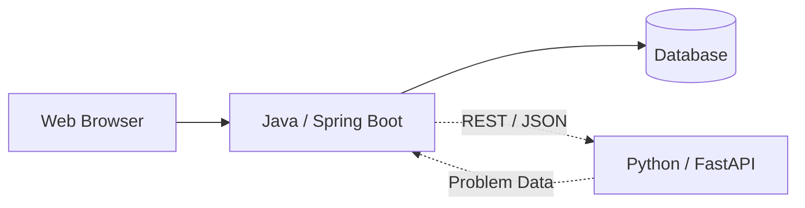

Python / FastAPIはMVP必須ではない。

**Java / Spring Bootだけでも最後まで完成することを最優先する。**

---

# 28. 要求モデル

## 28.3 Use Case Diagram（利用者ができることの図）

Use Case Diagramは、難しい図ではなく、

> **「このシステムで、利用者は何ができる？」**

を整理する図です。

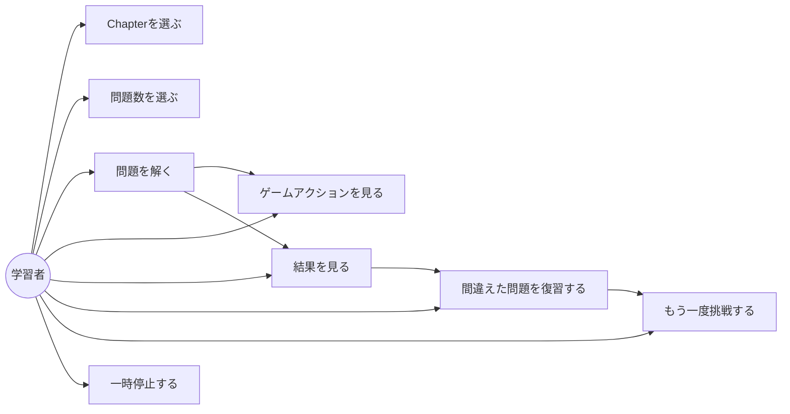

### 28.3.1 この図を日本語で説明すると

```text
選ぶ
 ↓
問題を解く
 ↓
ゲームが動く
 ↓
結果を見る
 ↓
復習する
 ↓
もう一度挑戦する
```

これが、この作品の利用者の基本的な流れです。

---

# 29. 主要ユースケース仕様：問題に回答する

## 事前条件

- Chapterが選択されている
- GameSessionが開始されている
- Questionが出題可能である

## 基本フロー

1. システムが出題候補を取得する
2. 重複しない問題を選択する
3. 問題を表示する
4. タイマーを開始する
5. ユーザーが回答する
6. システムが正解集合と比較する
7. AnswerHistoryを保存する
8. QuestionProgressを更新する
9. 短い解説を表示する
10. 正解ならGameProgressを進める
11. 次のQuestionへ進む
12. 5問終了ならStage結果を確定する
13. 全プレイ終了ならGameResultを生成する

## 代替フロー：不正解

```text
不正解
 ↓
MISS
 ↓
履歴保存
 ↓
QuestionProgress = REVIEW
 ↓
解説
 ↓
次問題
```

## 代替フロー：時間切れ

```text
TIME = 0
 ↓
入力ロック
 ↓
不正解確定
 ↓
履歴保存
 ↓
QuestionProgress = REVIEW
 ↓
解説
 ↓
次問題
```

## 事後条件

- 回答結果が保存されている
- 学習状態が更新されている
- 次の問題へ進行可能
- 必要に応じて復習対象になっている

---

# 30. 分析モデル：ドメインモデリング

```text
Chapter
  ↓
Question
  ↓
Choice

User
  ↓
QuestionProgress
  ↓
ChapterProgress

User
  ↓
GameSession
  ↓
StageSession
  ↓
AnswerHistory
  ↓
GameResult
```

ドメインモデルでは、アプリケーションの世界を「名詞」で整理し、データ構造の基礎とする。

---

# 31. ロバストネス分析

## 31. ロバストネス分析

「ロバストネス分析」という名前は難しいですが、ここでは、

> **「画面」「処理」「データ」の役割分担を考える方法**

として理解します。

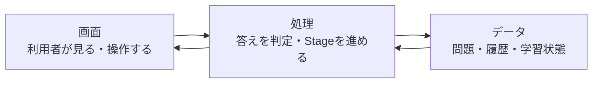

### 31.1 3つの意味

```text
画面 = 見る・操作する
処理 = 考える・判断する
データ = 覚えておく
```

例えば問題に答えると、

```text
画面
「Aキーが押された」
       ↓
処理
「Aは正解？」
       ↓
データ
「この問題は正解だった」と記録
       ↓
画面
「CORRECT！攻撃！」
```

となります。

この関係を整理するのがロバストネス分析です。

---

# 32. 設計モデル：3層アーキテクチャ

```text
Controller
    ↓
Service
    ↓
Repository
    ↓
Entity / Database
```

## Controller

HTTPリクエストや画面操作を受け取り、適切なServiceへ渡す。

## Service

業務ルールを担当する。

例：

- 問題抽選
- 正誤判定
- 複数選択判定
- タイムアウト処理
- スコア更新
- コンボ更新
- Stage進行
- QuestionProgress更新
- 復習対象取得

## Repository

Databaseへのアクセスを担当する。

## Entity

業務データを表現する。

この分離により、画面・業務ロジック・DBアクセスを直接密結合させない。

---

# 33. クラス図

## 33. クラス図

クラス図は、**プログラムの中にどんな「役割の箱」を作るか**を表す図です。

細かい型名を暗記する必要はありません。

まずは次の関係だけ理解します。

```text
        学習する内容
             │
        ┌────┴────┐
        ↓         ↓
      Chapter   Question
                   │
                   ↓
                 Choice

今回のプレイ
      │
      ↓
GameSession
      │
      ↓
StageSession
      │
      ├→ 回答履歴
      └→ Result
```

### 33.1 今回の設計で追加・整理した考え方

```text
StageDefinition
= Stageの設定
（キャラクター・敵・フィールド・ゲーム種類）

StageSession
= 今回プレイ中のStageの状態
（何問目・敵HP・正解数など）
```

この2つを分けることで、例えば、

```text
「Stage 2は忍者・城・敵B」
```

という設定と、

```text
「今回のStage 2は3問目・敵HP2」
```

という現在の状態を混同しません。

### 33.2 詳細クラス図

```mermaid
classDiagram
    class Course {
        Long id
        String name
        String level
    }

    class Chapter {
        Long id
        String name
        String description
    }

    class StageDefinition {
        Long id
        int stageNumber
        String playerCharacter
        String enemy
        String field
        String miniGameId
        int maxEnemyHp
    }

    class Question {
        Long id
        String questionText
        String codeBlock
        int timeLimitSeconds
        String category
        String explanation
    }

    class Choice {
        Long id
        String choiceLabel
        String choiceText
        boolean correct
    }

    class GameSession {
        Long id
        int requestedQuestionCount
        int currentStageNumber
        int totalScore
    }

    class StageSession {
        Long id
        int questionCount
        int currentQuestionIndex
        int correctCount
        int enemyHp
    }

    class AnswerHistory {
        Long id
        boolean correct
        boolean timeout
        int answerTimeSeconds
    }

    class QuestionProgress {
        Long userId
        Long questionId
        int attemptCount
        String currentStatus
    }

    Course "1" --> "many" Chapter
    Chapter "1" --> "many" StageDefinition
    Chapter "1" --> "many" Question
    Question "1" --> "many" Choice
    GameSession "1" --> "many" StageSession
    StageSession "1" --> "many" AnswerHistory
    Question "1" --> "many" AnswerHistory
    Question "1" --> "many" QuestionProgress

---

# 34. MiniGame / GameEffectの設計

## 34. MiniGame / GameEffectの設計

ここは、**「正解したとき、ゲームをどう動かすか」**を整理する場所です。

最初はシンプルに考えます。

```text
問題に正解
    ↓
ゲームアクション
    ↓
敵HP -1
```

### 34.1 Stageによってアクションを変える

```text
Stage 1
正解 → 剣士が斬る → HP -1

Stage 2
正解 → サラリーマンが攻撃 → HP -1

Stage 3
正解 → 忍者が手裏剣 → HP -1
```

### 34.2 後から新しいゲームを追加する

```text
                共通のミニゲーム
                       │
          ┌────────────┼─────────────┐
          ↓            ↓             ↓
      Target        Samurai      Code Breaker

                  ＋後から追加＋
                       ↓
                   Java Shoot
```

### 34.3 QuestionとMiniGameを分ける理由

- Question = **何を答えるか**
- MiniGame = **答えた後どう動くか**

この2つを分けておくと、同じ問題を別のゲームで復習できます。

---

# 35. シーケンス図：回答判定

## 35. シーケンス図：回答判定

シーケンス図は、

> **「1問に答えたとき、何がどの順番で動くか」**

を表します。

まずは利用者から見た流れだけ覚えれば十分です。

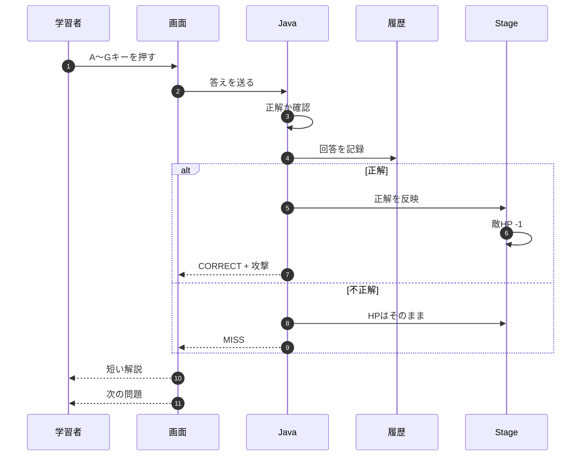

### 35.1 一言で覚える

```text
キー
 ↓
判定
 ↓
記録
 ↓
攻撃 / MISS
 ↓
次の問題
```

---

# 36. シーケンス図：時間切れ

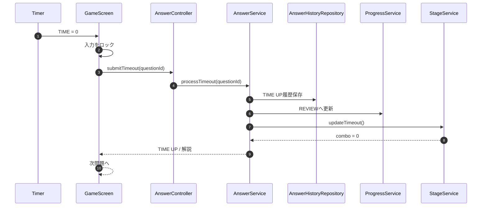

---

# 37. シーケンス図：Stage進行

## 37. シーケンス図：Stage進行

Stageは**5問で1セット**です。

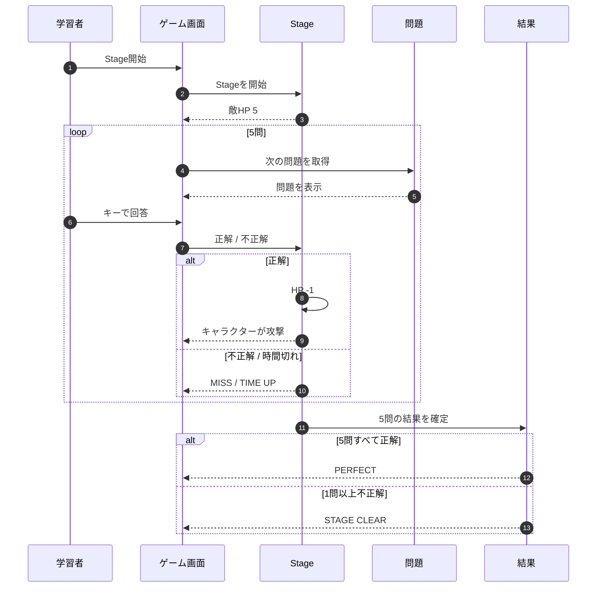

### 37.1 つまり何が起きる？

```text
Stage開始 → HP5
 ↓
5問を1問ずつ解く
 ↓
正解した回数だけHPが減る
 ↓
5問終了
 ↓
Clear
 ↓
5問全部正解ならPerfect
```

---

# 38. シーケンス図：Result / Review

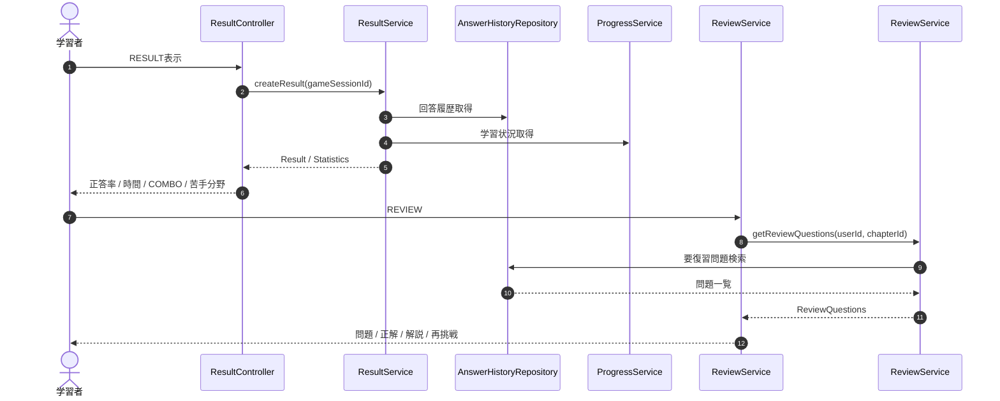

---

# 39. REST API候補

APIは、**画面とJava側がやり取りするための窓口**です。最初は「画面からJavaへお願いを送る場所」と考えれば十分です。

```text
GET  /api/chapters
GET  /api/chapters/{chapterId}
GET  /api/chapters/{chapterId}/progress

POST /api/sessions
GET  /api/sessions/{sessionId}

GET  /api/questions/next
POST /api/answers
POST /api/answers/timeout

GET  /api/results/{sessionId}
GET  /api/history
GET  /api/reviews
GET  /api/statistics
```

Python / FastAPI連携を行う場合は別APIとして分離する。

実際のrequest / response形式は詳細設計で確定する。

---

# 40. 設計整合性チェック

## 40. 設計整合性チェック

ここは、

> **「READMEで決めたことと、実際のプログラムの動きが同じか」**

を確認するための場所です。

| 決めたこと | プログラムでどうする？ |
|---|---|
| 1 Stage = 5問 | 5問回答したらStage終了 |
| 敵は1体・HP5 | Stage開始時にHP5 |
| 正解 | キャラクターが動き、HP -1 |
| 不正解 | MISS、HPはそのまま |
| 時間切れ | TIME UP、不正解として扱う |
| 5問終了 | Stage Clear |
| 5問すべて正解 | Perfect |
| A～Gで回答 | キーボード入力に対応 |
| 複数選択 | 選んだ答えを全部確認 |
| 問題ごとの時間 | 問題ごとに制限時間を設定 |
| 間違えた問題 | 復習対象にする |
| Stageごとの世界 | キャラクター・敵・フィールドを設定 |
| 新しいゲーム | 共通の仕組みを使って追加する |

### 40.1 4つを見比べる

```text
README
  ↓
設計図
  ↓
Java / JavaScriptのコード
  ↓
実際の画面
```

この4つの説明がズレていないかを確認します。

---

# 41. Java型とDB型の対応方針

| Java | DB例 | 用途 |
|---|---|---|
| `Long` | `BIGINT` | ID |
| `String` | `VARCHAR / TEXT` | 問題文・名前 |
| `int` | `INT` | スコア・件数・時間 |
| `boolean` | `BOOLEAN` | 正解・クリア状態 |
| `double` | `DECIMAL` | 正答率 |
| `LocalDateTime` | `DATETIME / TIMESTAMP` | 回答日時 |
| `enum` | `VARCHAR` 等 | Difficulty / ProgressStatus |

実際のDB製品・方言に合わせて詳細設計時に確定する。

---

# 42. SOLID / KISS / DRY

## 42.1 SOLID

### S：Single Responsibility Principle

1クラス1責務を基本とする。

悪い例：

```text
QuestionService
 ├ 問題取得
 ├ 画面描画
 ├ 正誤判定
 ├ スコア計算
 ├ DB保存
 └ 復習
```

改善：

```text
QuestionService
AnswerService
ScoreService
StageService
ProgressService
ReviewService
```

### O：Open / Closed Principle

既存の問題判定を変更せず、新しいゲーム演出を追加できるようにする。

### L：Liskov Substitution Principle

`MiniGame` の共通インターフェースを使い、各ゲーム実装が同じ基本契約で扱えるようにする。

### I：Interface Segregation Principle

巨大なインターフェースを1つ作らず、必要な責務ごとに分ける。

### D：Dependency Inversion Principle

Controllerが具体的なDB実装へ直接依存しない。

```text
Controller
 ↓
Service
 ↓
Repository Interface
 ↓
DB実装
```

## 42.2 KISS

必要以上に複雑な仕組みを作らない。

例：

- スコア計算を最初から複雑にしない
- ミニゲームを最初から20種類作らない
- Python連携をMVP必須にしない

## 42.3 DRY

同じ処理をコピーして増やさない。

例：

```text
正誤判定
タイマー
履歴保存
Progress更新
```

を共通処理としてまとめる。

---

# 43. Axiomatic Design / 設計原則

授業で学習したAxiomatic Designの考え方を、実装上の責務分離に反映する。

## Independence Axiom

機能要求が互いに過度に干渉しないようにする。

```text
問題表示
   ↓
回答判定
   ↓
学習履歴
   ↓
ゲーム演出
```

をできるだけ独立させる。

例えば「忍者演出を追加するために回答判定コードを大量修正する」構造を避ける。

## Information Axiom

必要以上に複雑な設計を避け、理解・実装・保守しやすい構造を優先する。

---

# 44. ICONIXによる開発・設計の流れ

## 44. ICONIXによる開発・設計の流れ

学校で学んだ流れを、初心者にも分かる言葉でまとめます。

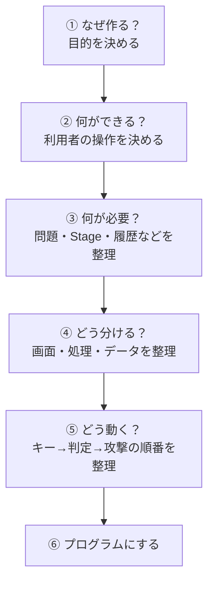

### 44.1 今回の作品に当てはめると

```text
① 目的
Javaの勉強を続けやすくしたい
 ↓
② 利用者がすること
Chapterを選ぶ → 問題を解く → 復習する
 ↓
③ 必要なもの
問題・選択肢・Stage・履歴・結果
 ↓
④ 役割分担
画面 / Javaの処理 / データ保存
 ↓
⑤ 1問の流れ
キー → 正誤判定 → 攻撃 → HP更新
 ↓
⑥ 実装
Java / HTML / CSS / JavaScript / DB
```

「ICONIX」という言葉を覚えることより、**この順番で考えてから作る**ことが大切です。

---

# 45. WaterfallとAgileの使い分け

本制作では、WaterfallとAgileを対立させるのではなく、**目的の違うものとして使い分ける**。

## 45.1 Waterfall的な部分

学校の提出物は、

```text
要求
 ↓
分析
 ↓
設計
 ↓
実装
 ↓
テスト
 ↓
納品
```

という段階管理が必要である。

設計書・UML・提出物を各フェーズで整理する。

## 45.2 Agile的な部分

実装中は、短い単位で、

```text
Backlog
 ↓
Sprint Planning
 ↓
実装
 ↓
動作確認
 ↓
レビュー
 ↓
改善
```

を繰り返す。

## 45.3 この方式のメリット

```text
学校提出
→ フェーズで管理

実装
→ 小さく作って動かす
```

という二つを両立する。

---

# 46. Git / GitHubの実務的な運用

## 46. Git / GitHubの実務的な運用

Git / GitHubは、簡単にいうと、

> **「プログラムがどう変わってきたかを残しておく仕組み」**

です。

### 46.1 基本の流れ

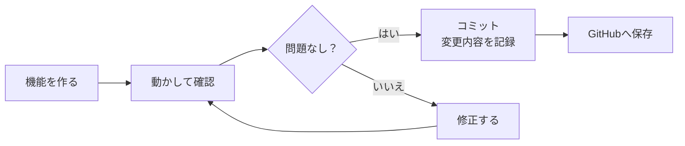

### 46.2 変更内容が分かる名前を付ける

```text
Chapter画面を作成
問題表示を実装
回答判定を実装
タイマーを追加
StageのHP処理を追加
Review画面を追加
```

### 46.3 初心者向けの覚え方

```text
作る
 ↓
動かす
 ↓
確認する
 ↓
記録する
```

一度に大量の変更を入れるより、**小さく作って小さく記録する**方が、バグを見つけやすくなります。

---

# 47. AI活用方針

## 47. AI活用方針

AIは、**全部作ってもらうためではなく、自分の開発を助けてもらうため**に使います。

### 47.1 AIに相談すること

```text
問題のアイデア
設計の相談
エラーの原因
UIのアイデア
テストの観点
READMEの整理
```

### 47.2 自分で担当すること

```text
最終仕様を決める
設計図を理解する
Javaコードを書く
HTML / CSS / JavaScriptを書く
DBを作る
実際に動かす
デバッグする
```

### 47.3 開発の流れ

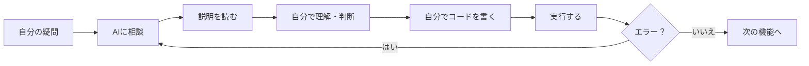

### 47.4 大切なルール

> **AIが出した答えを、そのまま「分かったつもり」で使わない。**

自分の言葉で説明できるようにしてから使います。

---

# 48. 問題作成・データ生成・著作権方針

## 48.1 大量の問題を効率よく作る

問題を1問ずつゼロから手作業で考え続けるのではなく、AIを利用して問題案を大量生成する。

ただし、

> **既存問題を書き換えること**

ではなく、

> **学習テーマから新しい問題を生成すること**

を基本とする。

```text
Javaの学習テーマ
     ↓
問題の知識項目を整理
     ↓
AIがオリジナル問題案を生成
     ↓
Java仕様・実行結果を確認
     ↓
人間が選別・修正
     ↓
JSON / DBへ登録
```

## 48.2 参考教材の扱い

市販のJava学習教材等は、

- 学習範囲
- テーマ
- Javaの基礎知識
- 難易度の目安

を把握するための参考資料として利用する。

問題文・選択肢・解説・画像・コード例をそのまま転載したり、単純な言い換えで公開用問題に変換したりしない。

## 48.3 オリジナル問題方針

READMEに次の方針を明記する。

> 本アプリに収録している問題は、Javaの学習範囲・一般的な技術知識を参考に制作者が作成したオリジナル問題です。特定の試験問題・問題集・教材の文章、選択肢、解説、画像等をそのまま転載・改変して使用するものではありません。

実際の公開時には、利用した教材・素材の利用条件も確認する。

---

# 49. 問題データ品質管理

AI生成問題をそのままDBへ登録しない。

最低限、

```text
問題ID重複
選択肢数
正解数
問題形式
難易度
カテゴリ
制限時間
解説
```

をチェックする。

例：

```text
A～E / 1つ選択
→ 正解は1つ

A～G / 2つ選択
→ 正解は2つ

A～G / 3つ選択
→ 正解は3つ
```

さらにJavaコード問題は、可能な範囲で実際にコンパイル・実行して結果を確認する。

---

# 50. テスト方針

学校のガイダンスでは導通テストを最低限実施する。

余裕があれば単体・結合観点も追加する。

## 50.1 主要テスト

- Chapterが表示される
- 5 / 10 / 20問を選択できる
- 問題がランダムに選ばれる
- 同じプレイ内で重複しない
- 未回答問題が優先される
- Review問題が優先される
- タイマーが動作する
- 正解が正しく判定される
- 複数選択が正しく判定される
- 部分点にならない
- 正解時にGameEffectが発生する
- 不正解時にMISSになる
- 時間切れ時に入力がロックされる
- 時間切れが不正解として保存される
- コンボがリセットされる
- Stageが5問で終了する
- 5問正解時にPerfectになる
- GameProgressが正しく進む
- AnswerHistoryが保存される
- QuestionProgressが更新される
- ChapterProgressが更新される
- Resultが正しく集計される
- Review対象が表示される
- Pause / Resumeが動作する
- Homeへ戻る確認ダイアログが出る

---

# 51. Must / Should / Could

## 🔴 MUST

- Java Bronze学習システムとして最後まで完成
- Chapter選択
- Chapter難易度★
- 5 / 10 / 20問
- Question Pool
- ランダム出題
- 未回答 / Review優先
- A～E / A～G
- 単一選択 / 複数選択
- 問題ごとの制限時間
- 正誤判定
- 短い解説
- 正解時のゲーム演出
- MISS / TIME UP
- 5問Stage
- Stage Clear / Perfect
- スコア
- 回答履歴
- 学習状態
- 復習
- Result
- 成績・苦手分析
- DB
- Java / Spring Boot
- HTML / CSS / JavaScript
- 基本的なGit / GitHub管理

## 🟡 SHOULD

- コンボ
- 複数ゲーム演出
- サウンド
- エフェクト
- 成績グラフ強化
- 問題管理
- Pythonによる問題データ処理
- レスポンシブ対応
- 演出バリエーション

## 🟢 COULD

- Blender 3D
- 3Dキャラクター
- 複雑なエフェクト
- キャラクター成長
- Java Silver / Gold
- 基本情報技術者試験
- Python
- Database
- Linux
- GitHub
- オンラインランキング
- Python / FastAPIによる類似問題生成

> **追加機能より、本体の完成を優先する。**

---

# 52. 将来の拡張性

本システムは、ゲーム処理と問題データを分離することで、Java Bronze以外にも展開できる構造を目指す。

```text
Subject
 ├ Java Bronze
 ├ Java Silver
 ├ Java Gold
 ├ 基本情報技術者
 ├ Python
 ├ Database
 ├ Linux
 └ GitHub
       ↓
共通Questionモデル
       ↓
共通Answer判定
       ↓
共通GameEngine
```

## 拡張方針

### 新しい学習分野

基本的には問題データとChapterを追加する。

### 新しいゲーム

`MiniGame` / `GameEffect` を追加する。

つまり、

> **「科目追加」と「ゲーム追加」を別問題として扱える設計**

にする。

---

# 53. MVP完成条件

以下の一連の流れが最後まで動けばMVP完成とする。

```text
HOME
 ↓
CHAPTER SELECT
 ↓
PLAY SETTING
   5 / 10 / 20
 ↓
QUESTION SELECTION
 ↓
GAME SCREEN
 ↓
回答
 ↓
正誤判定
 ↓
短い解説
 ↓
正解ならゲーム演出
不正解ならMISS
時間切れならTIME UP
 ↓
次問題
 ↓
5問終了
 ↓
STAGE CLEAR
 ↓
次Stage
 ↓
全問終了
 ↓
RESULT
 ↓
苦手分析
 ↓
REVIEW
 ↓
再挑戦
```

この流れを完成させることを第一優先とする。

---

# 54. 開発スケジュール

学校の総合演習スケジュールを基準にする。

| 日付 | フェーズ | 内容 |
|---|---|---|
| 10/2 | 企画 | 検討項目1～5 第1版 |
| 10/6 | 要求 | 要求モデル完成 |
| 10/9 | 分析 | 分析モデル完成 |
| 10/13 | 設計 | 設計モデル完成 |
| 10/14 | 実装 | プログラミング開始 |
| 10/20頃 | Sprint | コア機能・ゲーム機能実装 |
| 10/25頃 | MVP | 一連の学習フロー完成 |
| 10/26 | 品質 | 動作確認・デバッグ・リファクタリング |
| 10/28 | 納品 | 納品・発表資料作成 |
| 10/29 | 発表 | プレゼン・実演 |

---

# 55. 開発フェーズの実装順

## Step 1：Spring Boot起動

```text
Spring Boot
 ↓
Controller
 ↓
HTML
```

まずブラウザから画面を表示する。

## Step 2：Chapter Select

Chapter一覧を表示する。

## Step 3：Question

Question / Choiceを表示する。

## Step 4：Answer判定

```text
選択
 ↓
POST /api/answers
 ↓
AnswerService
 ↓
正誤判定
```

## Step 5：Timer

JavaScriptで問題ごとの残り時間を管理する。

## Step 6：GameProgress

正解イベントをJavaScript側のゲーム演出につなぐ。

## Step 7：Stage

5問単位でStage管理する。

## Step 8：History / Progress

AnswerHistory / QuestionProgressを保存する。

## Step 9：Result / Review

成績・復習を作る。

## Step 10：UI・演出強化

最後に、

- アニメーション
- 効果音
- 3D
- 背景
- エフェクト

を追加する。

---

# 56. ポートフォリオとして伝えたいこと

この作品では、「派手なゲームを作った」だけではなく、**企画 → 要求 → 分析 → 設計 → 実装 → テスト → 改善**まで説明できることを重視する。

## 企画

なぜこのシステムを作るのか。

## 要求

ユーザーは何ができるのか。

## 分析

画面・処理・データをどう分離するか。

## 設計

責務をどう分け、拡張しやすくするか。

## 実装

Java / Spring Boot / JavaScript / DBをどう連携するか。

## 品質

Git / GitHub / テスト / デバッグ / リファクタリングをどう行うか。

## AI

AIを何に使い、自分がどこを判断・実装したか。

---

# 57. SES / SE向けの技術的な見どころ

この作品では、

- Java / Spring Boot
- HTML / CSS / JavaScript
- 3層アーキテクチャ
- MVC
- REST API
- Database
- UML
- Use Case
- Domain Model
- Robustness Diagram
- Sequence Diagram
- Class Diagram
- SOLID
- KISS
- DRY
- Axiomatic Design
- Waterfall / Agileの使い分け
- Git / GitHub
- AI開発支援
- UI / UX
- データ分析
- テスト
- リファクタリング

を一つのWebシステムで説明できる。

特に、

> **問題データとゲーム演出を分離し、正解イベントを共通化する**

ことで、新しいゲーム演出を追加しても、問題判定・履歴・学習管理への影響を抑えられる設計を目指している。

これは、

```text
新しいゲームを作る
≠
問題判定を作り直す
```

という**変更に強い設計**につながる。

---

# 58. 学校提出物との対応

| 学校提出物 | 本READMEでの対応 |
|---|---|
| 1. 要求モデル | Business / Use Case / Use Case仕様 |
| 2. 分析モデル | Domain / Robustness / Sequence |
| 3. 設計モデル | Architecture / Class / Sequence |
| 4. プログラム | Spring Boot / JS / DB |
| 5. 操作マニュアル | 実装後に追記 |
| 6. 実行イメージ | 完成後にスクリーンショット追加 |

---

# 59. 現在の開発状況

| 項目 | 状況 |
|---|---|
| プロジェクト企画 | ✅ |
| コンセプト | ✅ |
| 問題形式 | ✅ |
| Chapter / Stage / Question設計 | ✅ |
| UI方針 | ✅ |
| Must / Should / Could | ✅ |
| 要求モデル | ✅ |
| 分析モデル | ✅ |
| 設計モデル | ✅ |
| ロバストネス図 | ✅ |
| クラス図 | ✅ |
| シーケンス図 | ✅ |
| SOLID / KISS / DRY | ✅ |
| Agile方針 | ✅ |
| DB詳細実装 | ⏳ |
| Java / Spring Boot | ⏳ |
| HTML / CSS / JavaScript | ⏳ |
| ゲーム演出 | ⏳ |
| 履歴・復習 | ⏳ |
| テスト | ⏳ |
| Blender / 3D | 🟢 余裕があれば |

**ここからは設計を無限に増やすのではなく、実装へ移行する。**

---

# 60. 今後の詳細設計で決める項目

基本方針は確定している。

実装時に具体値を決める項目：

- 実際のQuestion件数
- Chapterごとの問題配分
- 各Questionの具体的な時間
- 問題重複防止の詳細ルール
- `MASTERED`になる連続正解回数
- スコア演出
- サウンド / BGM
- 具体的なゲーム素材
- API request / response
- DB INDEX / UNIQUE / FK
- 認証をMVPに含めるか
- Python / FastAPIをMVPに含めるか
- 長文問題のスクロール
- レスポンシブ表示

これは「基本仕様が未定」という意味ではなく、**実装に必要な具体値を詳細設計で決定する**という意味である。

---

# 61. 開発上の基本ルール

1. まず動くものを作る。
2. 1つの機能を完成させてから次へ進む。
3. AIの出力を理解せずコピーしない。
4. エラーは原因を理解してから修正する。
5. 共通処理をコピーして増やさない。
6. 必要以上に機能を増やさない。
7. 既存作品の文章・キャラクター・画面をそのままコピーしない。
8. Blender等の追加要素より本体完成を優先する。
9. 未実装の機能を実装済みとしてREADMEに書かない。
10. READMEは実装状況に合わせて更新する。
11. 問題データの正しさを確認してから公開する。
12. 設計変更が発生した場合は、README・UML・コードの整合性を保つ。

---

# 62. 最終コンセプト

## JAVA QUEST

### Javaを、遊びながら身につけよう。

**Java Bronze学習**

×

**選択式問題**

×

**問題ごとの時間制限**

×

**優先度付きランダム出題**

×

**ゲームアクション**

×

**回答履歴**

×

**学習状態管理**

×

**成績分析**

×

**復習・再挑戦**

を組み合わせたJava学習管理Webシステム。

1問正解するたびに、

```text
🥷 攻撃
🏀 シュート
🎣 釣る
🎳 倒す
🏎️ 追い抜く
🚆 追い抜く
🐧 捕まえる
```

などゲーム世界が動く。

しかし、目的はゲームそのものではない。

> **「Javaの知識を使って答える → その結果としてゲームが動く → 結果を振り返る → 苦手問題をもう一度学ぶ」**

という学習ループを作ることが目的である。

---

# 63. 将来的な完成イメージ

```text
JAVA QUEST
│
├─ LEARN
│   ├─ Chapter Select
│   ├─ 5 / 10 / 20問
│   ├─ Game Session
│   └─ Stage
│
├─ REVIEW
│   ├─ Review Questions
│   ├─ Explanations
│   └─ Re-Challenge
│
├─ RECORD
│   ├─ Accuracy
│   ├─ Average Time
│   ├─ Weak Categories
│   └─ Learning Progress
│
└─ HELP
```

将来的には、

```text
Java Bronze
   ↓
Java Silver
   ↓
Java Gold

さらに

基本情報技術者
Python
Database
Linux
GitHub
```

へ問題データを追加できる構造を目指す。

ただし、**卒業制作の完成範囲はJava Bronzeを中心とする。**

---

# 64. README更新履歴

## 2026/10/06 最終統合版

- Java Bronze学習システムとして全体方針を整理
- 「問題とゲームを分離」ではなく「回答結果がゲーム世界を動かす」設計へ整理
- PC向け左右2ペインUIを明確化
- Chapter / Question Pool / Stage / Questionの関係を整理
- Chapterを自由に選択できる仕様を明記
- 5 / 10 / 20問のプレイ設定を追加
- 5問 = 1 Stageの構成を明記
- Stageごとの固定難易度上昇を採用しない方針を明記
- Chapter難易度を★で表現
- Chapterごとの習得率・回答数・要復習数を表示する方針を追加
- UNSEEN / REVIEW / CLEAR / MASTEREDの学習状態を追加
- 未回答・Review優先のランダム出題を追加
- 同一プレイ内の問題重複防止を追加
- 一度正解した問題を再度間違えた場合はREVIEWへ戻す方針を追加
- GameProgressを導入し、戦闘・スポーツ・釣り・レースを共通化
- 正解 / MISS / TIME UPの処理を整理
- Pause / Resume / HomeのUI仕様を整理
- Result / Review / 学習分析を整理
- ロバストネス図、クラス図、シーケンス図、状態図、ERモデルを統合
- Controller / Service / Repository / Entityの責務分離を整理
- SOLID 5原則、KISS、DRYを整理
- Axiomatic Designの考え方を設計方針に追加
- WaterfallとAgileの使い分けを追加
- Git / GitHubの実務的な管理方針を整理
- AI活用方針とオリジナル問題作成方針を整理
- Java Bronze以外への将来拡張方針を整理
- 学校提出物との対応表を追加
- SES / SE向けの技術的な見どころを整理


## 2026/10/06 追加更新：初心者向け図解・説明の改善

- 1 Stage = 5問・敵1体・HP5を中心とする図に更新
- 「考える → キーを押す → 即反応 → キャラクターが動く」の流れを基本ループに反映
- Stageごとのキャラクター・敵・フィールド変更を図と説明に反映
- データモデルを「何を覚える箱なのか」という日本語中心の説明に変更
- データの関係図を、初心者が追いやすい日本語の関係図に変更
- システム全体像を「ブラウザ → Java → データ保存」の3段階で説明
- Use Case Diagramを「利用者に何ができるか」が分かる図に変更
- ロバストネス分析を「画面 = 見る / 処理 = 考える / データ = 覚える」で説明
- 回答判定・Stage進行のシーケンス図を日本語中心に更新
- 設計整合性チェックを基本ルール中心に整理
- ICONIXを「目的 → できること → 必要なもの → 役割分担 → 処理順 → 実装」の流れで説明
- Git / GitHubを「作る → 動かす → 確認する → 記録する」で説明
- AI活用を「相談 → 理解 → 自分で判断 → 自分で実装」の流れで説明
- 初心者向け用語集・先生／面接向け説明を追加
- Stage標準時間の二重管理を避け、MVPではQuestion単位の時間制限に整理
---

## License / Notes

本リポジトリに含まれるコード・問題データ・画像・3D素材等については、各ファイル・素材のライセンスおよび利用規約を確認したうえで利用・公開する。

既存の書籍・試験問題・ゲーム作品等の文章、問題、画像、キャラクター、ロゴ、画面デザイン等をそのまま転載・複製しない。

本READMEに記載された機能のうち、実装前のものは設計・予定であり、完成後に実装状況を更新する。

---

# 65. 初心者向け用語集

このREADMEに出てくる英語は、最初から全部暗記しなくて大丈夫です。

| 言葉 | この作品での意味 |
|---|---|
| Course | 学習コース。例：Java Bronze |
| Chapter | 勉強するテーマのまとまり |
| Question | 問題 |
| Choice | 選択肢 |
| Stage | 5問で1セットのゲーム |
| GameSession | 今回のプレイ全体 |
| StageSession | 今回プレイしているStageの状態 |
| AnswerHistory | 過去の回答記録 |
| QuestionProgress | 今の学習状態 |
| GameResult | プレイ結果 |
| API | 画面とJava側がやり取りする窓口 |
| Controller | 画面からのお願いを受け取る役 |
| Service | 受け取った内容を処理する役 |
| Repository | データを保存・取得する役 |
| Database | データを保存する場所 |
| Use Case | 利用者ができること |
| Sequence Diagram | 処理の順番を表す図 |
| Robustness Analysis | 画面・処理・データの役割を整理する方法 |
